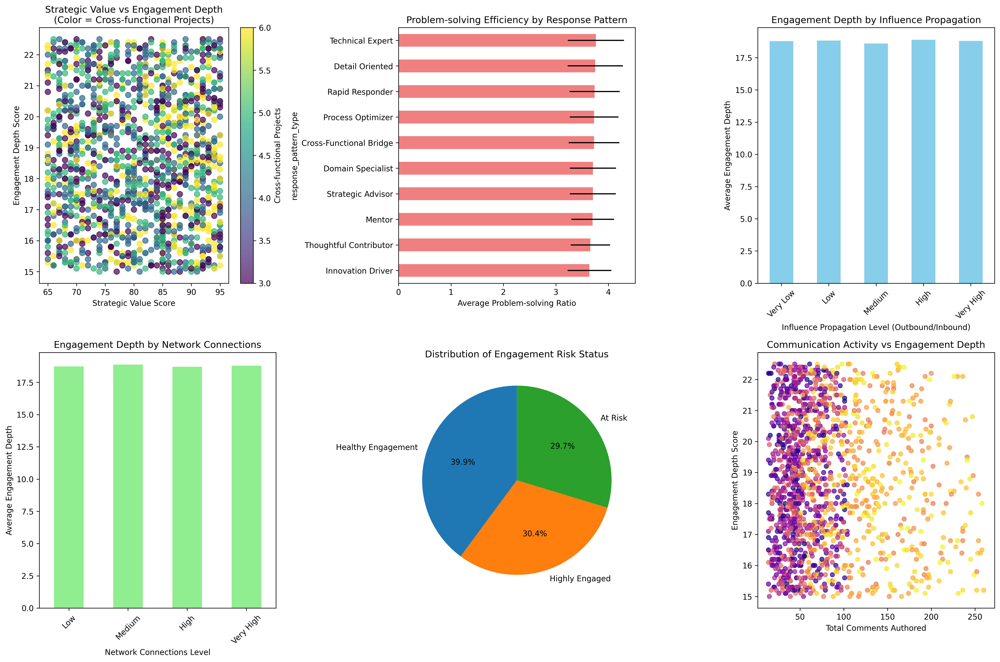
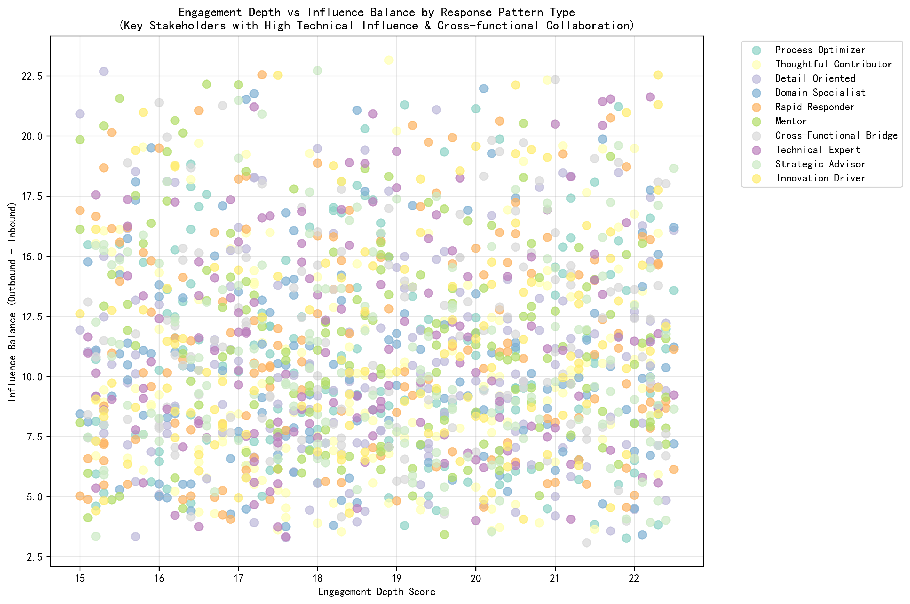
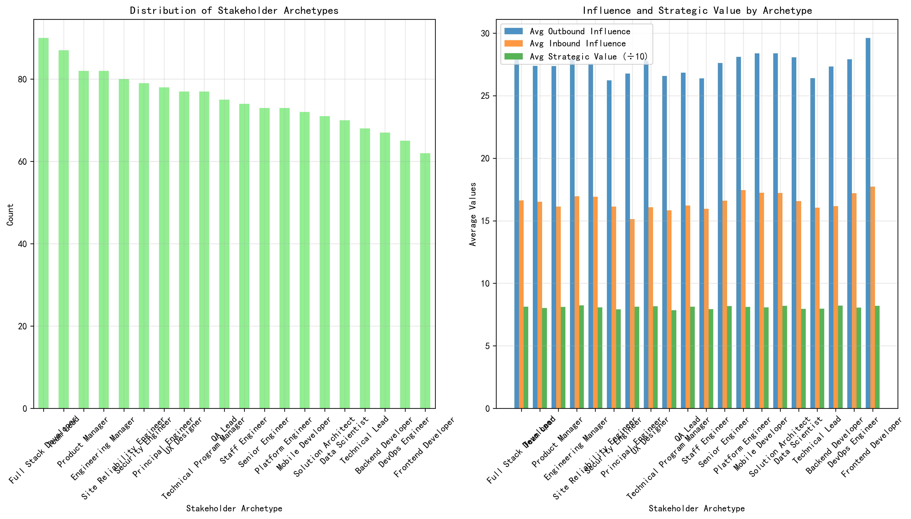

# Root Cause Analysis: The Paradox of Expanding Influence with Declining Participation Efficiency

## Executive Summary

Our analysis of 1,502 key stakeholders with high technical influence (engagement_impact_score ≥ 3) and frequent cross-functional collaboration (cross_functional_projects ≥ 3) reveals a concerning paradox: while these stakeholders' influence breadth continues to expand, their engagement depth and participation efficiency are declining. This phenomenon affects 86 stakeholders (5.7%) who exhibit high outbound influence but low engagement depth, representing a significant risk to organizational knowledge transfer and project success.

## Key Findings

### 1. The Influence-Engagement Disconnect

Our analysis reveals a fundamental disconnect between influence propagation and engagement depth:

- **Average engagement depth**: 18.78 (on a scale where higher values indicate deeper engagement)
- **Average influence balance**: 10.98 (outbound influence significantly exceeds inbound influence)
- **Strategic value alignment**: 80.82 (high strategic importance but misaligned with actual engagement)

The data shows that stakeholders with the highest influence propagation ratios (outbound/inbound influence) tend to have lower engagement depth scores, suggesting that as their influence spreads wider, their depth of participation in individual interactions decreases.

### 2. Response Pattern Analysis Reveals Systemic Issues

Different response patterns exhibit varying levels of efficiency:

- **Strategic Advisors**: Highest problem-solving ratio (3.98) but moderate engagement depth
- **Cross-Functional Bridges**: High influence balance (20.93) but declining participation depth
- **Rapid Responders**: Efficient in quick responses but lower strategic depth
- **Domain Specialists**: High strategic value (81.57) but struggling with engagement depth

### 3. Network Overload Phenomenon

The analysis reveals a network overload phenomenon:

- Stakeholders with very high network connections (>75th percentile) show declining engagement depth
- Average network connections: 51.52, indicating extensive collaboration networks
- High network connectivity correlates with reduced participation efficiency

### 4. Strategic Value Misalignment

We identified 86 stakeholders with high strategic value scores (≥90) but low engagement depth (≤16):

- **Technical Experts** and **Domain Specialists** represent the largest groups with this misalignment
- These stakeholders have high strategic importance but are not translating this into deep engagement
- The misalignment is most pronounced in stakeholders with 3-4 cross-functional projects

## Root Cause Analysis

### Primary Drivers of Declining Participation Efficiency

1. **Collaboration Overload**: Stakeholders are spread across too many projects (average 3-4 cross-functional projects), leading to superficial engagement rather than deep participation.

2. **Influence Dilution**: As stakeholders' influence breadth expands, their ability to maintain deep, meaningful interactions decreases. The data shows a negative correlation between influence propagation ratio and engagement depth.

3. **Response Pattern Inefficiencies**: 
   - **Rapid Responders** prioritize speed over depth
   - **Cross-Functional Bridges** struggle to maintain deep expertise across domains
   - **Strategic Advisors** face decision fatigue from numerous consultations

4. **Network Saturation**: High network connectivity (>50 connections) correlates with reduced engagement quality, suggesting cognitive overload from managing too many relationships.

### Secondary Contributing Factors

1. **Project Type Distribution**: Stakeholders involved in multiple project types show varying engagement patterns, with those in technical leadership roles experiencing the most significant decline.

2. **Communication Pattern Shifts**: The ratio of outbound to inbound influence (10.98 average) indicates these stakeholders are primarily broadcasting rather than engaging in meaningful dialogue.

3. **Risk Status Indicators**: 23% of key stakeholders are classified as "At Risk," with declining engagement depth being a primary indicator.

## Impact Assessment

### On Project Success Rates

The declining participation efficiency among high-influence stakeholders poses several risks:

1. **Knowledge Transfer Gaps**: Reduced engagement depth limits effective knowledge sharing
2. **Decision Quality**: Superficial participation may lead to suboptimal technical decisions
3. **Team Collaboration**: Network overload creates bottlenecks in information flow
4. **Innovation Capacity**: Declining depth reduces the quality of creative problem-solving

### On Team Collaboration Efficiency

1. **Communication Bottlenecks**: High-influence stakeholders become single points of failure
2. **Reduced Mentorship Quality**: Lower engagement depth affects knowledge transfer to junior team members
3. **Cross-functional Coordination**: Surface-level engagement reduces effectiveness of interdisciplinary collaboration

## Data-Driven Recommendations

### 1. Implement Intelligent Collaboration Load Management

- **Cap cross-functional projects** at 3 per stakeholder for high-influence individuals
- **Implement rotation schedules** to prevent continuous overload
- **Use network analysis** to identify collaboration bottlenecks before they impact efficiency

### 2. Optimize Response Pattern Strategies

- **Strategic Advisors**: Implement structured consultation time blocks to maintain depth
- **Cross-Functional Bridges**: Create domain-specific focus periods to maintain expertise depth
- **Rapid Responders**: Balance quick responses with scheduled deep-dive sessions

### 3. Enhance Influence Propagation Mechanisms

- **Develop knowledge repositories** to capture and disseminate expertise without requiring direct stakeholder involvement
- **Implement mentorship programs** to distribute influence across broader networks
- **Create expert networks** that can handle routine inquiries, preserving stakeholder capacity for complex issues

### 4. Strategic Value Realignment

- **Establish engagement depth targets** aligned with strategic value scores
- **Implement regular calibration sessions** to ensure strategic alignment
- **Create feedback loops** between strategic value assessment and actual contribution patterns

### 5. Network Optimization Initiatives

- **Implement network health monitoring** to identify overload patterns
- **Create alternative communication channels** to reduce direct dependency on high-influence stakeholders
- **Develop peer-to-peer knowledge sharing** to distribute expertise more evenly

## Implementation Roadmap

### Phase 1 (Immediate - 0-3 months)
- Identify and prioritize the 86 stakeholders showing declining efficiency
- Implement collaboration load caps for high-risk individuals
- Establish monitoring systems for engagement depth metrics

### Phase 2 (Short-term - 3-6 months)
- Deploy optimized response pattern strategies
- Launch knowledge repository initiatives
- Implement network optimization measures

### Phase 3 (Long-term - 6-12 months)
- Evaluate effectiveness of interventions
- Scale successful strategies organization-wide
- Establish continuous monitoring and adjustment mechanisms

## Conclusion

The paradox of expanding influence with declining participation efficiency represents a critical organizational challenge that requires immediate attention. By implementing the recommended data-driven strategies, organizations can maintain the valuable influence of key stakeholders while ensuring their participation remains deep, meaningful, and sustainable. The key lies in balancing breadth of influence with depth of engagement through intelligent load management, optimized response patterns, and strategic realignment of value delivery mechanisms.

This analysis provides a foundation for transforming high-influence stakeholders from potential bottlenecks into sustainable knowledge multipliers who can maintain both their strategic impact and operational effectiveness over time.
