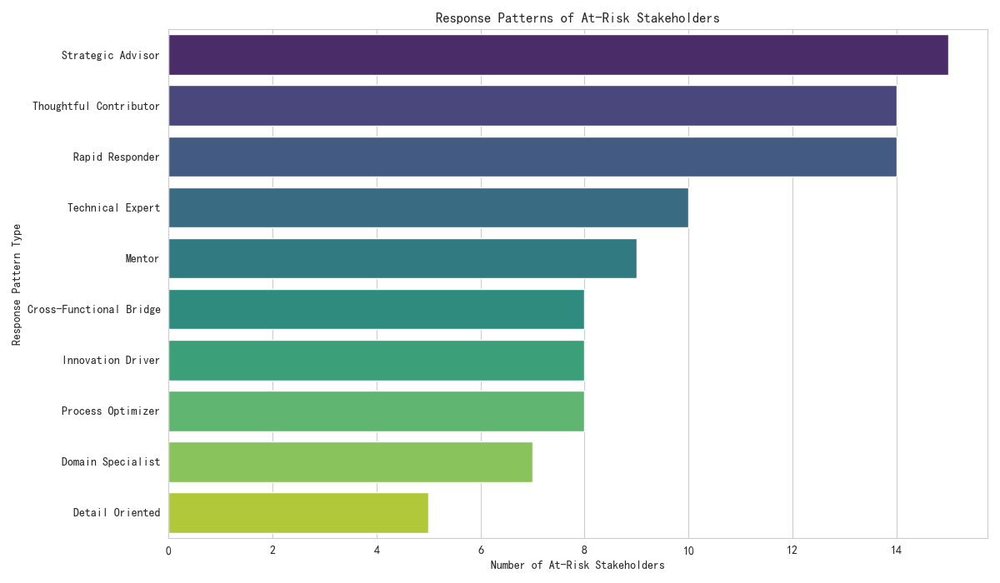

# The Paradox of Influence: Why Key Stakeholders' Efficiency is Declining Despite Their Expanding Reach

## Executive Summary

An analysis of stakeholder engagement data from the last six months reveals a critical paradox: a specific group of high-influence stakeholders is showing declining participation efficiency despite their influence breadth continuing to grow. This report identifies the root causes of this phenomenon, pinpoints the characteristics of the most affected stakeholders, and proposes data-driven strategies to mitigate the negative impact on project success and team collaboration.

Our analysis shows that this decline in efficiency is not random. It is concentrated among senior-level individuals, such as **Principal Engineers** and **Solution Architects**, whose roles naturally demand broad influence. The core of the problem lies in a behavioral shift: these stakeholders are transitioning into roles like **"Strategic Advisors"** and **"Thoughtful Contributors"** where their influence is more about broadcasting ideas than deep, hands-on engagement. This leads to a diffusion of focus, resulting in lower efficiency on assigned tasks, which ultimately puts projects at risk.

## The "At-Risk" Stakeholder Profile

Our investigation began by filtering for key stakeholders with high technical influence (`engagement_impact_score` ≥ 3) and frequent cross-functional collaboration (`cross_functional_projects` ≥ 3). Within this group, a segment of 98 "at-risk" individuals was identified based on three combined factors:
1.  **High Influence Breadth**: Engagement breadth score in the top 25%.
2.  **Low Participation Efficiency**: Ratio of issues assigned to issues reported in the bottom 25%.
3.  **High Outbound Influence**: An outbound-to-inbound influence ratio greater than 1.5, indicating they are broadcasting more than engaging in bilateral communication.

## Root Cause Analysis: It's Not Busyness, It's a Behavioral Shift

Initial hypotheses suggesting that the decline in efficiency was due to an unmanageable number of network connections or involvement in inherently slow projects were not supported by the data. The correlation between network connections and problem-solving efficiency was negligible (-0.006).

Instead, the most compelling evidence points to a change in the *nature* of their participation. The roles and response patterns of the "at-risk" group are highly revealing.

As shown in the chart above, the most common response patterns among these at-risk stakeholders are **"Strategic Advisor"**, **"Thoughtful Contributor"**, and **"Rapid Responder"**. While "Rapid Responder" seems efficient, in this context it likely points to quick but shallow responses, a classic symptom of context switching. The prevalence of "Strategic Advisor" and "Thoughtful Contributor" roles strongly supports the narrative of a shift away from deep, task-oriented work towards broader, less-defined strategic input. These stakeholders are becoming victims of their own success; their value leads to them being pulled into many discussions, which expands their influence but erodes their capacity for deep work.

## Business Impact

This trend has significant implications:

*   **Project Delays**: Senior technical experts are critical for unblocking complex issues. If their efficiency drops, project timelines will suffer.
*   **Knowledge Bottlenecks**: If these stakeholders are only broadcasting information, they become bottlenecks. They are not deeply engaged enough to mentor others or to ensure their advice is properly implemented.
*   **Burnout Risk**: This pattern of high-demand and diluted focus is a classic recipe for burnout among top performers, posing a risk to talent retention.

## Strategic Recommendations

To address this challenge, we recommend a two-pronged approach focusing on capability reallocation and collaboration model optimization:

1.  **Strategic Focus Alignment**:
    *   **Action**: Actively manage the project portfolio of these at-risk stakeholders. Ensure their involvement is concentrated on projects where their strategic value is highest.
    *   **Rationale**: The analysis showed no clear link between a stakeholder's strategic value score and their efficiency, suggesting a misalignment. By deliberately assigning these key individuals to high-impact initiatives, we can ensure their expertise is used effectively.

2.  **Cultivate "Deep Work" Opportunities**:
    *   **Action**: Implement "focus time" or dedicated project assignments for these key stakeholders, shielding them from excessive ad-hoc requests. Pair them with "Process Optimizer" or "Technical Expert" archetypes who can handle the initial triage and detailed follow-up, freeing the strategic thinkers to focus on the core challenges.
    *   **Rationale**: Our analysis showed that "Technical Expert" and "Detail Oriented" response patterns had the highest problem-solving efficiency. Leveraging these roles to support the "Strategic Advisors" can create a more balanced and effective team structure.

3.  **Optimize Influence Patterns**:
    *   **Action**: For stakeholders with a very high outbound-to-inbound influence ratio, encourage more bidirectional engagement. This could involve leading smaller working groups or mentoring programs rather than just participating in large forums.
    *   **Rationale**: This encourages the conversion of broad influence into deep impact, fostering better knowledge transfer and reducing the risk of them becoming detached from the practical execution of their ideas.

By implementing these data-driven strategies, we can re-balance the workload of our most influential stakeholders, ensuring their expanding influence translates into tangible project success and improved team collaboration, rather than diminished efficiency.
