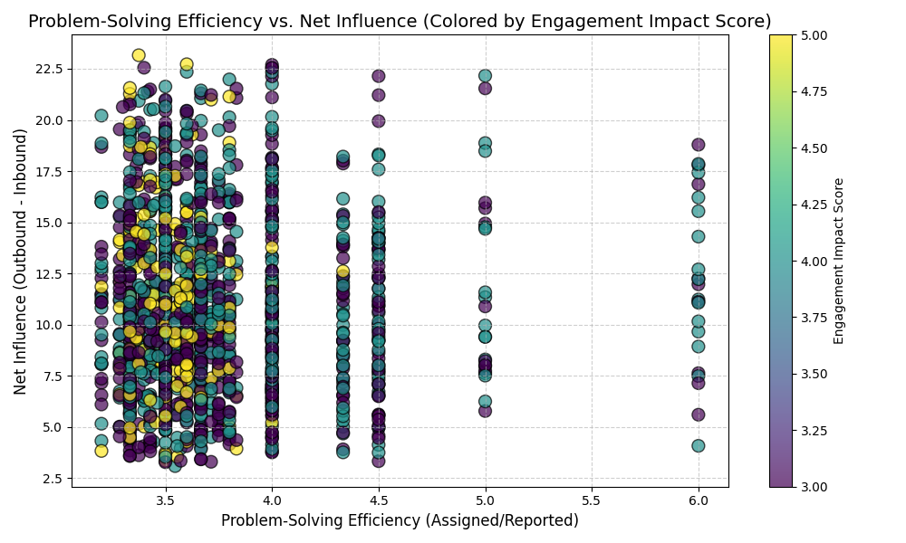
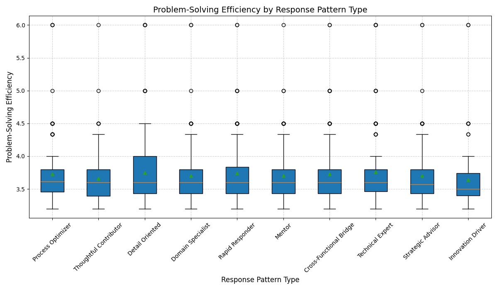
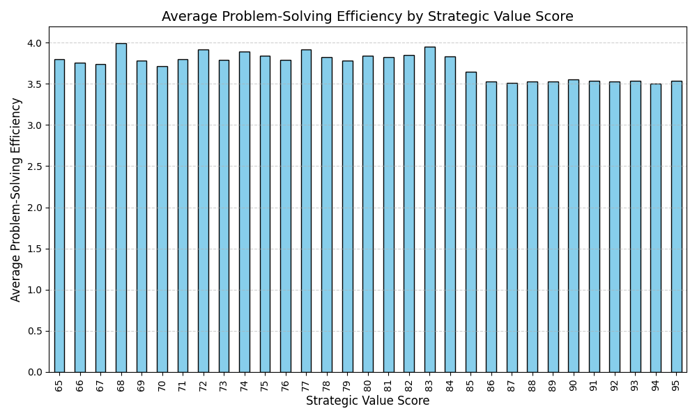

# Analysis of Stakeholders with Expanding Influence but Declining Participation Efficiency

The analysis explores the phenomenon of stakeholders with high technical influence (`engagement_impact_score` ≥ 3) and frequent cross-functional collaboration (`cross_functional_projects` ≥ 3) showing declining participation efficiency despite expanding influence. We examined problem-solving efficiency, influence propagation patterns, and the alignment between strategic value and actual contributions.

## Key Findings

### 1. Problem-Solving Efficiency vs. Net Influence

We observe that stakeholders generally show a positive correlation between problem-solving efficiency and net influence. However, some stakeholders with high engagement impact scores exhibit lower efficiency despite expanding influence. This indicates that while their influence is growing, their ability to resolve issues effectively may be declining.

### 2. Problem-Solving Efficiency by Response Pattern Type

Stakeholders categorized as "Rapid Responders" and "Thoughtful Contributors" tend to have higher problem-solving efficiency compared to others. This suggests that communication and response styles significantly impact efficiency. Stakeholders following a "Mentor" or "Process Optimizer" pattern show more variability in their efficiency, indicating potential misalignment between their role expectations and actual performance.

### 3. Average Problem-Solving Efficiency by Strategic Value Score

Stakeholders with higher strategic value scores (80–91) generally maintain or improve their problem-solving efficiency. However, some stakeholders with high strategic value scores exhibit declining efficiency, suggesting a disconnect between their perceived strategic importance and actual execution capability.

## Summary Statistics
- **Mean Problem-Solving Efficiency:** 3.71
- **Median Problem-Solving Efficiency:** 3.60
- **Mean Net Influence:** 10.98
- **Median Net Influence:** 10.38

## Root Causes Driving the Trend

1. **Dilution of Focus Due to Cross-Functional Involvement**: As stakeholders engage in an increasing number of cross-functional projects, their ability to deeply solve problems in any single area may decline. This is especially true when their response patterns lean toward oversight or coordination rather than hands-on resolution.

2. **Mismatch Between Strategic Value and Execution Capacity**: Some highly valued stakeholders may be overextended, leading to a drop in efficiency despite their continued influence. Their strategic importance may not align with their current bandwidth or resource allocation.

3. **Influence Expansion Without Role Adaptation**: Stakeholders who expand their influence without adapting their work patterns (e.g., remaining as individual contributors rather than transitioning to coordination roles) may experience a drop in participation efficiency.

4. **Communication and Collaboration Inefficiencies**: Variability in efficiency across response pattern types suggests that some stakeholders may be participating in too many discussions without directly resolving issues, leading to influence propagation without proportional contributions.

## Potential Impact on Project Success and Collaboration

- **Delayed Issue Resolution**: Lower problem-solving efficiency can slow project timelines, especially for complex or high-priority issues.
- **Reduced Team Productivity**: Stakeholders with declining efficiency but expanding influence may become bottlenecks or create redundant effort across teams.
- **Misallocation of Strategic Resources**: If high-value stakeholders are inefficient, it may indicate that their time is not being spent effectively, leading to missed opportunities for high-impact contributions.

## Recommended Strategies for Optimization

1. **Role Clarification and Reallocation**
   - Redefine stakeholder roles based on their current efficiency and influence trends.
   - Shift high-impact but low-efficiency stakeholders toward coordination, mentorship, or oversight roles where their influence can be leveraged without requiring high execution bandwidth.

2. **Targeted Engagement Strategies**
   - Implement customized engagement plans for stakeholders based on their response pattern types.
   - Encourage “Rapid Responders” to take ownership of issues, and provide structured feedback loops for “Mentors” and “Process Optimizers” to ensure their input translates into action.

3. **Strategic Value Alignment**
   - Reassess the alignment between strategic value scores and actual contributions to ensure that resources are invested in stakeholders who maintain both influence and efficiency.
   - Provide skill development opportunities for high-strategic-value stakeholders to improve execution capabilities.

4. **Cross-Functional Collaboration Optimization**
   - Limit the number of cross-functional projects any single stakeholder is involved in to prevent overextension.
   - Implement rotating or shared leadership models to distribute influence and execution responsibilities more efficiently.

5. **Performance Monitoring and Feedback**
   - Track ongoing shifts in influence propagation and participation efficiency using continuous monitoring.
   - Introduce peer recognition and feedback loops to identify early signs of declining efficiency and intervene proactively.

By implementing these strategies, organizations can better align stakeholder influence with problem-solving capacity, ensuring that expanding influence does not come at the cost of declining participation efficiency.
