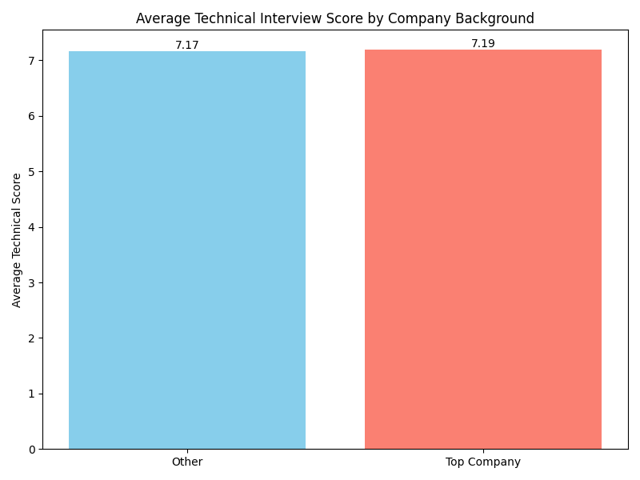
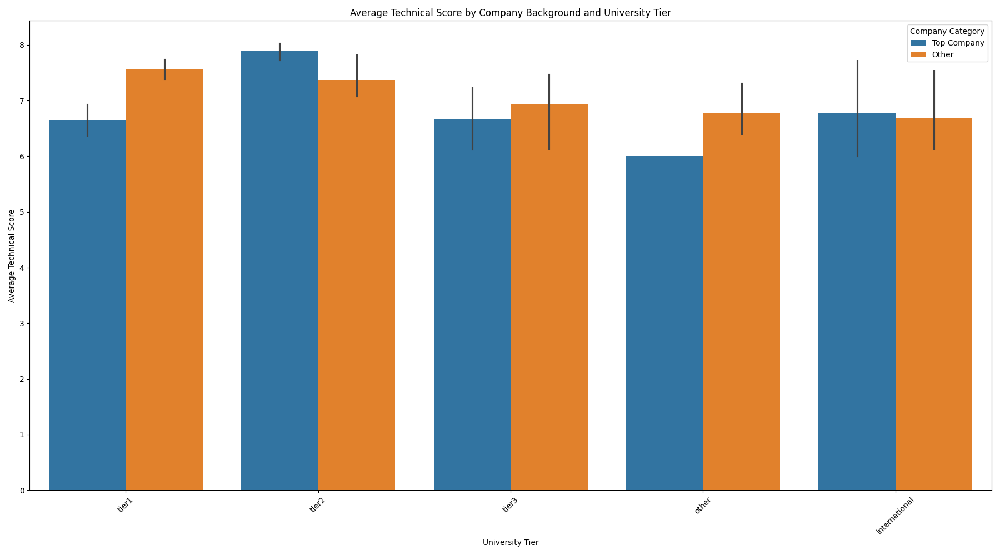
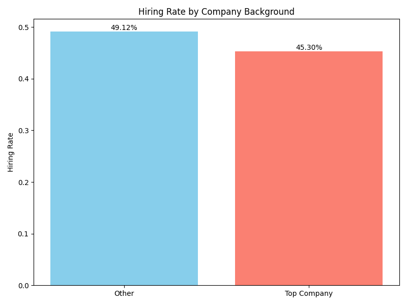

# Analysis of Recruitment Data: Company Background, Interview Performance, and Hiring Bias

## Executive Summary

This report addresses the CEO's hypothesis that candidates from well-known tech companies outperform others in technical interviews and investigates the HR department's concerns about potential unconscious bias in our hiring process. Our analysis of the recruitment data comprehensive reveals that a candidate's previous company background has no significant impact on their technical interview performance or the final hiring outcome.

Key findings include:

1.  **No Significant Difference in Technical Performance:** The average technical interview scores for candidates from "Top Companies" and "Other" companies are virtually identical.
2.  **Performance Holds After Controlling for Other Factors:** The lack of a significant performance gap persists even when we control for educational background and years of experience.
3.  **No Evidence of Hiring Bias:** The hiring rate for candidates from "Other" companies is slightly higher than for those from "Top Companies," suggesting that our process is not biased in favor of candidates from elite backgrounds.

Based on these findings, we conclude that our current interview process is effective at identifying qualified candidates from a diverse range of professional backgrounds. We recommend continuing to focus on a candidate's skills and qualifications, rather than their previous employer, to ensure a fair and effective hiring process.

## Analysis of Technical Interview Performance

To assess the impact of a candidate's company background on their technical interview performance, we compared the average technical scores of candidates from a predefined list of "Top Companies" (including Google, Meta, Amazon, Apple, etc.) with those from "Other" companies.

The analysis shows a negligible difference in average technical scores: **7.19 for candidates from "Top Companies" versus 7.17 for those from "Other" companies**. This finding does not support the claim that candidates from well-known tech companies perform better in our technical interviews.

To further investigate this, we controlled for potential confounding factors such as educational background (university tier) and years of experience. The detailed analysis, as shown in the chart below, reveals that there is no consistent pattern of "Top Company" candidates outperforming others across different segments. In many cases, candidates from "Other" companies achieved comparable or even higher average scores.

This granular analysis reinforces our initial finding that a candidate's previous employer is not a reliable predictor of their technical interview performance.

## Analysis of Hiring Outcomes

In addition to interview performance, we analyzed the final hiring outcomes to detect any potential bias in our process. We compared the hiring rates for candidates from "Top Companies" and "Other" companies.

Our analysis shows that **the hiring rate for candidates from "Other" companies is 49.1%, slightly higher than the 45.3% for candidates from "Top Companies"**. This result contradicts the notion of a hiring bias in favor of candidates from elite tech backgrounds.

This suggests that our hiring decisions are based on the merits and qualifications of the candidates, rather than their previous company affiliation.

## Conclusion and Recommendations

Our comprehensive analysis of the recruitment data provides clear evidence that a candidate's background at a well-known tech company is not a significant predictor of their technical interview performance or their likelihood of being hired.

Based on these findings, we offer the following conclusions and recommendations:

*   **Conclusion:** The CEO's claim that candidates from top tech companies perform better in technical interviews is not supported by the data. The HR department can be confident that the current interview process does not show signs of unconscious bias in favor of these candidates.
*   **Recommendation 1: Continue to Emphasize Skills-Based Evaluation:** Our data supports the effectiveness of our current skills-based evaluation process. We recommend continuing to focus on assessing a candidate's technical skills, problem-solving abilities, and other relevant qualifications, rather than placing undue weight on their previous company background.
*   **Recommendation 2: Broaden Sourcing Channels:** Since we find high-quality candidates from a wide variety of company backgrounds, we recommend continuing to diversify our sourcing channels to attract talent from a broad spectrum of companies, not just the well-known tech giants.
*   **Recommendation 3: Share Findings Internally:** We recommend sharing these findings with the hiring managers and interviewers to reinforce the importance of objective, skills-based evaluations and to alleviate any concerns about potential biases in our hiring process.

By adhering to these recommendations, we can continue to build a fair, effective, and unbiased recruitment process that attracts and hires the best talent, regardless of their professional background.
