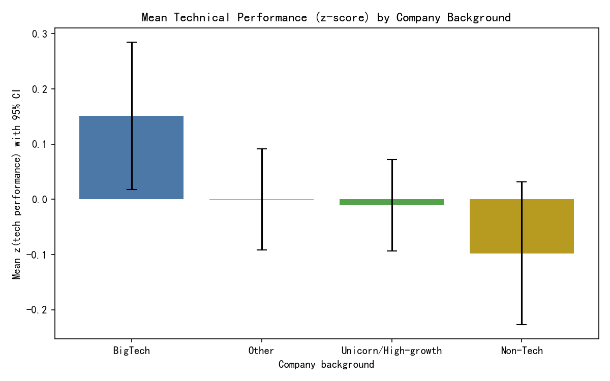
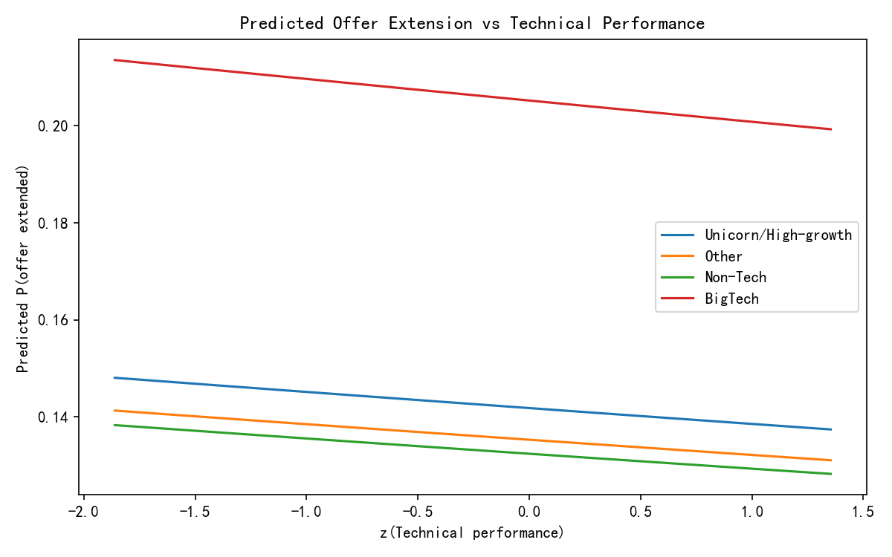

# Recruitment fairness and performance analysis: Company background, education, technical skills, and bias

## Executive summary
- Do candidates from well-known tech companies perform better technically?
  - Unadjusted: Candidates from BigTech show slightly higher technical interview performance than Unicorn/High-growth and Non-Tech peers (≈0.16–0.25 standard deviations; some differences statistically significant).
  - After controlling for education, university tier, GPA, experience, and skills: Only Non-Tech shows a modest negative difference vs BigTech (≈−0.23 SD, p=0.024). The Unicorn/High-growth difference is no longer significant. Practical effect sizes are small (model explains ≈1–2% of variance).
  - Conclusion: The CEO’s claim holds only weakly; FAANG/BigTech candidates are not materially stronger once covariates are considered. Unicorn/high-growth talent performs comparably to BigTech when adjusting for background.

- Does company background influence interviewer decisions and hiring outcomes beyond actual performance?
  - Interviewer recommendation (technical stage): After controlling for standardized technical performance and demographics, company background is not a robust driver. However, significant gaps appear by gender and race in recommendation probability, suggesting potential bias.
  - Offer extension (company decision): Offer extension shows weak dependence on technical performance or demographics in the model and overlapping predicted curves by company category. Yet, disparate-impact checks within the top performance quartile show potential gaps by gender and race (small-n caveats apply).

- Potential systemic bias:
  - Interviewer recommendations: Holding technical performance constant, male candidates receive ≈+4.7 percentage points higher positive-recommendation probability; non-binary candidates ≈−4.2 pp; race “Other” ≈−21 pp (marginal effects; p<0.05 for several terms). This points to possible adverse impact at the recommendation step.
  - Offer extension: Among top performers (top quartile by standardized technical scores), offer extension rates vary by gender (e.g., male 18.2% vs non-binary 4.0% → impact ratio ≈0.22) and by race (e.g., Asian 6.7% vs male best group 18.2% → impact ratio ≈0.37). These ratios fall below the 80% rule threshold; however, group sizes are small and warrant cautious interpretation.

## Data and approach
- Source tables:
  - greenhouse__application_enhanced: candidate/application attributes (current_company, education_level, university_tier, skills, demographics, stages, offers).
  - greenhouse__interview_enhanced: interview-level scores and recommendations (technical_score, problem_solving_score, overall_recommendation, job_stage, interviewer details).

- Derived features:
  - Technical performance per application: Average of technical_score and problem_solving_score across all technical-stage interviews; standardized into a z-score.
  - Company background categories from current_company:
    - BigTech: Google/Alphabet, Meta/Facebook, Apple, Amazon, Microsoft, Netflix.
    - Unicorn/High-growth: e.g., Airbnb, Stripe, Uber, Snowflake, Datadog, Coinbase, Shopify, ByteDance, Palantir, SpaceX, etc.
    - Non-Tech: large non-tech firms (e.g., Bank of America, GE, Pfizer, etc.).
    - Other: everything else.

- Models:
  - OLS regressions of standardized technical performance on company category, then adding controls for education_level, university_tier, GPA, years_of_experience, total_experience_months, skill_count, startup_experience, leadership_experience.
  - Logistic regression for interviewer positive recommendation (rec_pos) with controls for interview-level standardized performance, company category, candidate_gender, candidate_race.
  - Logistic regressions for offer_extended and offer_accepted with the same covariates (application level).
  - Fairness diagnostics: Offer extension rates within the top technical performance quartile by gender and race (disparate-impact style ratios).

## What the data shows

1) Technical performance differences by company background
- Sample sizes (applications with technical interviews): Unicorn/High-growth 525, Other 476, Non-Tech 249, BigTech 199.
- Unadjusted OLS (baseline BigTech):
  - Unicorn/High-growth: −0.162 SD (p=0.044)
  - Non-Tech: −0.249 SD (p=0.009)
  - Other: −0.152 SD (p=0.066)
  - R^2 ≈ 0.5% (small effect size)
- With controls (education, experience, skills):
  - Non-Tech remains −0.233 SD (p=0.024)
  - Unicorn/High-growth: −0.137 SD (p=0.122, not significant)
  - Other: −0.125 SD (p=0.172, not significant)
  - R^2 ≈ 1.7% (still small)
- Interpretation: BigTech candidates are modestly ahead unadjusted; after controlling for covariates, Unicorn/High-growth candidates are statistically indistinguishable from BigTech, while Non-Tech show a small but significant deficit. Practically, these differences are minor.

Figure: Mean technical performance by company background (z-score with 95% CI)


2) Does company background matter after controlling for education and experience?
- Yes, but only weakly. The only persistent difference is Non-Tech vs BigTech (≈−0.23 SD). Unicorn/High-growth vs BigTech is no longer significant after controls.
- Education_level and university_tier have modest associations; a Master’s degree showed a slight negative coefficient in the performance model (p≈0.05), but most education controls were not strong predictors of technical performance once other factors were included.

3) Potential systemic biases in the process
- Interviewer recommendations (technical stage):
  - Strong performance effect, as expected (z_tech_perf_intv highly significant).
  - Holding performance constant, marginal effects indicate:
    - Male: +4.65 pp in positive recommendation probability (p<0.001)
    - Non-binary: −4.17 pp (p=0.027)
    - Race “Other”: −20.98 pp (p=0.005); Native American: −11.67 pp (p≈0.077)
  - Company category terms are not robustly significant in this model.
  - Caveat: The model shows quasi-separation (very strong predictability), but directionally indicates potential bias affecting certain groups.

- Offer extension (company decision):
  - Logistic model for offer_extended shows limited dependence on performance or demographics (small pseudo R^2, non-significant slopes). Predicted curves by company category are overlapped and relatively flat:

Figure: Predicted offer extension vs standardized technical performance by company category


  - Disparate impact within top performers (top quartile by standardized tech performance):
    - Gender offer extension rates:
      - Male 18.2%, Unknown 17.8%, Female 13.6%, Prefer not to say 10.0%, Non-binary 4.0%
      - Impact ratio (min/max): 4.0% / 18.2% ≈ 0.22 (<0.80 threshold), but note small sample for Non-binary.
    - Race offer extension rates:
      - Examples: Asian 6.7%, White 14.3%, Native American 20.0% (small-n)
      - Impact ratio (Asian vs best): 6.7% / 20.0% ≈ 0.33; using White as reference 6.7% / 14.3% ≈ 0.47; both <0.80 threshold.
  - These patterns merit deeper review with adequate sample size and confidence intervals by group.

- Offer accepted (candidate decision):
  - In a deduplicated application-level model, offer_accepted did not show robust dependence on performance or demographics; acceptance is influenced by candidate preferences and competing offers, and should not be used to diagnose process bias.

## What this means for the business
- Strength of BigTech candidates is modest in magnitude and mostly explained by education/experience/skills. Relying heavily on brand-name employers for screening likely adds little beyond what we already capture in objective signals.
- Interviewer recommendations exhibit disparities by gender and race even after controlling for actual technical performance, pointing to potential unconscious bias in the interview step.
- Offer decisions appear weakly linked to technical signals; in top-performer cohorts, we observe disparate rates by gender/race that could reflect bias, inconsistent thresholds, or small-sample noise. This deserves monitoring and interviewer/recruiter calibration.

## Recommendations
- Reduce prestige bias:
  - Blind current_company and university fields for early screening and interviewer packets when feasible.
  - Prioritize structured signals (technical scores, work samples, skill-based assessments) over pedigree.

- Standardize and calibrate interviews:
  - Use explicit rubrics with anchored rating scales; require justification text linked to rubric criteria.
  - Calibrate interview difficulty; monitor inter-interviewer variance and adjust guides.
  - Add second-opinion or tie-breaker reviews when recommendations conflict with performance.

- Fairness monitoring and governance:
  - Track fairness metrics (selection/offer rates, recommendation rates) by group within performance bands.
  - Apply the 80% rule and confidence intervals; flag areas below threshold for review.
  - Conduct interviewer-level audits to identify outliers and provide targeted feedback/training.
  - Run periodic bias audits using logistic models with performance controls; include interviewer fixed effects.

- Decision thresholds:
  - Define clear performance thresholds for moving forward and for offer extension; enforce them across teams.
  - Pilot an offer committee or pre-offer review for high performers to reduce inconsistent outcomes.

- Experimentation:
  - A/B test anonymized profiles for early stages; measure changes in recommendation disparity.
  - Introduce structured take-home or calibrated coding exercises to reduce variance attributable to interviewer differences.

## Limitations and next steps
- Company category mapping is heuristic; refine with an internal list of prestige/market-stage classifications.
- Observational design; causal claims are limited. Consider interviewer fixed-effects or hierarchical models, and propensity score matching across backgrounds.
- Some protected groups have small samples; repeat analysis with pooled data across longer periods and add confidence intervals for disparate-impact rates.

## Figures
- tech_perf_by_company.png
- offer_extension_vs_perf.png

## Appendix: Python code used to generate the figures and models
```
import sqlite3
import pandas as pd
import numpy as np
import statsmodels.api as sm
import statsmodels.formula.api as smf
import matplotlib.pyplot as plt

plt.rcParams['font.sans-serif'] = ['SimHei']
plt.rcParams['axes.unicode_minus'] = False

conn = sqlite3.connect('dacomp-en-065.sqlite')

agg_sql = """
WITH tech AS (
  SELECT 
    application_id,
    AVG(technical_score) AS avg_tech,
    AVG(problem_solving_score) AS avg_prob,
    AVG(communication_score) AS avg_comm,
    COUNT(*) AS n_tech
  FROM greenhouse__interview_enhanced
  WHERE job_stage = 'Technical Interview'
  GROUP BY application_id
), app AS (
  SELECT 
    application_id,
    current_company,
    education_level,
    university_tier,
    gpa,
    years_of_experience,
    total_experience_months,
    skill_count,
    startup_experience,
    leadership_experience,
    candidate_gender,
    candidate_race,
    stage_technical_interview,
    stage_panel_interview,
    stage_final_interview,
    stage_offer,
    stage_hired,
    offer_extended,
    offer_accepted
  FROM greenhouse__application_enhanced
)
SELECT 
  a.*, 
  t.avg_tech, t.avg_prob, t.avg_comm, t.n_tech
FROM app a
LEFT JOIN tech t ON a.application_id = t.application_id
WHERE t.n_tech IS NOT NULL AND t.n_tech > 0;
"""
df = pd.read_sql_query(agg_sql, conn)
df['tech_perf_raw'] = df[['avg_tech','avg_prob']].mean(axis=1, skipna=True)
df = df[~df['tech_perf_raw'].isna()].copy()
df['z_tech_perf'] = (df['tech_perf_raw'] - df['tech_perf_raw'].mean()) / df['tech_perf_raw'].std(ddof=0)

bigtech = {'Google','Alphabet','Meta','Facebook','Apple','Amazon','Microsoft','Netflix'}
high_growth = {'Airbnb','Stripe','Uber','Lyft','Snowflake','Datadog','Coinbase','Shopify','Robinhood','Revolut','Nubank','Palantir','ByteDance','SpaceX','Instacart','Notion','Spotify','Twilio','Okta','Canva','Pinterest','Dropbox','Atlassian','MongoDB','ServiceNow','LinkedIn','Tesla','Slack','Snap','DoorDash','Zoom','Cloudflare','Rivian','Square','Block','Reddit'}
non_tech = {'Bank of America','Capital One','Citigroup','JP Morgan','JPMorgan','Wells Fargo','Goldman Sachs','Boeing','General Electric','Pfizer','Merck','Mc\\'Donald\\'s','McDonald\\'s','Costco','Walmart','Target','Procter & Gamble','P&G','Johnson & Johnson','Coca-Cola','PepsiCo'}
def map_company(c): 
    c = '' if c is None else str(c).strip()
    return 'BigTech' if c in bigtech else ('Unicorn/High-growth' if c in high_growth else ('Non-Tech' if c in non_tech else 'Other'))
df['company_cat'] = df['current_company'].apply(map_company)

# OLS models
for col in ['education_level','university_tier','candidate_gender','candidate_race']:
    df[col] = df[col].fillna('Unknown')
for col in ['gpa','years_of_experience','total_experience_months','skill_count','startup_experience','leadership_experience']:
    df[col] = pd.to_numeric(df[col], errors='coerce').fillna(df[col].median())
ols1 = smf.ols('z_tech_perf ~ C(company_cat)', data=df).fit(cov_type='HC3')
ols2 = smf.ols('z_tech_perf ~ C(company_cat) + C(education_level) + C(university_tier) + gpa + years_of_experience + total_experience_months + skill_count + startup_experience + leadership_experience', data=df).fit(cov_type='HC3')

# Interview-level recommendation model
interview_sql = """
SELECT 
  i.application_id,
  i.overall_recommendation,
  i.technical_score,
  i.problem_solving_score,
  i.communication_score,
  a.current_company,
  a.education_level,
  a.university_tier,
  a.candidate_gender,
  a.candidate_race
FROM greenhouse__interview_enhanced i
JOIN greenhouse__application_enhanced a USING (application_id)
WHERE i.job_stage = 'Technical Interview';
"""
intv = pd.read_sql_query(interview_sql, conn)
intv['company_cat'] = intv['current_company'].apply(map_company)
def map_rec(x):
    v = '' if x is None else str(x).strip().lower()
    if 'strong yes' in v or v == 'yes' or 'recommend hire' in v or 'definite hire' in v: return 1
    if 'strong no' in v or v == 'no' or 'reject' in v: return 0
    if 'leaning yes' in v: return 1
    if 'leaning no' in v: return 0
    return np.nan
intv['rec_pos'] = intv['overall_recommendation'].apply(map_rec)
intv['tech_perf_intv'] = intv[['technical_score','problem_solving_score']].mean(axis=1, skipna=True)
intv = intv[~intv['tech_perf_intv'].isna()].copy()
intv['z_tech_perf_intv'] = (intv['tech_perf_intv'] - intv['tech_perf_intv'].mean()) / intv['tech_perf_intv'].std(ddof=0)
intv['candidate_gender'] = intv['candidate_gender'].fillna('Unknown')
intv['candidate_race'] = intv['candidate_race'].fillna('Unknown')
logit1 = smf.logit('rec_pos ~ z_tech_perf_intv + C(company_cat) + C(candidate_gender) + C(candidate_race)', data=intv.dropna(subset=['rec_pos'])).fit(disp=False, maxiter=200)

# Application-level offer models
app_demo = pd.read_sql_query('SELECT application_id, candidate_gender, candidate_race FROM greenhouse__application_enhanced', conn).drop_duplicates('application_id')
app_demo['candidate_gender'] = app_demo['candidate_gender'].fillna('Unknown')
app_demo['candidate_race'] = app_demo['candidate_race'].fillna('Unknown')
app_df = df.merge(app_demo, on='application_id', how='left').drop_duplicates('application_id')
for c in ['offer_accepted','offer_extended','stage_offer','stage_hired']:
    app_df[c] = pd.to_numeric(app_df[c], errors='coerce').fillna(0).astype(int)
logit_offer = smf.logit('offer_extended ~ z_tech_perf + C(company_cat) + C(candidate_gender) + C(candidate_race) + C(education_level) + C(university_tier) + gpa + years_of_experience + total_experience_months + skill_count + startup_experience + leadership_experience', data=app_df).fit(disp=False, maxiter=200)

# Figures
summary = df.groupby('company_cat')['z_tech_perf'].agg(['count','mean','std']).reset_index()
summary['se'] = summary['std'] / np.sqrt(summary['count'].clip(lower=1))
summary['ci95'] = 1.96 * summary['se']
plt.figure(figsize=(8,5))
order = summary.sort_values('mean', ascending=False)['company_cat']
plt.bar(order, summary.set_index('company_cat').loc[order, 'mean'], yerr=summary.set_index('company_cat').loc[order, 'ci95'], capsize=5, color=['#4C78A8','#F58518','#54A24B','#B79A20'][:len(order)])
plt.title('Mean Technical Performance (z-score) by Company Background')
plt.ylabel('Mean z(tech performance) with 95% CI')
plt.xlabel('Company background')
plt.tight_layout()
plt.savefig('tech_perf_by_company.png', dpi=150)

z_vals = np.linspace(app_df['z_tech_perf'].quantile(0.05), app_df['z_tech_perf'].quantile(0.95), 50)
base = {
    'education_level': app_df['education_level'].mode().iat[0],
    'university_tier': app_df['university_tier'].mode().iat[0],
    'gpa': float(app_df['gpa'].median()),
    'years_of_experience': float(app_df['years_of_experience'].median()),
    'total_experience_months': float(app_df['total_experience_months'].median()),
    'skill_count': float(app_df['skill_count'].median()),
    'startup_experience': float(app_df['startup_experience'].median()),
    'leadership_experience': float(app_df['leadership_experience'].median()),
    'candidate_gender': app_df['candidate_gender'].mode().iat[0],
    'candidate_race': app_df['candidate_race'].mode().iat[0],
}
cats = app_df['company_cat'].value_counts().index.tolist()
preds = []
for cat in cats:
    for z in z_vals:
        row = {'z_tech_perf': z, 'company_cat': cat}; row.update(base); preds.append(row)
pred_df = pd.DataFrame(preds)
pred_df['pred'] = logit_offer.predict(pred_df)
plt.figure(figsize=(8,5))
for cat in cats:
    sub = pred_df[pred_df['company_cat']==cat]
    plt.plot(sub['z_tech_perf'], sub['pred'], label=cat)
plt.title('Predicted Offer Extension vs Technical Performance')
plt.xlabel('z(Technical performance)')
plt.ylabel('Predicted P(offer extended)')
plt.legend()
plt.tight_layout()
plt.savefig('offer_extension_vs_perf.png', dpi=150)
```
