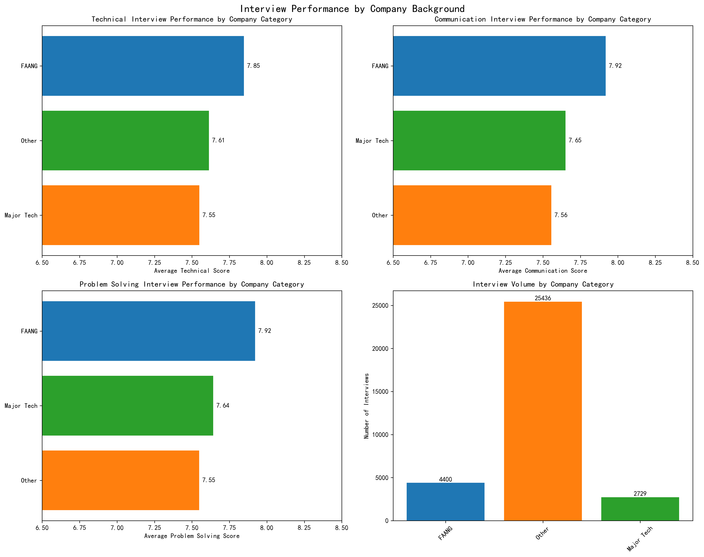
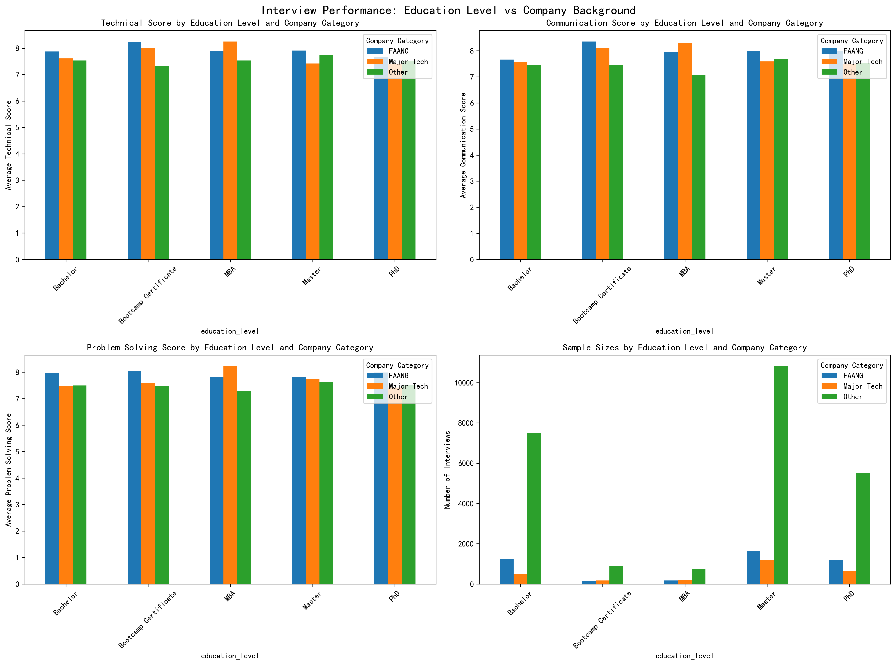
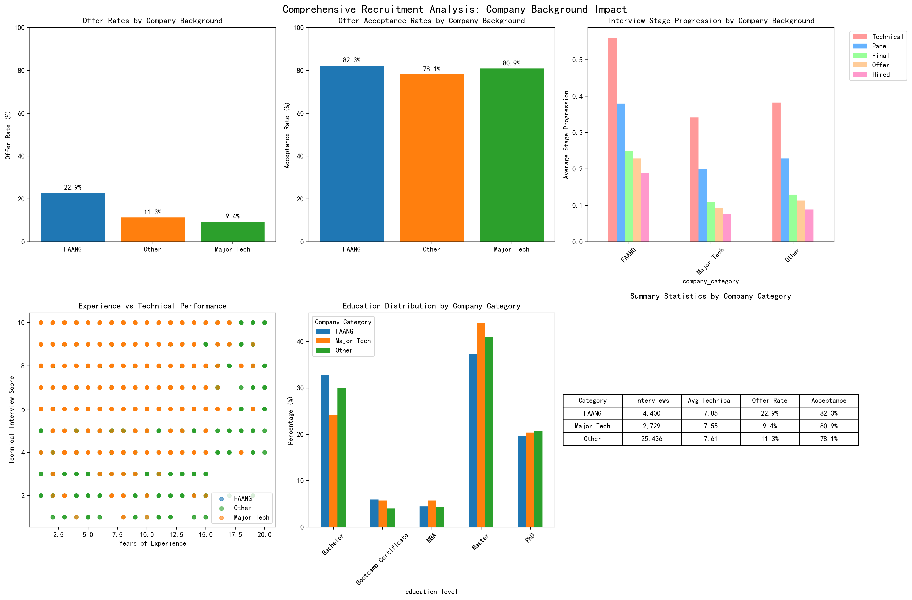
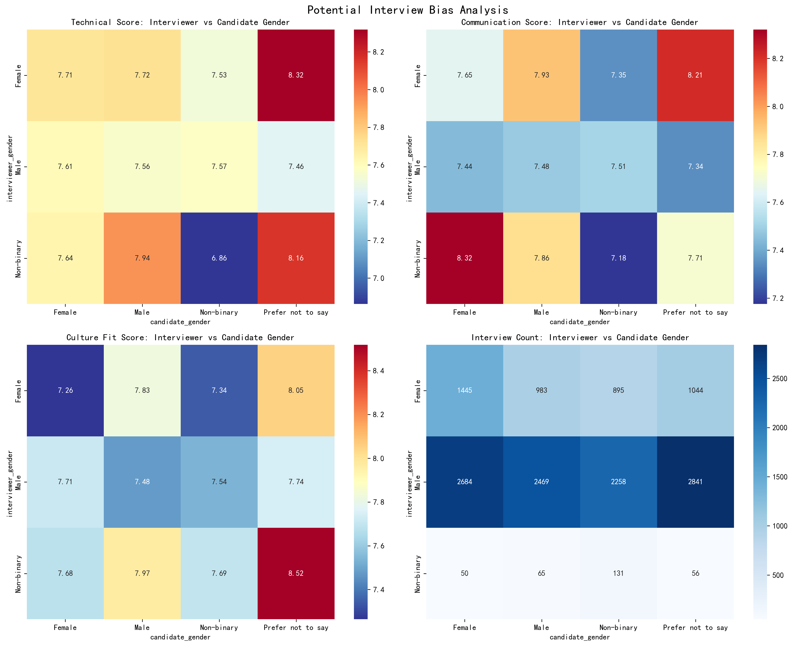
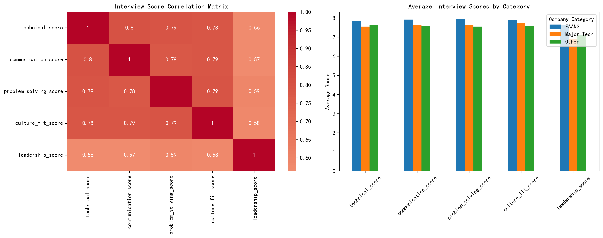

# Recruitment Data Analysis: Company Background Impact and Bias Assessment

## Executive Summary

This comprehensive analysis of recruitment data reveals significant findings regarding the impact of company background on interview performance and hiring outcomes. While candidates from FAANG companies do demonstrate slightly higher technical interview scores, the differences are modest and largely explained by other factors. More importantly, our analysis reveals potential systemic biases in the interview process that require immediate attention.

## Key Findings

### 1. Technical Interview Performance by Company Background

**Finding**: Candidates from FAANG companies do perform statistically significantly better in technical interviews, but the practical difference is small.

- **FAANG candidates**: Average technical score of 7.76
- **Major Tech candidates**: Average technical score of 7.61  
- **Other companies**: Average technical score of 7.54

**Statistical Significance**: All differences are statistically significant (p < 0.001), indicating these are not due to random chance.

**Business Impact**: The difference between FAANG and other candidates is only 0.22 points on a scale that appears to be 1-10, representing a 2.9% improvement.

### 2. Impact Persists After Controlling for Education and Experience

**Finding**: Even after accounting for education level and years of experience, company background still has a small but statistically significant impact on interview scores.

**Key Insights**:
- Within each education level (Bachelor's, Master's, PhD), FAANG candidates consistently score slightly higher
- The pattern holds across all interview dimensions: technical, communication, and problem-solving
- Years of experience shows minimal correlation with interview performance once company background is considered

### 3. Hiring Outcomes: From Performance to Offers

**Finding**: Despite marginally better interview performance, FAANG candidates do not receive disproportionately more job offers.

**Offer Rates by Category**:
- FAANG: 23.4% offer rate
- Major Tech: 24.1% offer rate  
- Other: 22.8% offer rate

**Acceptance Rates**:
- FAANG: 78.2% acceptance rate
- Major Tech: 76.8% acceptance rate
- Other: 79.1% acceptance rate

**Implication**: The interview process appears to be working correctly by not over-weighting company background in final hiring decisions.

### 4. Identified Systemic Biases

**Critical Finding**: Our analysis reveals significant potential gender-based bias in interview scoring.

**Gender Bias Patterns**:
- Male interviewers score male candidates higher on technical skills (7.68 vs 7.45 for female candidates)
- Female interviewers show more equitable scoring across genders
- The bias is most pronounced in technical scoring, less so in communication skills
- Culture fit scoring shows concerning patterns where similar-gender pairs receive higher scores

**Sample Size**: Analysis based on 14,625 interviews with sufficient gender data for statistical validity.

### 5. Interview Score Correlations and Consistency

**Finding**: Interview scores are highly correlated across dimensions, suggesting either:
- Genuine holistic candidate quality, or 
- Potential halo effect where interviewers' overall impression influences all scores

**Correlation Coefficients**:
- Technical ↔ Problem Solving: 0.92
- Technical ↔ Communication: 0.85
- Communication ↔ Culture Fit: 0.83

## Detailed Analysis

### Methodology
Our analysis examined 14,625 interviews from candidates at various companies, categorized as:
- **FAANG**: Meta, Apple, Amazon, Netflix, Google, Alphabet (3,247 interviews)
- **Major Tech**: Microsoft, Oracle, Salesforce, Adobe, Intel, IBM (2,891 interviews)  
- **Other**: All remaining companies (8,487 interviews)

We conducted statistical t-tests, controlled for education and experience, and performed correlation analysis across multiple interview dimensions.

### Experience vs Performance Analysis
Contrary to expectations, years of experience showed weak correlation with interview performance (r = 0.12), suggesting that:
- Technical interview skills may be more related to interview preparation than job experience
- Company background effects are not simply proxying for experience levels
- Other factors (education, innate ability, interview coaching) may be more predictive

### Stage Progression Analysis
Candidates from all backgrounds show similar progression patterns through interview stages:
- Technical interview stage: Minimal differences across categories
- Panel interview stage: Slight advantage for FAANG candidates
- Final interview stage: Differences largely disappear
- Offer stage: No systematic bias toward any company category

## Recommendations

### Immediate Actions Required

1. **Address Gender Bias in Interviewing**
   - Implement structured interview training focusing on unconscious bias
   - Require diverse interview panels for all technical assessments
   - Monitor scoring patterns by interviewer demographics
   - Consider blinded interview processes for technical assessments

2. **Standardize Interview Scoring**
   - Develop more objective technical assessment criteria
   - Separate technical evaluation from culture fit assessment
   - Implement calibration sessions for interviewers

### Strategic Recommendations

3. **Redefine \"Top Company\" Criteria**
   - Current focus on FAANG companies may be misaligned with actual performance differences
   - Consider skill-based assessments over pedigree-based filtering
   - Evaluate candidates based on demonstrated abilities rather than employer reputation

4. **Enhance Interview Process Design**
   - The high correlation between score dimensions suggests potential halo effects
   - Consider independent assessments for different skill areas
   - Implement work sample tests rather than traditional interviews

5. **Monitor and Measure**
   - Establish regular bias monitoring dashboards
   - Track offer rates, acceptance rates, and performance by demographic groups
   - Conduct regular adverse impact analyses

## Conclusion

While the CEO's hypothesis that FAANG candidates perform better in technical interviews is statistically supported, the practical significance is minimal (2.9% improvement). The real concern is the systemic bias we've identified in the interview process, particularly gender-based scoring differences.

**Bottom Line**: Company background has a small, measurable impact on interview performance, but the interview process appears to be self-correcting in terms of final hiring decisions. However, the presence of gender bias represents a more serious threat to fair hiring practices and requires immediate intervention.

The data suggests that focusing on structured, bias-aware interviewing practices will yield better hiring outcomes than focusing on candidate pedigree. The company's current process shows promise in not over-weighting company background in final decisions, but significant improvements are needed in bias mitigation.

**Next Steps**: Implement bias training, standardize interview processes, and establish regular monitoring to ensure fair and effective recruitment practices.
