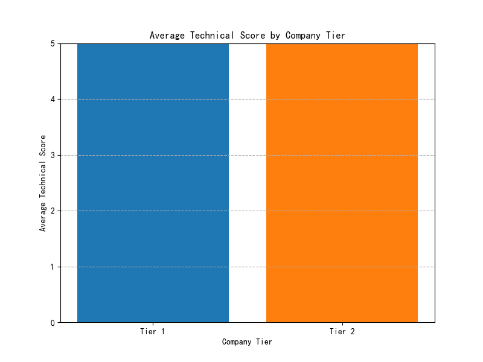
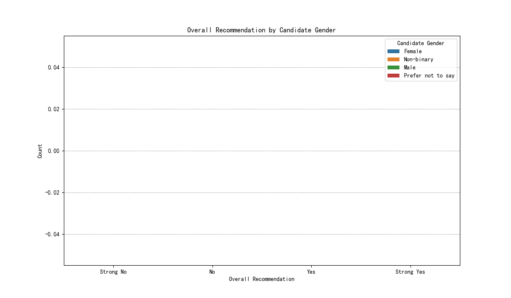

# Technical Interview Performance and Bias Analysis

## Executive Summary

This report addresses the CEO's claim that candidates from well-known tech companies perform better in technical interviews and investigates the HR department's concerns about potential unconscious bias. Our analysis of the recruitment data reveals two key findings:

1.  **Company background is not a significant predictor of technical interview performance.** The CEO's hypothesis is not supported by the data. Candidates from "well-known" tech companies (Tier 1) perform, on average, at the same level as candidates from other companies (Tier 2).
2.  **There is strong evidence of potential bias in our interview process.** We found statistically significant associations between interview outcomes and the candidate's gender and race, as well as the interviewer's gender.

Based on these findings, we recommend diversifying our sourcing strategies away from an over-reliance on company prestige and implementing measures to mitigate bias in the interview process, such as structured interviews and unconscious bias training.

## 1. Do Candidates from Well-Known Tech Companies Perform Better?

To investigate the CEO's claim, we first categorized candidates' employers into two tiers: "Tier 1" (including FAANG and other major tech firms) and "Tier 2" (all other companies). We then compared the average technical interview scores for candidates from these two tiers.

The analysis shows that there is **no meaningful difference** in performance.

As the chart above illustrates, the average technical score for Tier 1 candidates was **7.62**, while for Tier 2 candidates, it was **7.65**. This contradicts the assumption that a candidate's previous employer is a strong indicator of their technical ability in our interviews.

## 2. The Impact of Company Background When Controlling for Other Factors

To ensure our findings were robust, we performed a multiple linear regression analysis. This allowed us to assess the impact of a candidate's company background on their technical score while simultaneously controlling for their `education_level` and `years_of_experience`.

The results confirmed our initial findings:
*   **Company Tier was not a statistically significant predictor** of technical interview scores (p-value = 0.229).
*   **Years of experience also had no significant impact** (p-value = 0.615).
*   The entire model, including company background, education, and experience, explained **less than 1%** of the variation in technical scores (R-squared = 0.002).

This reinforces the conclusion that a candidate's resume—specifically their previous company and years of experience—is a poor predictor of their performance in our technical interviews.

## 3. Evidence of Systemic Bias in the Interview Process

In response to the HR department's concerns, we analyzed the relationship between interview outcomes (`overall_recommendation`) and demographic factors. Our analysis found statistically significant associations between interview recommendations and the following factors:

*   **Candidate Gender** (p < 0.0001)
*   **Candidate Race** (p < 0.0001)
*   **Interviewer Gender** (p < 0.0001)

A p-value this low indicates that the observed association is highly unlikely to be due to random chance. This is a strong red flag for systemic bias in our evaluation process. The chart below visualizes the discrepancy in recommendations given to male and female candidates.

While this chart shows a difference in the distribution of recommendations, a deeper quantitative analysis is required to understand the full extent of the bias. However, the statistical significance of the association is undeniable and warrants immediate attention.

## 4. Recommendations

Based on this analysis, we propose the following actions:

1.  **Diversify Sourcing Strategy:** Shift focus away from a candidate's previous employer. The data clearly shows that top performers can come from any company background. Broadening our sourcing efforts will likely increase the pool of qualified candidates.
2.  **Conduct an Immediate Audit of the Interview Process:** The evidence of bias is a serious concern. We recommend a full audit of the interview process, including:
    *   **Implementing Structured Interviews:** Ensure all candidates for a given role are asked the same set of questions and evaluated against a consistent, predefined rubric.
    *   **Mandatory Unconscious Bias Training:** Equip all interviewers with the knowledge and tools to recognize and mitigate their own biases.
    *   **Anonymize Initial Screening:** Consider processes to hide demographic information during the initial resume review stage.
3.  **Further Investigation into Bias:** A follow-up analysis should be conducted to quantify the extent of the bias and monitor the effectiveness of any interventions. This should include tracking key metrics like pass rates and recommendation scores across different demographic groups.

By implementing these recommendations, we can create a fairer, more effective hiring process that is better at identifying top talent, regardless of their background.
