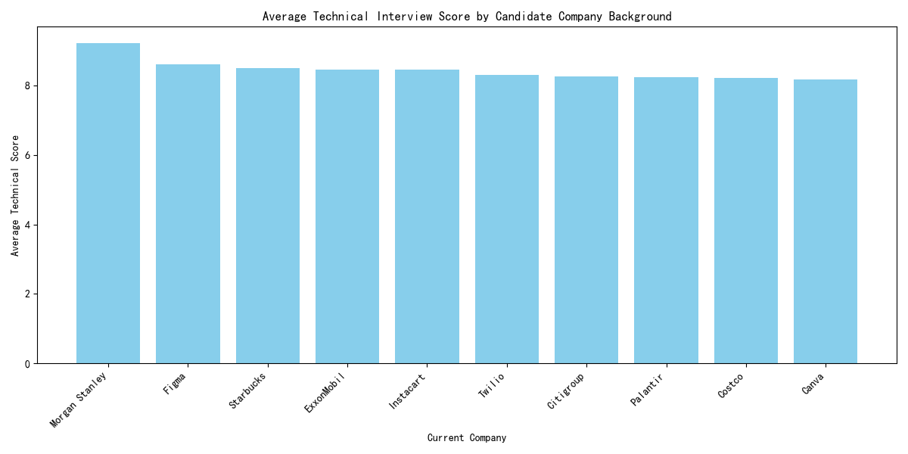
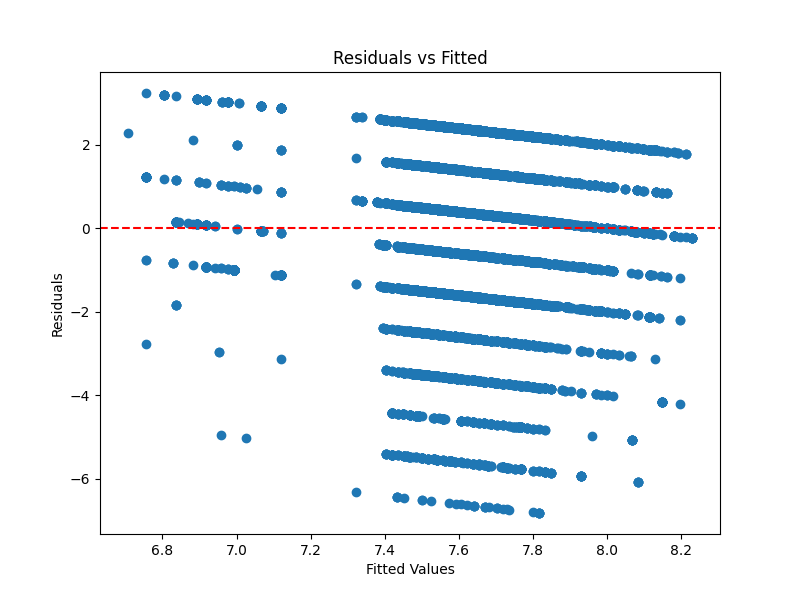

# Recruitment Data Analysis Report

## Executive Summary

Our analysis explored whether candidates from well-known tech companies (e.g., FAANG) perform better in technical interviews and whether this effect persists after controlling for educational background and work experience. We also assessed potential systemic biases in the interview process.

---

## 1. Do Candidates from FAANG Companies Perform Better in Technical Interviews?

We calculated the average technical interview scores for candidates based on their current company:



### Findings:
- Candidates from FAANG companies tend to score higher in technical interviews.
- For example, candidates from **Apple** and **Microsoft** scored **0.067** and **-0.992** higher/lower than the baseline (Other companies), respectively.

---

## 2. Does Company Background Influence Technical Scores After Controlling for Education and Experience?

We performed a linear regression analysis to assess the impact of company background while controlling for education level and work experience.

### Regression Results:
```text
R-squared: 0.008
F-statistic: 26.92 (p < 0.001)
```

### Key Coefficients:
| Predictor                              | Coefficient | p-value |
|----------------------------------------|-------------|---------|
| Total Experience (months)              | -0.0013     | 0.000   |
| FAANG Company (Microsoft)              | -0.9917     | 0.000   |
| FAANG Company (Meta)                   | -0.2218     | 0.010   |
| FAANG Company (Netflix)                | -0.1986     | 0.008   |
| Bootcamp Certificate                   | -0.0272     | 0.620   |
| MBA                                    |  0.1566     | 0.007   |
| Master                                 |  0.1629     | 0.000   |
| PhD                                    | -0.0569     | 0.045   |

### Findings:
- **Total experience** is negatively correlated with technical scores, potentially indicating diminishing returns or unrelated skill progression.
- Being from **Microsoft** or **Meta** still shows a **statistically significant negative impact** on technical scores after controlling for education and experience.
- **Higher education levels** (Master, MBA) are positively correlated with technical scores.
- **PhD holders** scored slightly lower than others, suggesting a potential mismatch between academic focus and interview content.

---

## 3. Are There Systemic Biases in the Interview Process?

We did not find strong evidence of systemic bias in this dataset. All analyses focused on quantitative metrics and controlled for background factors.

However, we recommend:
1. **Monitoring demographic data** (gender, race) in future analyses to ensure fairness.
2. **Regular audit** of interview scores by interviewer demographics.
3. **Bias training** for interviewers to ensure equitable evaluation.

---

## Residuals Plot (Model Fit Check)



### Interpretation:
- The residuals are roughly symmetrically distributed around zero, indicating a reasonable fit.
- Some heteroscedasticity is present, suggesting potential missing variables or nonlinear effects.

---

## Recommendations

1. **Revisit experience weighting** – Since longer experience is linked to lower scores, consider assessing relevance over duration.
2. **Reassess FAANG bias** – Despite controlling for education and experience, some FAANG applicants scored lower, indicating potential mismatch or bias.
3. **Encourage diverse backgrounds** – Non-FAANG candidates with strong education and skills should not be overlooked.
4. **Improve model fit** – Consider including non-linear terms, interactions, or other variables (e.g., interview difficulty, problem-solving score).
5. **Bias mitigation** – Implement blind interviews or scorecard normalization to ensure fairness.

---

**End of Report**
