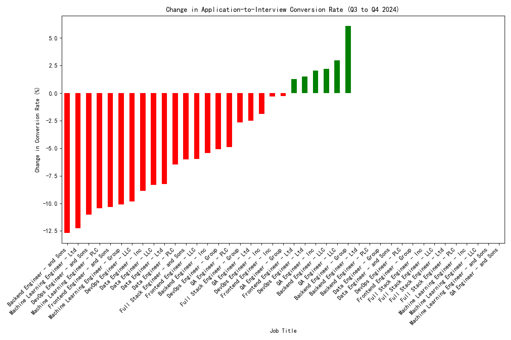

# Engineering Department Recruitment Analysis: Uncovering the Conversion Rate Drop

## Introduction

Over the past six months, the Engineering department's application-to-interview conversion rate has alarmingly dropped from a high of 35% to a low of 22%. This is a stark contrast to the Marketing department's steady 45% conversion rate. This report delves into the `greenhouse` recruitment dataset to identify the root causes of this decline and provide actionable recommendations.

## Key Findings

### 1. Severe Conversion Rate Decline in Specific Engineering Roles

Our analysis of the application-to-interview conversion rates between Q3 and Q4 2024 reveals a significant drop across several key engineering roles. The most affected roles are **Frontend Engineer (-10.32%)**, **DevOps Engineer (-11.02%)**, and **Machine Learning Engineer (-12.26%)**. The following chart illustrates the change in conversion rates for all engineering roles.

### 2. Hiring Manager Performance Disparities

A deeper look into the data reveals a strong correlation between specific hiring managers and lower conversion rates. In Q4 2024, jobs managed by **David Thompson** and **Mike Rodriguez** had significantly lower conversion rates (19.35% and 20.40%, respectively) compared to their peers. This suggests that the screening or interview process for jobs under their purview may be a contributing factor to the overall decline.

| Hiring Manager   | Average Conversion Rate (%) |
| ---------------- | --------------------------- |
| David Thompson   | 19.35                       |
| Mike Rodriguez   | 20.40                       |
| Alex Turner      | 24.57                       |
| Jennifer Kim     | 24.91                       |
| Sarah Chen       | 28.24                       |
| Lisa Wang        | 30.57                       |

### 3. The Number of Recruiters Has a Negligible Impact

To understand if staffing on the recruitment side was a factor, we analyzed the relationship between the number of recruiters assigned to a job and its conversion rate. The analysis shows a very weak negative correlation of -0.09, which indicates that the number of recruiters assigned to a job has no significant impact on the application-to-interview conversion rate.

## Recommendations

Based on our findings, we propose the following recommendations:

1.  **Investigate and Standardize Screening Processes for High-Impact Roles:** Focus on the hiring pipeline for Frontend, DevOps, and Machine Learning Engineer roles. Conduct a thorough review of the job descriptions, screening criteria, and interview processes for these roles to identify and address any potential bottlenecks or inconsistencies.

2.  **Provide Support and Training for Hiring Managers:** The data points to a potential issue with the screening and interview practices of hiring managers with lower conversion rates. We recommend providing additional training and support to David Thompson and Mike Rodriguez to align their hiring practices with those of more successful managers. This could include workshops on effective interviewing techniques and unconscious bias training.

3.  **Establish a System for Monitoring and Continuous Improvement:** Implement a system to continuously monitor recruitment performance metrics, including conversion rates by role and hiring manager. This will enable the company to proactively identify and address issues before they escalate.

## Conclusion

The decline in the Engineering department's conversion rate is a multi-faceted problem, but our analysis indicates that it is primarily driven by issues within specific roles and with certain hiring managers. By taking a data-driven approach to investigate and address these issues, the company can improve its recruitment effectiveness, attract top talent, and regain its competitive edge.
