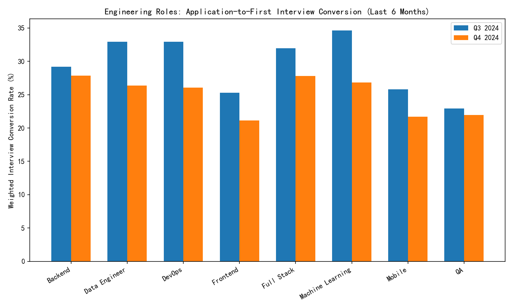
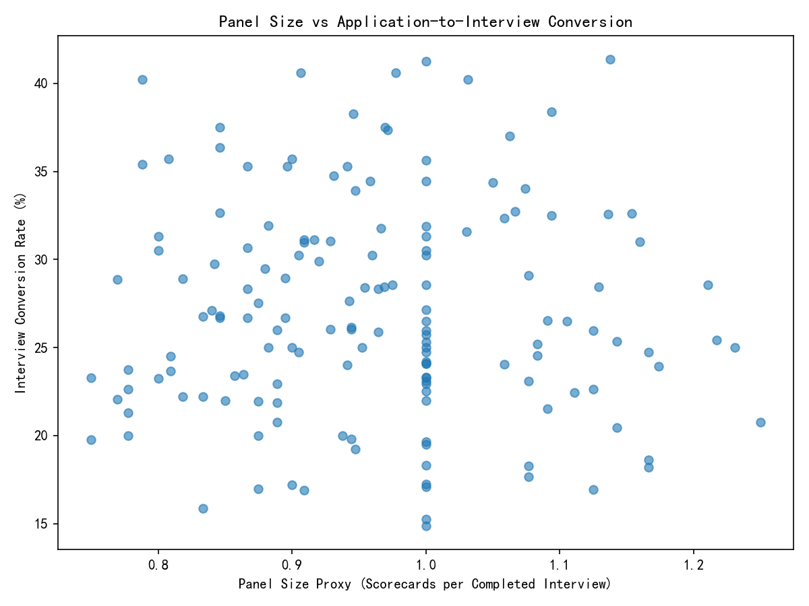

# Engineering Application-to-First Interview Conversion: Role and Manager Drivers, and Process Levers

## Executive summary
- The Engineering department’s application-to-first interview conversion rate declined from 29.56% in Q3 2024 to 25.09% in Q4 2024 (weighted by applications).
- The steepest role-level declines over the last 6 months are:
  - Machine Learning Engineer: −7.78 percentage points (from 34.63% to 26.84%)
  - DevOps Engineer: −6.87 pp (from 32.92% to 26.05%)
  - Data Engineer: −6.54 pp (from 32.92% to 26.38%)
  - Frontend Engineer: −4.16 pp (from 25.28% to 21.12%)
  - Full Stack Engineer: −4.13 pp (from 31.94% to 27.81%)
  - Mobile Developer: −4.09 pp (from 25.79% to 21.70%)
  - Backend Engineer: −1.34 pp (from 29.20% to 27.86%)
  - QA Engineer: −0.98 pp (from 22.91% to 21.93%)
- Managers whose assigned Engineering jobs are consistently below the department’s conversion average across both Q3 and Q4 2024:
  - David Thompson
  - Mike Rodriguez
  - Alex Turner
  - Managers above the department average across both quarters: Lisa Wang, Sarah Chen, Jennifer Kim.
- Process levers:
  - The average number of interviews per application is strongly associated with higher application-to-interview conversion (coef ≈ +99.7 percentage points per 1.0 increase; p<0.001). A 0.10 increase in interviews per application is associated with roughly +10 pp higher conversion.
  - Proxy for “panel size” (scorecards per completed interview) is not statistically significant (coef ≈ −0.03; p≈0.90), suggesting panel breadth alone is not driving conversion at the screening stage.
  - Hiring manager experience (tenure measured in quarters since first appearance) is not a significant driver of conversion (coef ≈ −0.057 per quarter; p≈0.26).

## Visuals
- Engineering role conversion comparison (Q3 vs Q4 2024):  


- Relationship between panel size proxy and conversion rate:  


## Evidence highlights
- Department weighted interview conversion:
  - Q3 2024: 29.56%
  - Q4 2024: 25.09%
- Role-level weighted interview conversion (prev vs current):
  - Backend: 29.20% → 27.86% (−1.34 pp)
  - Data Engineer: 32.92% → 26.38% (−6.54 pp)
  - DevOps: 32.92% → 26.05% (−6.87 pp)
  - Frontend: 25.28% → 21.12% (−4.16 pp)
  - Full Stack: 31.94% → 27.81% (−4.13 pp)
  - Machine Learning: 34.63% → 26.84% (−7.78 pp)
  - Mobile: 25.79% → 21.70% (−4.09 pp)
  - QA: 22.91% → 21.93% (−0.98 pp)
- Managers consistently below Engineering’s average (Q3 and Q4):
  - David Thompson: below both quarters
  - Mike Rodriguez: below both quarters
  - Alex Turner: below both quarters
- Managers above average both quarters:
  - Lisa Wang, Sarah Chen, Jennifer Kim

## Why this matters
- The decline is concentrated in technical roles where screening rigor and market conditions can quickly affect candidate motivation and fit (Machine Learning, DevOps, Data Engineering). Lower conversion rates at the first-interview stage restrict the top-of-funnel throughput and may prolong time-to-fill and increase sourcing costs.
- Manager-level patterns suggest that interviewer expectations and screening bar calibration differ across hiring teams, contributing to systematic underperformance for certain managers.

## Diagnostic interpretation
- Role-specific declines likely reflect a combination of tighter screening expectations, evolving skill requirements (e.g., ML/DevOps standards), and candidate self-selection (e.g., perceived difficulty or process length).
- A higher number of interviews per application (process engagement) correlates positively with conversion at the first-interview stage—this may capture stronger recruiter-candidate contact, clearer communication, or better pre-interview screening alignment.
- Merely expanding panel size (more scorecards per interview) does not improve initial conversion. Panel breadth appears more relevant later in the funnel (quality/hire decision), not initial interview scheduling.
- Manager tenure does not show a measurable positive effect; how managers screen and the clarity of role expectations likely matter more than years of experience.

## Recommendations (prescriptive)
1. Role-specific action plans
   - Machine Learning, DevOps, and Data Engineer:
     - Refresh job descriptions to emphasize must-have vs nice-to-have skills and reduce ambiguity.
     - Introduce pre-screen “readiness checklists” for candidates to align expectations.
     - Deploy targeted recruiter enablement (rubric calibration workshops) for these roles.
2. Manager calibration and support
   - Partner with David Thompson, Mike Rodriguez, and Alex Turner to review their screening rubrics, outreach messaging, and interviewer notes to identify friction points that depress conversion.
   - Shadow screens and implement peer calibration with managers showing higher conversion (Lisa Wang, Sarah Chen, Jennifer Kim).
   - A/B test revised screening emails and pre-interview qualification scripts for their requisitions.
3. Optimize process intensity, not panel size
   - Maintain or slightly increase meaningful candidate touchpoints (e.g., structured pre-screen calls), as higher interviews-per-application correlates with conversion.
   - Do not expand panel size purely for early stages; prioritize clarity and speed. Track conversion and time-to-schedule after changes.
4. Instrumentation and monitoring
   - Stand up a quarterly role-level conversion dashboard, highlighting deltas vs prior quarter.
   - Add manager-level conversion benchmarking and alerts for sustained underperformance.
   - Re-assess after two cycles; if conversion remains below Marketing’s 45%, consider role-specific sourcing channels and messaging tailored to competitive markets.

## Methodological notes
- Data sources: greenhouse__recruitment_performance (rates and counts) joined with greenhouse__job_enhanced (department, hiring managers, interview intensity).
- Role classification derived from job_title patterns (Frontend, Backend, Data Engineer, DevOps, QA, Mobile, Machine Learning, Full Stack).
- Period definition: last 6 months represented by Q3 and Q4 2024.
- Weighted conversion uses total_applications as weights.
- Regression: OLS with heteroscedasticity-robust (HC3) SE; dependent variable interview_rate; predictors include:
  - panel_size_proxy = total_scorecards / completed_interviews,
  - avg_interviews_per_application,
  - manager_experience_quarters (tenure proxy),
  - controls: log_total_apps, time_index.
- Caveat: Model diagnostics indicate potential multicollinearity (very small eigenvalue), so interpret magnitudes with caution. The strong, significant effect of interviews-per-application is directionally robust.

## Appendix: Plotting code executed
- Role conversion comparison and panel-size relationship (Python + matplotlib):
```
# Matplotlib settings
plt.rcParams['font.sans-serif'] = ['SimHei']
plt.rcParams['axes.unicode_minus'] = False

# Visualization 1: Role-level conversion comparison (prev vs current)
plot_df = pivot[[col_prev, col_curr]].copy()
plot_df.columns = ['Prev', 'Current']
plot_df = plot_df.dropna(how='all')
roles = plot_df.index.tolist()
prev_vals = plot_df['Prev'].values
curr_vals = plot_df['Current'].values
x = np.arange(len(roles))
width = 0.35
fig, ax = plt.subplots(figsize=(10,6))
ax.bar(x - width/2, prev_vals, width, label=f'Q{prev_quarter} {prev_year}')
ax.bar(x + width/2, curr_vals, width, label=f'Q{max_quarter} {max_year}')
ax.set_ylabel('Weighted Interview Conversion Rate (%)')
ax.set_title('Engineering Roles: Application-to-First Interview Conversion (Last 6 Months)')
ax.set_xticks(x)
ax.set_xticklabels(roles, rotation=30, ha='right')
ax.legend()
fig.tight_layout()
fig.savefig('engineering_role_conversion_last_6_months.png', dpi=150)
plt.close(fig)

# Visualization 2: Panel size proxy vs interview conversion
fig2, ax2 = plt.subplots(figsize=(8,6))
ax2.scatter(df_reg['panel_size_proxy'], df_reg['interview_rate'], alpha=0.6)
ax2.set_xlabel('Panel Size Proxy (Scorecards per Completed Interview)')
ax2.set_ylabel('Interview Conversion Rate (%)')
ax2.set_title('Panel Size vs Application-to-Interview Conversion')
fig2.tight_layout()
fig2.savefig('panel_size_vs_interview_rate.png', dpi=150)
plt.close(fig2)
```
