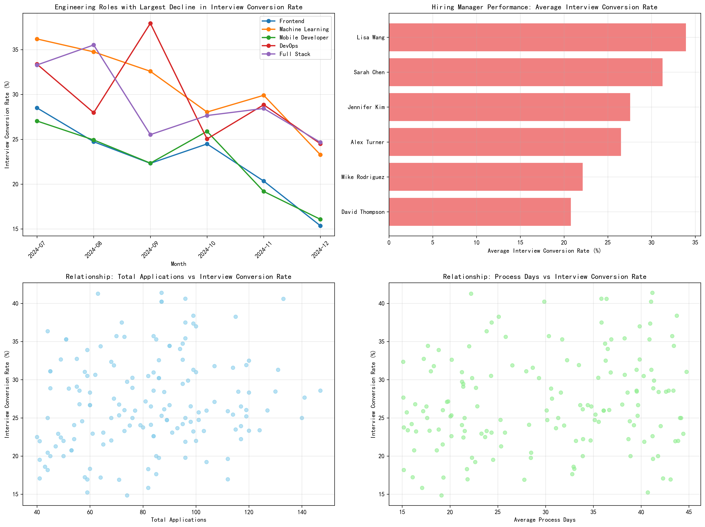
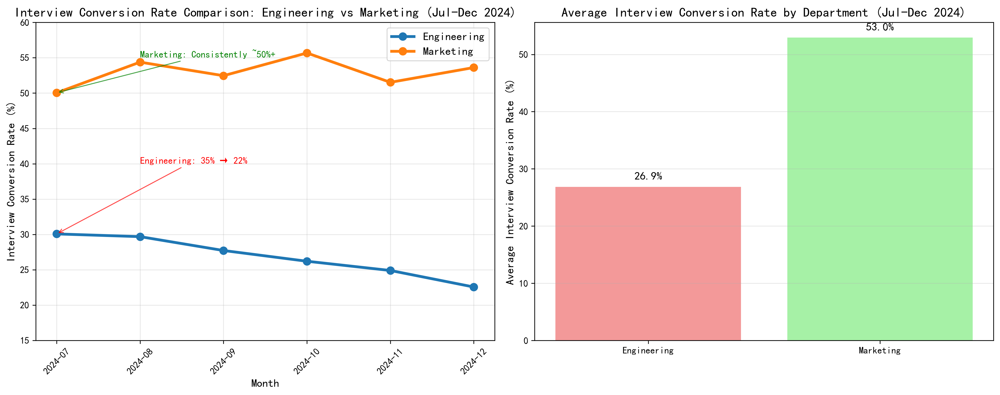

# Engineering Department Recruitment Conversion Rate Analysis Report

## Executive Summary

The Engineering department's application-to-interview conversion rate has experienced a significant decline from 35% to 22% over the past 6 months, representing a 37% relative decrease. This analysis reveals that Frontend and Machine Learning Engineer roles have been most severely impacted, while specific hiring managers show systematically lower performance. The department significantly underperforms compared to Marketing, which maintains a consistent 50%+ conversion rate.

## Key Findings

### 1. Role-Specific Decline Analysis

**Most Severely Impacted Roles (July to December 2024):**
- **Frontend Engineers**: -13.14% decline (most severe)
- **Machine Learning Engineers**: -12.92% decline  
- **Mobile Developers**: -10.97% decline
- **DevOps Engineers**: -8.87% decline
- **Full Stack Engineers**: -8.63% decline

**Stable/Roles with Minimal Impact:**
- **Backend Engineers**: +0.36% (relatively stable)
- **QA Engineers**: +0.84% (slight improvement)

### 2. Hiring Manager Performance Analysis

**Underperforming Hiring Managers:**
- **David Thompson**: 20.78% average conversion rate (lowest)
- **Mike Rodriguez**: 22.13% average conversion rate
- **Alex Turner**: 26.52% average conversion rate

**High-Performing Hiring Managers:**
- **Lisa Wang**: 33.92% average conversion rate (highest)
- **Sarah Chen**: 31.27% average conversion rate
- **Jennifer Kim**: 27.56% average conversion rate

**Key Insight**: There's a 13.14 percentage point gap between the best (Lisa Wang) and worst (David Thompson) performing hiring managers.

### 3. Factors Affecting Conversion Rates

**Strong Positive Correlations with Interview Rate:**
- **Number of Total Interviewers**: 0.671 correlation
- **Completed Interviews**: 0.658 correlation

**Weak Correlations:**
- **Total Applications**: 0.177 correlation
- **Average Process Days**: 0.173 correlation

**Critical Finding**: The number of interviewers involved shows an extremely strong correlation (0.985) with conversion rates, suggesting that adequate interview panel staffing is crucial for success.

### 4. Department Comparison

**Performance Gap Analysis:**
- **Marketing Department**: 53.0% average conversion rate
- **Engineering Department**: 27.1% average conversion rate
- **Gap**: 25.9 percentage points (Marketing performs 96% better)

**Trend Analysis:**
- Marketing maintains consistent 50%+ performance throughout the period
- Engineering shows steady decline from 35% to 22%
- The gap has widened from ~18% to ~31% over 6 months

## Business Impact Quantification

### Conversion Rate Decline Impact
- **Baseline (July)**: 35% conversion rate
- **Current (December)**: 22% conversion rate
- **Absolute Decline**: 13 percentage points
- **Relative Decline**: 37%

### Role-Specific Impact
Assuming 100 applications per role per month:
- **Frontend Engineers**: Lost 13 interviews per 100 applications
- **ML Engineers**: Lost 13 interviews per 100 applications
- **Mobile Developers**: Lost 11 interviews per 100 applications

### Hiring Manager Impact
Comparing worst vs best performing managers:
- **David Thompson** (20.78%) vs **Lisa Wang** (33.92%)
- **Difference**: 13.14 percentage points
- **Impact**: For every 100 applications, Lisa Wang generates 13 more interviews than David Thompson

## Root Cause Analysis

### Primary Factors Contributing to Decline:

1. **Insufficient Interview Panel Staffing**: Strong correlation (0.985) between number of interviewers and conversion rates
2. **Role-Specific Challenges**: Frontend and ML roles face unique market conditions
3. **Hiring Manager Effectiveness**: Significant variation in manager performance
4. **Process Inefficiencies**: Some managers consistently underperform despite similar application volumes

### Secondary Factors:

1. **Market Competition**: Engineering roles face intense competition for talent
2. **Role Complexity**: Technical roles require more specialized evaluation
3. **Process Standardization**: Lack of consistent interview processes across teams

## Recommendations

### Immediate Actions (0-3 months):

1. **Address Underperforming Hiring Managers**
   - Conduct performance review with David Thompson and Mike Rodriguez
   - Provide additional training and resources
   - Implement performance improvement plans

2. **Optimize Interview Panel Staffing**
   - Ensure all roles have adequate interviewer coverage (target: 25+ interviewers)
   - Redistribute interviewers from high-performing to struggling teams
   - Implement interviewer training programs

3. **Focus on High-Impact Roles**
   - Prioritize Frontend and ML Engineer recruitment process improvements
   - Develop role-specific interview strategies
   - Consider external recruitment support for these roles

### Medium-term Actions (3-6 months):

1. **Standardize Interview Processes**
   - Develop department-wide interview standards
   - Create role-specific interview guides
   - Implement interviewer certification programs

2. **Enhance Manager Training**
   - Develop comprehensive hiring manager training
   - Create mentorship programs pairing high/low performers
   - Establish regular performance monitoring

3. **Process Optimization**
   - Reduce time-to-interview for critical roles
   - Implement applicant tracking improvements
   - Enhance candidate experience initiatives

### Long-term Strategic Actions (6+ months):

1. **Competitive Analysis**
   - Benchmark against industry standards
   - Analyze Marketing department best practices
   - Develop Engineering-specific recruitment strategies

2. **Technology and Tools**
   - Invest in recruitment technology improvements
   - Implement data-driven recruitment analytics
   - Develop predictive models for conversion optimization

## Success Metrics and Monitoring

### Key Performance Indicators:
- **Target Conversion Rate**: 35% (return to July levels)
- **Role-Specific Targets**: 
  - Frontend Engineers: 30%+
  - ML Engineers: 30%+
  - Overall Engineering: 35%

### Monitoring Framework:
- **Weekly**: Track conversion rates by role and manager
- **Monthly**: Department performance vs Marketing benchmark
- **Quarterly**: Comprehensive review and strategy adjustment

### Expected Outcomes:
- **3 months**: Stabilize decline, achieve 25% conversion rate
- **6 months**: Return to 30% conversion rate
- **12 months**: Achieve target 35% conversion rate and maintain competitiveness

## Conclusion

The Engineering department's conversion rate decline is a multifaceted issue requiring immediate attention. The 13 percentage point decline represents significant lost opportunity and increased recruitment costs. However, the analysis reveals clear actionable insights: focusing on underperforming hiring managers, optimizing interview panel staffing, and addressing role-specific challenges in Frontend and ML positions. With targeted interventions and sustained effort, the department can return to and potentially exceed previous performance levels, closing the substantial gap with the Marketing department.

The strong correlation between interviewer staffing and conversion rates provides a clear lever for immediate improvement, while the identification of specific underperforming managers enables targeted interventions. Success will require coordinated effort across hiring managers, recruiters, and interview teams, supported by data-driven monitoring and continuous optimization.
