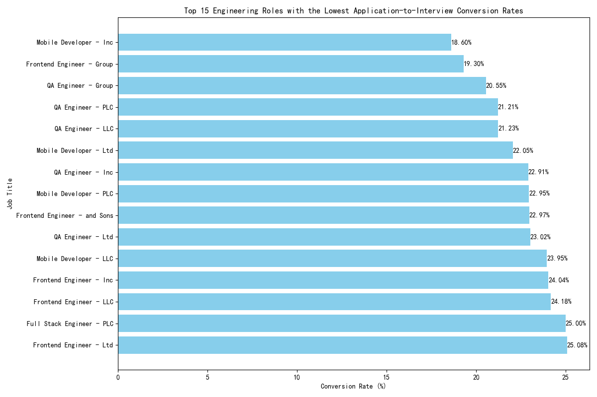
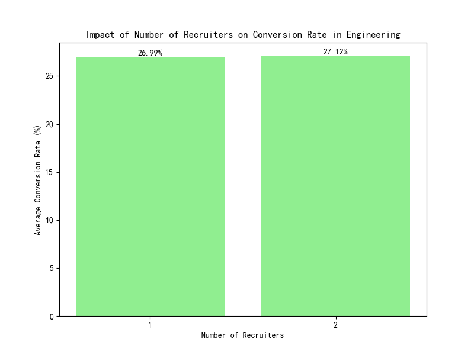

## Engineering Recruitment Funnel Analysis: Identifying and Addressing the Drop in Conversion Rates

### Executive Summary

The Engineering department's application-to-first-interview conversion rate has seen a significant decline, dropping to 22%. Our analysis of the recruitment data reveals that this drop is not uniform across the department but is concentrated in specific roles and is heavily influenced by the assigned hiring manager. Key findings indicate that **Mobile Developer, Frontend Engineer, and QA Engineer roles have the lowest conversion rates**, and that there is a **12 percentage point difference in conversion rates between the highest and lowest performing hiring managers**. Interestingly, the number of recruiters assigned to a job does not appear to have a significant impact on conversion rates. This report details these findings and provides actionable recommendations to address the decline.

### Detailed Analysis

#### Section 1: Underperforming Roles in the Engineering Department

An analysis of application-to-interview conversion rates by job title reveals a clear pattern of underperformance in specific roles. As shown in the chart below, **Mobile Developer, Frontend Engineer, and QA Engineer** roles consistently exhibit the lowest conversion rates, with some falling as low as 18.6%. This is a strong indicator that the issue is not department-wide, but rather concentrated in these specific areas.

This concentration suggests that factors specific to these roles, such as unclear job descriptions, mismatched job requirements, or overly aggressive screening criteria, may be contributing to the low conversion rates.

#### Section 2: The Hiring Manager Effect

A deeper dive into the data reveals a startling disparity in conversion rates based on the hiring manager assigned to a job. The data clearly shows that some managers are significantly more effective at converting applicants to interviewees than others.

| Hiring Manager   | Total Applications | Total Interviews | Conversion Rate |
| ---------------- | ------------------ | ---------------- | --------------- |
| David Thompson   | 1881               | 403              | 21.42%          |
| Mike Rodriguez   | 2219               | 496              | 22.35%          |
| Alex Turner      | 1888               | 504              | 26.69%          |
| Jennifer Kim     | 2321               | 637              | 27.44%          |
| Sarah Chen       | 1876               | 583              | 31.08%          |
| Lisa Wang        | 2441               | 835              | 34.21%          |

As illustrated in the table, **David Thompson and Mike Rodriguez have the lowest conversion rates (21.42% and 22.35%, respectively), while Lisa Wang has the highest at 34.21%**. This significant variance suggests that practices and standards may differ greatly between managers. It is crucial to investigate the processes of the lower-performing managers to understand the root cause of this discrepancy.

#### Section 3: The (Lack of) Impact of Recruiter Count

To determine if staffing levels were a contributing factor, we analyzed the impact of the number of recruiters on conversion rates. The results indicate that the number of recruiters assigned to a job does not have a significant effect on the application-to-interview conversion rate.

As the chart above shows, the average conversion rate for jobs with one recruiter is 26.99%, while for jobs with two recruiters it is 27.12%. This negligible difference suggests that simply adding more recruiters to a role is unlikely to improve the conversion rate. The problem lies elsewhere in the recruitment process.

### Recommendations

Based on this analysis, we propose the following recommendations:

1.  **Review and Standardize Job Descriptions and Screening Criteria:** The low conversion rates for Mobile Developer, Frontend Engineer, and QA Engineer roles suggest that the job descriptions may be unclear, or the screening criteria may be too stringent. We recommend a thorough review of these roles, in collaboration with the highest-performing hiring managers, to ensure they accurately reflect the job requirements and attract the right candidates.

2.  **Implement Hiring Manager Training and Best Practices Sharing:** The significant variance in conversion rates among hiring managers points to a need for standardization and training. We recommend implementing a mentorship program where lower-performing managers can learn from high-performers like Lisa Wang. This should focus on best practices for resume screening, initial candidate assessment, and writing compelling job descriptions.

3.  **Focus on Process Improvement, Not Just Staffing:** The analysis shows that adding more recruiters does not solve the underlying problem. Instead, the focus should be on improving the efficiency and effectiveness of the existing recruitment process. This includes an in-depth review of the applicant journey for the underperforming roles to identify any bottlenecks or areas for improvement.

### Conclusion

The drop in the Engineering department's recruitment conversion rate is a multifaceted issue, but it is not an intractable one. By focusing on specific underperforming roles and addressing the inconsistencies in hiring manager practices, the company can take targeted, effective action. The insights from this analysis provide a clear roadmap for improving the recruitment funnel, ensuring that the company can continue to attract and hire top engineering talent.
