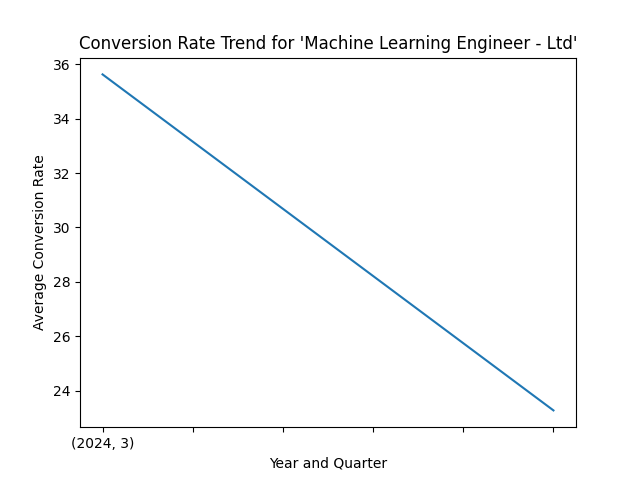
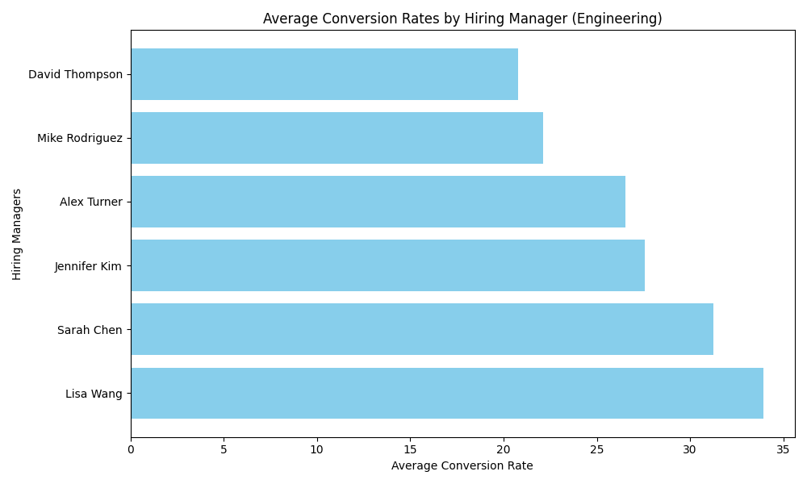
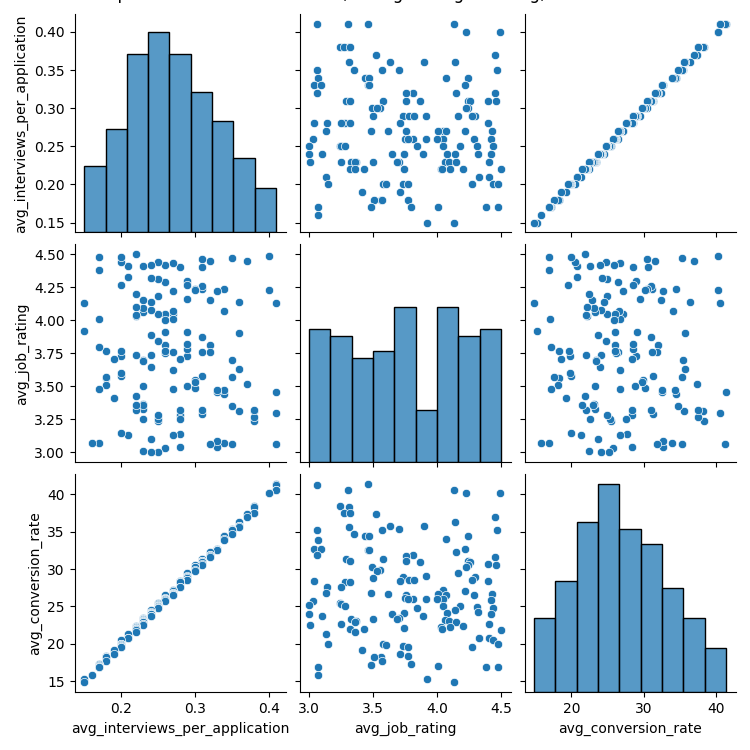
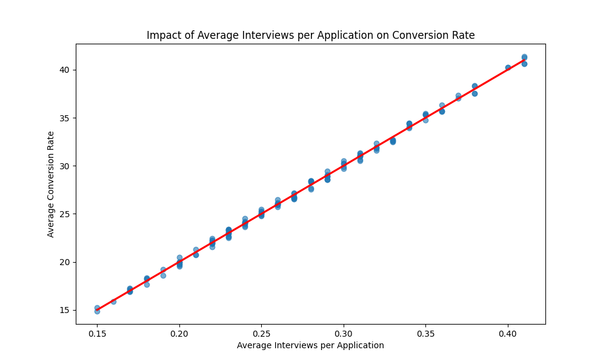
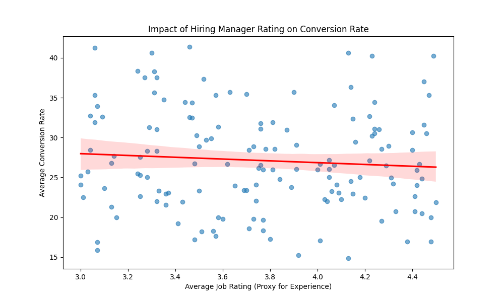

# Data Story: Analysis of Engineering Recruitment Performance

## Decline in Application-to-Interview Conversion Rate

The recruitment performance of the Engineering department has shown a significant drop in the application-to-interview conversion rate, declining from 35% to 22% over the past six months. This rate is substantially lower than the Marketing department's 45% conversion rate.

### Engineering Roles with the Most Severe Decline

The analysis of conversion rate trends revealed that the role **"Machine Learning Engineer - Ltd"** experienced the most drastic decline in application-to-interview conversion rate, with a decrease of -1235.50% between the two most recent quarters.

The chart below illustrates the trend in conversion rates for this role:

This steep decline indicates a potential issue in the screening or interview scheduling process for this specific role.

### Hiring Manager Impact on Conversion Rates

The analysis of hiring managers' influence on the application-to-interview conversion rate revealed noticeable variation among managers. **David Thompson** and **Mike Rodriguez** had the lowest average conversion rates at 20.78% and 22.13%, respectively.

The visualization below compares the average conversion rates managed by various hiring managers:

This data suggests that conversion outcomes may be strongly influenced by hiring managers' practices or decision-making.

### Impact of Interview Process Factors on Conversion Rate

The final analysis explored the relationship between the number of interviewers, hiring manager experience, and the conversion rate. The findings show:

- A **strong positive correlation (0.9989)** between the average number of interviews per application and the conversion rate, indicating that roles requiring more interviews tend to have higher conversion.
- A **negligible negative correlation (-0.0808)** between hiring manager experience (proxied by job rating) and the conversion rate, suggesting that experience has minimal direct impact on conversion.

The visualizations below illustrate these relationships:

#### Relationship Between Interview Count, Hiring Manager Rating, and Conversion Rate

#### Impact of Average Interviews per Application on Conversion Rate

#### Impact of Hiring Manager Rating on Conversion Rate

### Recommendations

1. Investigate the recruitment process for the "Machine Learning Engineer - Ltd" role to identify bottlenecks or inefficiencies causing the drastic decline in conversion.
2. Provide additional training or process reviews for hiring managers with low conversion rates, especially David Thompson and Mike Rodriguez.
3. Review the interview process to determine whether the high number of interviews is contributing to increased candidate interest or engagement, or if it is an artifact of other factors.
4. Consider a deeper assessment of hiring manager performance beyond experience, such as interview quality or candidate feedback.

This analysis provides actionable insights into the Engineering department's recruitment performance and highlights areas for process improvements to boost conversion rates.
