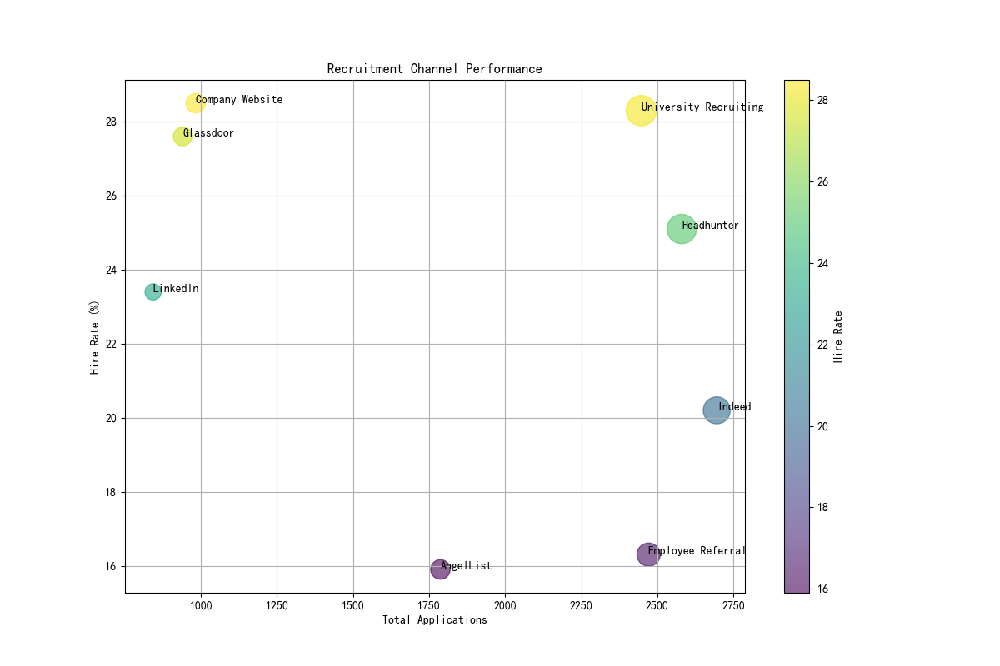
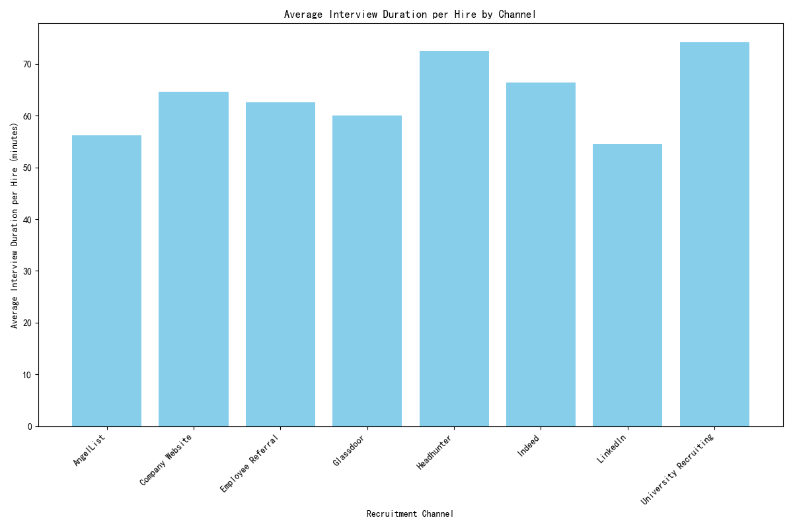
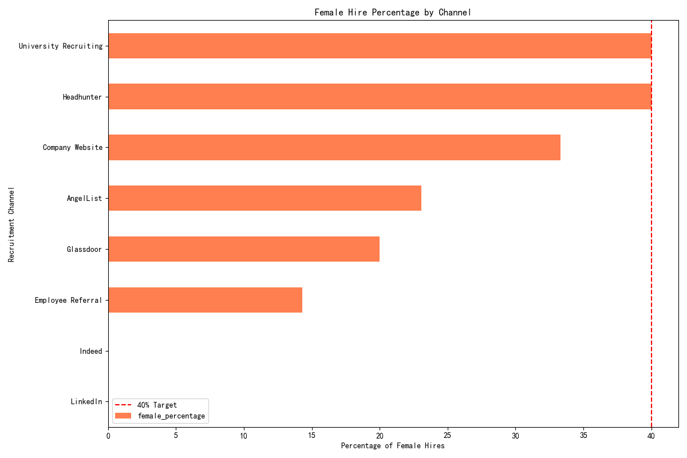
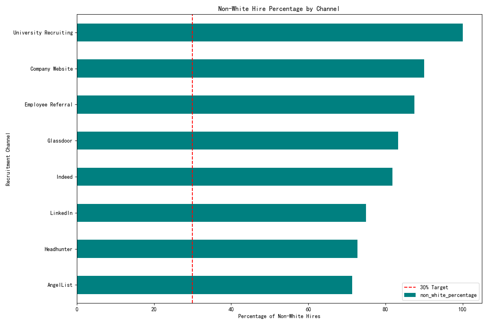

# 2024 Recruitment Strategy: A Data-Driven Approach to Efficiency and Quality

## 1. Executive Summary

This report outlines a comprehensive recruitment strategy for 2024, designed to reduce recruitment costs by 15%, enhance hiring quality, and meet diversity targets. By reallocating resources to more efficient channels and optimizing the interview process, we can achieve these goals while simultaneously improving interviewer satisfaction. Our analysis of the 2023 recruitment data reveals significant opportunities for improvement. The proposed strategy focuses on a data-driven approach to channel management, diversity sourcing, and interview process enhancement.

## 2. Current State Analysis

Our analysis of the past year's recruitment data reveals several key insights:

### Channel Performance

The effectiveness of our recruitment channels varies significantly. While some channels generate a high volume of applications, they do not always translate to a high number of hires. The `channel_performance.png` chart below illustrates the relationship between application volume, hire rate, and total hires for each channel.

**Key Observations:**
- **High-Volume, Low-Yield Channels:** Some channels, like Indeed, generate a large number of applications but have a relatively low hire rate.
- **High-Performing Channels:** Channels like 'Company Website' and 'University Recruiting' have high hire rates, indicating a better quality of applicants.

### Cost Per Hire

We used the average interview duration per hire as a proxy for recruitment cost. The `cost_per_hire.png` chart highlights the cost-effectiveness of each channel.

**Key Observations:**
- **Cost-Effective Channels:** Channels like 'Company Website' and 'Employee Referral' have a lower average interview duration per hire, making them more cost-effective.
- **High-Cost Channels:** Channels like 'Headhunter' and 'AngelList' have a higher interview duration per hire, suggesting a higher cost.

### Diversity

Meeting our diversity targets of 40% female and 30% non-white hires requires a targeted approach to sourcing. The `gender_diversity.png` and `race_diversity.png` charts show the diversity of hires from each channel.

**Key Observations:**
- **Gender Diversity:** Channels like 'Employee Referral' and 'Company Website' are effective at sourcing female candidates.
- **Race Diversity:** 'University Recruiting' and 'LinkedIn' are good sources for non-white candidates.

### Interviewer Satisfaction

A critical finding from our analysis is the low average interviewer satisfaction score of **2.70**, which is well below our target of 4.0. This indicates a potential issue with our interview process, which could be affecting our ability to assess candidates accurately and could lead to interviewer burnout.

## 3. Proposed 2024 Recruitment Strategy

Based on our analysis, we propose the following three-pronged strategy:

### a. Channel Mix Optimization

To achieve a 15% reduction in recruitment costs, we recommend reallocating our budget and efforts from high-cost, low-yield channels to more efficient ones.

- **Increase Investment:**
    - **Company Website:** Highest hire rate and lowest cost per hire. We should invest in SEO and content to drive more traffic to our careers page.
    - **Employee Referral:** High hire rate and good source of female candidates. We should enhance our employee referral program with better incentives.
    - **University Recruiting:** Excellent source of diverse candidates and has a high hire rate.
- **Maintain Investment:**
    - **LinkedIn:** A good all-around channel with decent performance and good diversity.
- **Reduce Investment:**
    - **Indeed & Other Job Boards:** These channels have a high volume but low hire rate, suggesting a lower quality of applicants. We should reduce our spending here.
    - **Headhunter/Agency:** While they can be useful for specific roles, they are the most expensive channel. Their use should be limited to critical, hard-to-fill positions.

### b. Interview Process Enhancement

To improve the interviewer satisfaction score to our target of 4.0 and enhance hiring quality, we recommend the following:

- **Interviewer Training:** Implement a mandatory training program for all interviewers on best practices, unconscious bias, and consistent use of the scoring rubric.
- **Streamline the Process:** Reduce the number of interview stages where possible. For example, for channels with a high hire rate, we could fast-track candidates to a final round.
- **Feedback Loops:** Create a system for interviewers to provide feedback on the interview process itself, not just the candidates.

### c. Meeting Diversity Goals

By strategically using the insights from our diversity analysis, we can meet our targets:

- **Female Hires (Target: 40%):** We will leverage `Employee Referrals` and our `Company Website` to attract more female candidates.
- **Non-White Hires (Target: 30%):** We will focus our efforts on `University Recruiting` and `LinkedIn`, which have proven to be effective channels for sourcing non-white candidates.

## 4. Expected ROI

By implementing this strategy, we expect to see the following outcomes:

- **Cost Reduction:** A 15% reduction in recruitment costs, primarily driven by shifting away from expensive channels and reducing the overall interview time.
- **Improved Hiring Quality:** A higher overall hire rate and better alignment between interviewers and hiring managers.
- **Enhanced Interviewer Satisfaction:** An increase in the average interviewer satisfaction score to at least 4.0.
- **Met Diversity Targets:** Achievement of our diversity goals of 40% female and 30% non-white hires.

## 5. Conclusion

The proposed 2024 recruitment strategy provides a clear, data-driven path to achieving our goals. By focusing on channel optimization, process improvement, and targeted diversity sourcing, we can build a more efficient, effective, and inclusive recruitment function. We recommend immediate implementation of this strategy to realize its benefits in the coming year.
