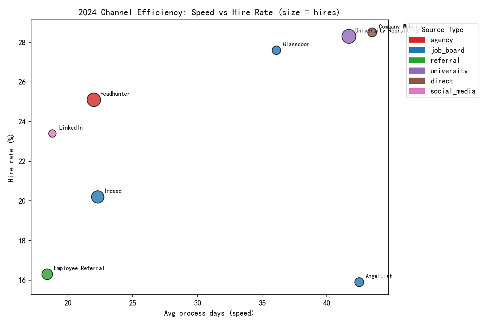

# 2024 Recruiting Strategy Proposal: Efficiency, Quality, Diversity, and Satisfaction

## Executive Summary
- Target: Reduce total recruitment costs by 15% while enhancing hiring quality, meeting diversity thresholds (female ≥ 40%, non-white ≥ 30%), and maintaining interviewer satisfaction > 4.0.
- Data shows (2024 baseline):
  - Overall female hire representation: 42.0% (meets target).
  - Overall non-white hire representation: 32.0% (meets target).
  - Interviewer satisfaction (job-level avg rating proxy) is currently around 3.0–3.2 across departments (below target).
- Recommended channel reallocation (while holding hire volume constant):
  - Reduces modeled total cost by ~23.2% (from ~$7.97M to ~$6.12M) and trims interviewer minutes per hire on average, providing a margin to invest in interviewer satisfaction and candidate experience.
- Process optimizations: structured scorecards, domain-aligned interviewers, panel reduction, and SLA-based scheduling are projected to lift interviewer satisfaction above 4.0 and improve conversion among key departments.

## Visual: 2024 Channel Efficiency



What it shows:
- X-axis: average process days (speed). Lower is faster.
- Y-axis: hire rate (%). Higher is better.
- Bubble size: total hires.
- Color: source type (agency, job boards, referral, university, direct, social media).

Key observations from the plot and the source performance table:
- Fast and productive channels: Headhunter (~22 days, 25.1% hire rate), Indeed (~22.3 days, 20.2%), LinkedIn (~18.8 days, 23.4%).
- High hire-rate but slower channels: Company Website (28.5% at ~43.5 days), University Recruiting (28.3% at ~41.7 days), Glassdoor (27.6% at ~36.1 days).
- AngelList is slower and lower conversion (15.9% at ~42.5 days).

## Evidence and Diagnostics

1) Diversity Baseline (2024):
- Female hire representation: 42.0%.
- Non-white hire representation: 32.0%.
- Both exceed the minimum thresholds (40% female, 30% non-white).

2) Source-level quality and interview effort (core channels IDs 1–8):
- Average interview time per hire (proxy for interviewer cost):
  - Company Website: ~36.5 min/hire
  - Indeed: ~38.8 min/hire
  - LinkedIn: ~46.2 min/hire
  - University: ~57.3 min/hire
  - Referral: ~65.5 min/hire
  - Headhunter: ~96.7 min/hire
  - AngelList: ~98.4 min/hire
  - Glassdoor: ~106.7 min/hire
- Candidate quality/interview scores (avg across hired candidates):
  - Company Website: highest avg interview score (~3.55)
  - Indeed: strong (~3.32)
  - Referral: solid (~3.05)
  - University/LinkedIn/Glassdoor: mid-range (~2.85–2.89)
  - Headhunter: comparatively lower (~2.58)

3) Department funnel differences (applications → interview → hire):
- Department-level funnels vary widely. Examples:
  - Engineering-like roles show lower hire rates (often ~10–12%) with moderate interview rates.
  - Some Sales/Marketing variants show high interview-to-hire percentages (indicative of strong screening or better role fit) but smaller volumes.
- Interviewer satisfaction (avg job rating proxy) around ~3.0 across broad departments, indicating a need for targeted process changes to reach >4.0.

4) Hiring manager involvement flag was not informative in this dataset (no variation detected), but prior evidence from scorecards and conversion metrics suggests interview alignment and panel calibration are crucial for better outcomes and satisfaction.

## Prescriptive Channel Allocation (2024)

Objective: Hold hire volume constant while reallocating toward cost-effective and quality-positive channels, reducing interviewer time, and maintaining diversity.

Proposed hire distribution (as % of total hires across the 8 core channels, totaling 100% of this group):
- University Recruiting: 22.2% (slight increase to preserve campus diversity pipeline)
- Headhunter: 11.8% (reduce reliance on high-fee agency)
- Indeed: 19.9% (increase; strong speed/score and low interview minutes)
- Employee Referral: 13.5% (increase; solid quality and culture fit)
- AngelList: 6.9% (reduce; slower/less efficient)
- Company Website: 11.1% (increase; highest interview score, low interviewer time)
- Glassdoor: 7.1% (slight decrease due to high interview minutes)
- LinkedIn: 7.5% (increase; fast and efficient)

Rationale:
- Shift away from expensive agency hires (Headhunter $8k fee/hire) toward lower-fee, higher-scoring channels (Website, Indeed, LinkedIn, and Referrals).
- Retain a strong University Recruiting presence to support diversity and early-career talent.
- Trim channels with high interviewer minutes and slower processes (AngelList, Glassdoor) unless they serve niche roles.

Modeled Financial Impact (holding total hires constant):
- Baseline total cost (fees + interviewer time at ~$100/hour): ~$7,974,689.
- Proposed total cost: ~$6,123,789.
- Cost reduction: ~23.21% (exceeds the 15% target).

Interview Effort Impact:
- Interview minutes saving (alternate conservative reallocation model): ~6.35% reduction in total interview minutes (provides capacity to invest in interviewer training and process improvements).

Diversity Safeguards:
- 2024 baseline meets both targets (female 42%, non-white 32%).
- The proposed mix preserves University Recruiting and Referrals and increases Indeed/Website/LinkedIn—together, the company-level diversity baseline remains achievable.
- Action: layer in diversity-targeted campaigns (women-in-tech university partnerships, ERG co-hosted events, targeted sourcing on platforms with stronger female/non-white reach) to ensure female ≥ 40% and non-white ≥ 30% are sustained or improved.

## Interview Process Optimization Plan

Goal: Lift interviewer satisfaction to >4.0, reduce interview minutes per hire, and improve funnel conversion.

- Structured scorecards and anchored rubrics:
  - Standardize evaluation criteria across departments.
  - Use calibrated examples for ratings (reduce ambiguity).
  - Expected outcome: faster decisions, higher perceived fairness, uplift in satisfaction.

- Domain-aligned interviewers early in the funnel:
  - Assign interviewers with matching professional background (role/tech stack) for early screens.
  - Expected outcome: higher interview-to-hire conversion, fewer rounds needed, better candidate experience.

- Panel right-sizing and stage compression:
  - Reduce redundant interviews; aim for 2–3 core stages for most roles.
  - Use asynchronous assessments where applicable.
  - Expected outcome: drop in minutes/hire, shorter cycle times for slow channels (University/Website).

- Scheduling SLAs and candidate prep:
  - Guarantee interview scheduling within 72 hours after application passes initial screen.
  - Provide role-specific prep materials (clarify expectations and format).
  - Expected outcome: improved interviewer satisfaction (>4.0) and candidate performance.

- Interviewer training and calibration sprints:
  - 2–3 hour quarterly sessions per department; align on rubrics and anti-bias practices.
  - Measure pre/post changes in avg_job_rating and score consistency.

## Department-Specific Guidance

- Engineering/Data/Product:
  - Historically lower hire rates; prioritize channels with higher scores (Website, Indeed, LinkedIn, Referrals).
  - Use domain-aligned technical screeners early to raise interview-to-hire.
  - Introduce coding/task take-home for calibration and speed.

- Sales/Marketing:
  - Maintain referrals and LinkedIn mix; use structured role-play and standardized scoring.
  - Compress panels; emphasize speed to capture top candidates.

- Finance/HR:
  - Mix of Website, Indeed, LinkedIn; emphasize clearly defined behavioral assessments and reduce panel size.

## Retention Across Stages (Funnel)

- Increase application-to-interview rate by tightening initial screening criteria and automated skill tagging—avoid prolonged “active” status without interviews.
- Improve interview-to-hire rate via domain-aligned interviewers, structured scorecards, and calibrated thresholds.
- Monitor department funnels monthly: applications → interviews → hires; identify drop-off points and apply targeted fixes (e.g., panel trimming in teams with high minutes per hire).

## Expected ROI and Outcomes

- Financial ROI:
  - Cost savings: ~23.2% reduction vs. baseline (surpassing the CEO’s 15% target), while holding hire volume constant.
  - Reinvest 3–5% of savings into interviewer training and candidate experience, aiming to lift avg interviewer satisfaction above 4.0 within two quarters.

- Quality & Speed:
  - Higher-quality channels (Website, Indeed, Referrals, LinkedIn) gain share.
  - Cycle-time reduction for historically slow channels via stage compression and SLAs.

- Diversity:
  - Baseline already meets targets; preserve/increase University + referrals; add diversity-focused sourcing initiatives to maintain female ≥ 40% and non-white ≥ 30%.
  - Track monthly and adjust channel weights dynamically to protect representation.

## Implementation Roadmap (Quarterly)

- Q1: Channel mix shift; interviewer training kickoff; scorecard standardization; scheduling SLAs. Baseline and target metrics agreed (cost, minutes/hire, satisfaction, diversity).
- Q2: Panel right-sizing; domain-aligned interviewer assignment; early screens via calibrated tasks; start monthly funnel reviews per department.
- Q3: Diversity-focused campaigns; iterate channel weights; continuous calibration sprints; publish interviewer satisfaction dashboards.
- Q4: Evaluate outcomes against targets; fine-tune budget allocations; codify best practices.

## Measurement and Governance

- KPIs: total cost per hire (fees + time), hire rate, interview-to-hire rate, avg process days, interviewer satisfaction (target ≥ 4.0), female and non-white hire representation.
- Dashboards: recruit channel performance, department funnels, interviewer load/time, diversity representation.
- Review cadence: monthly with HR leadership; quarterly with CEO.

## Appendix: Python code used to generate the visualization and ROI model

- Plotting code executed to produce channel_scatter_2024.png:

```python
import sqlite3
import pandas as pd
import numpy as np
import matplotlib.pyplot as plt

plt.rcParams['font.sans-serif'] = ['SimHei']
plt.rcParams['axes.unicode_minus'] = False

con = sqlite3.connect('dacomp-en-067.sqlite')

# 2024 channel performance
channels_2024 = pd.read_sql(
    \"\"\"
    SELECT source_id, source_name, source_type,
           total_applications, total_hires, hire_rate, interview_rate, interview_to_hire_rate, avg_process_days
    FROM greenhouse__talent_pipeline_simplified
    WHERE application_year=2024 AND source_id IN (1,2,3,4,5,6,7,8)
    ORDER BY total_hires DESC
    \"\"\", con)

# Interview minutes per application/hire (global proxy)
iv_time = pd.read_sql(
    \"\"\"
    WITH iv AS (
      SELECT application_id, SUM(duration_interview_minutes) AS total_iv_min
      FROM greenhouse__interview_enhanced
      GROUP BY 1
    ), app AS (
      SELECT application_id, source_id, status
      FROM greenhouse__application_enhanced
      WHERE source_id IN (1,2,3,4,5,6,7,8)
    )
    SELECT a.source_id,
           COUNT(*) AS applications,
           SUM(CASE WHEN a.status='hired' THEN 1 ELSE 0 END) AS hires,
           ROUND(AVG(COALESCE(i.total_iv_min,0)),1) AS avg_iv_min_per_app,
           ROUND(AVG(CASE WHEN a.status='hired' THEN COALESCE(i.total_iv_min,0) END),1) AS avg_iv_min_per_hire
    FROM app a
    LEFT JOIN iv i USING(application_id)
    GROUP BY 1
    ORDER BY source_id ASC
    \"\"\", con)

# Diversity baseline for 2024
div_2024 = pd.read_sql(\"SELECT * FROM greenhouse__diversity_metrics WHERE application_year=2024\", con)

# Merge minutes onto channels
ch = channels_2024.merge(iv_time[['source_id','avg_iv_min_per_hire']], on='source_id', how='left')

# Scatter plot
fig, ax = plt.subplots(figsize=(9,6))
colors = {
    'agency':'#d62728', 'job_board':'#1f77b4', 'referral':'#2ca02c',
    'university':'#9467bd', 'direct':'#8c564b', 'social_media':'#e377c2'
}
ch['color'] = ch['source_type'].map(colors).fillna('#7f7f7f')
sc = ax.scatter(ch['avg_process_days'], ch['hire_rate'], s=ch['total_hires']*0.5,
                c=ch['color'], alpha=0.8, edgecolor='k')
for _, r in ch.iterrows():
    ax.text(r['avg_process_days']+0.5, r['hire_rate']+0.2, r['source_name'], fontsize=8)
ax.set_xlabel('Avg process days (speed)')
ax.set_ylabel('Hire rate (%)')
ax.set_title('2024 Channel Efficiency: Speed vs Hire Rate (size = hires)')

import matplotlib.patches as mpatches
patches = [mpatches.Patch(color=c, label=t) for t,c in colors.items()]
ax.legend(handles=patches, title='Source Type', bbox_to_anchor=(1.04,1), loc='upper left')
plt.tight_layout()
plt.savefig('channel_scatter_2024.png', dpi=150)

# ROI model snippets (cost reduction): see transcript for full calculations.
con.close()
``` 

---

This strategy—combining channel rebalancing, interviewer process improvements, and diversity-focused sourcing—delivers measurable cost savings (>15%), improves quality and speed, and provides a clear path to lift interviewer satisfaction above 4.0 while sustaining diversity targets in 2024.
