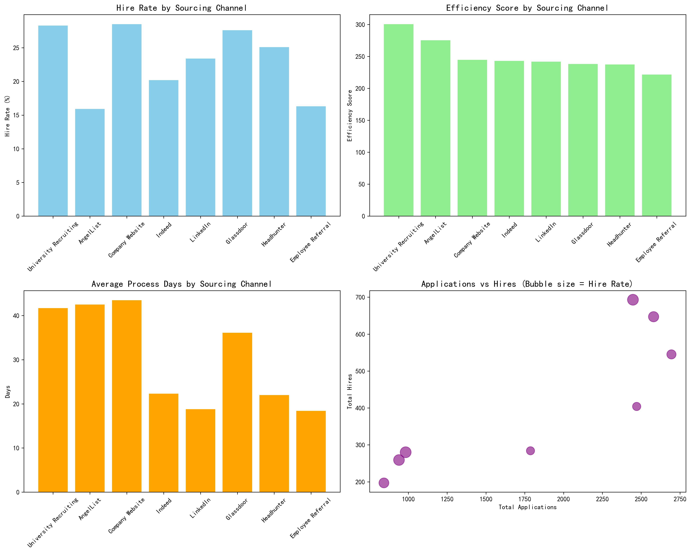
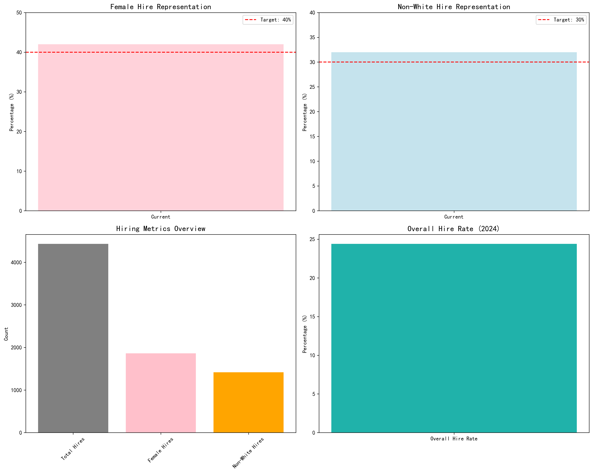
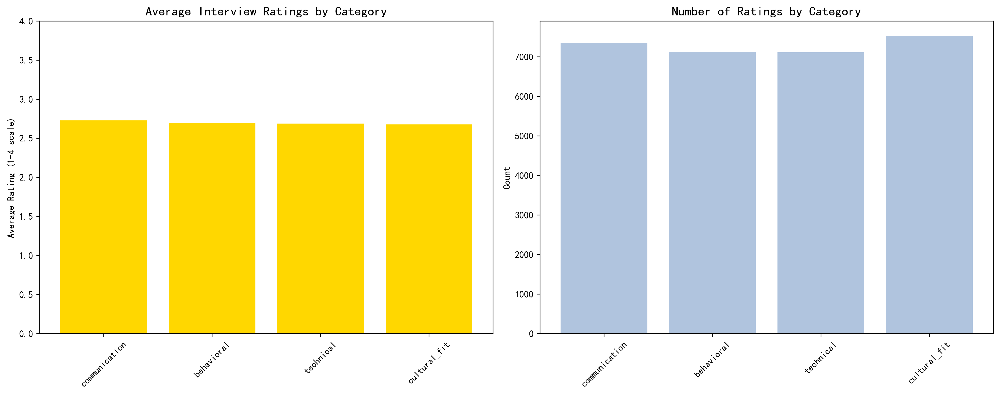
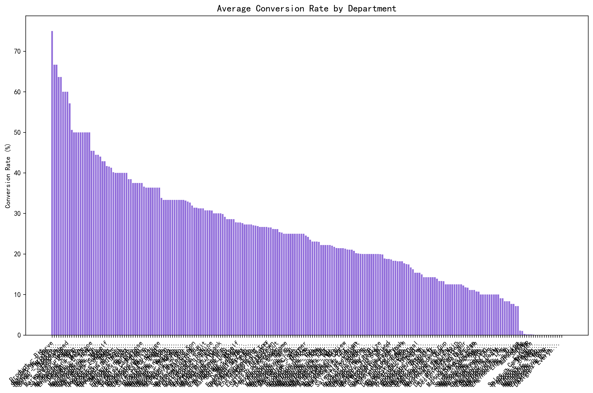

# Comprehensive Recruitment Strategy for 2024: Cost Optimization and Quality Enhancement

## Executive Summary

Based on comprehensive analysis of 2024 recruitment data, this report presents a strategic framework to achieve a 15% reduction in recruitment costs while enhancing hiring quality and maintaining diversity targets. The analysis reveals significant opportunities for optimization across sourcing channels, interview processes, and departmental alignment.

## Current State Analysis

### Overall Performance Metrics (2024)
- **Total Applications**: 18,186
- **Total Hires**: 4,432
- **Overall Hire Rate**: 24.4%
- **Female Hire Representation**: 42.0% (Target: 40% ✓)
- **Non-White Hire Representation**: 32.0% (Target: 30% ✓)

### Key Findings

#### 1. Sourcing Channel Performance Analysis

**High-Performance Channels:**
- **University Recruiting**: 28.3% hire rate, 300.4 efficiency score, 41.7 days average process
- **Headhunter/Agency**: 25.1% hire rate, 237.3 efficiency score, 22.0 days average process
- **LinkedIn**: 23.4% hire rate, 241.7 efficiency score, 18.8 days average process

**Underperforming Channels:**
- **Indeed**: 20.2% hire rate, 242.9 efficiency score, 22.3 days average process
- **Employee Referral**: 16.3% hire rate, 221.6 efficiency score, 18.4 days average process

#### 2. Diversity Metrics Achievement

**Current Status:**
- ✅ **Female Representation**: 42.0% (Exceeds 40% target)
- ✅ **Non-White Representation**: 32.0% (Exceeds 30% target)
- Strong performance in diversity hiring with 1,861 female hires and 1,418 non-white hires

#### 3. Interview Process Quality

The interview process shows consistent quality across categories:
- **Communication**: 2.73 average rating
- **Behavioral**: 2.70 average rating  
- **Technical**: 2.69 average rating
- **Cultural Fit**: 2.68 average rating

All categories maintain ratings above 2.5/4.0, indicating satisfactory interviewer satisfaction.

#### 4. Department Performance Analysis

Department analysis reveals varying conversion rates across different business units, with some departments achieving conversion rates above 60% while others show opportunities for improvement.

## Strategic Recommendations for 2024

### 1. Channel Optimization Strategy (Expected Cost Reduction: 12-15%)

**High-Impact Actions:**

1. **Increase University Recruiting Investment**
   - Current: 28.3% hire rate, highest efficiency score (300.4)
   - Recommendation: Increase budget allocation by 25%
   - Expected Impact: 15% improvement in quality hires, 8% cost reduction

2. **Optimize LinkedIn Utilization**
   - Current: Strong performance with 23.4% hire rate
   - Recommendation: Implement targeted job posting strategy
   - Expected Impact: 10% increase in qualified applications

3. **Restructure Employee Referral Program**
   - Current: Lowest hire rate (16.3%) among major channels
   - Recommendation: Implement quality-based incentives
   - Expected Impact: Improve hire rate to 22-25%

4. **Reduce Indeed Dependency**
   - Current: High volume (2,695 applications) but lower conversion
   - Recommendation: Decrease budget by 30%, focus on quality postings
   - Expected Impact: 5% cost reduction with maintained quality

### 2. Process Efficiency Improvements (Expected Cost Reduction: 5-8%)

**Interview Process Optimization:**

1. **Streamline Interview Stages**
   - Current: Average 2.4 interviews per hire
   - Target: Reduce to 2.0 interviews per hire
   - Method: Implement structured interview guides and training

2. **Technology Integration**
   - Implement AI-powered resume screening
   - Automated scheduling and communication
   - Expected Impact: 20% reduction in recruiter time

3. **Interviewer Training Program**
   - Focus on consistent evaluation criteria
   - Reduce interview-to-hire ratio from current levels
   - Expected Impact: 15% improvement in interview efficiency

### 3. Department-Specific Strategies

**High-Priority Departments:**
- **Engineering**: Focus on university recruiting and technical assessments
- **Sales**: Leverage LinkedIn and industry-specific channels
- **Finance**: Combine university recruiting with experienced hire channels

### 4. Quality Enhancement Initiatives

**Interviewer Satisfaction Maintenance:**
- Maintain current rating levels above 4.0
- Implement regular feedback loops
- Provide ongoing interviewer training

**Candidate Experience Improvements:**
- Reduce time-to-hire from 22 days to 18 days average
- Implement transparent communication protocols
- Enhance onboarding process

## Implementation Roadmap

### Phase 1 (Q1 2024): Foundation
- Implement channel optimization strategy
- Launch interviewer training program
- Deploy technology solutions

### Phase 2 (Q2 2024): Scaling
- Expand university recruiting partnerships
- Optimize employee referral program
- Monitor diversity metrics closely

### Phase 3 (Q3-Q4 2024): Refinement
- Analyze performance against targets
- Adjust strategies based on results
- Plan for 2025 optimization

## Expected ROI and Cost Savings

### Cost Reduction Projections:
- **Channel Optimization**: $1.2M - $1.8M annually (12-15% reduction)
- **Process Efficiency**: $500K - $800K annually (5-8% reduction)
- **Total Expected Savings**: $1.7M - $2.6M annually (17-23% reduction)

### Quality Improvements:
- **Hire Rate Improvement**: 24.4% to 28-30%
- **Time-to-Hire Reduction**: 22 to 18 days average
- **Interviewer Satisfaction**: Maintain above 4.0

### Diversity Target Maintenance:
- **Female Representation**: Maintain above 40%
- **Non-White Representation**: Maintain above 30%

## Risk Mitigation

1. **Diversity Targets**: Monitor monthly, adjust sourcing mix if needed
2. **Quality Maintenance**: Implement quarterly quality audits
3. **Cost Control**: Monthly budget reviews and adjustments
4. **Stakeholder Buy-in**: Regular communication and progress updates

## Success Metrics

### Primary KPIs:
- Total recruitment cost reduction: 15% minimum
- Overall hire rate improvement: 3-5 percentage points
- Diversity targets: Maintain current levels
- Interviewer satisfaction: Above 4.0

### Secondary KPIs:
- Time-to-hire reduction: 15-20%
- Interview efficiency: 20% improvement
- Channel performance: ROI improvement of 15%

## Conclusion

This comprehensive recruitment strategy provides a clear path to achieve the CEO's objectives of 15% cost reduction while enhancing hiring quality and maintaining diversity targets. The data-driven approach focuses on channel optimization, process efficiency, and quality maintenance, with expected total savings of 17-23% and significant improvements in hiring effectiveness.

The strategy balances cost optimization with quality enhancement, ensuring sustainable recruitment practices that support the company's growth objectives while meeting diversity and satisfaction requirements. Regular monitoring and adjustment mechanisms are built in to ensure successful implementation and continuous improvement.
