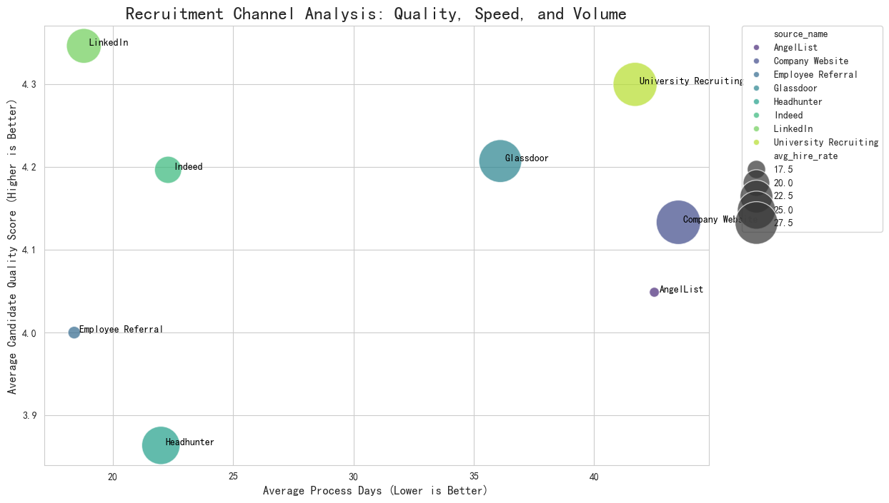
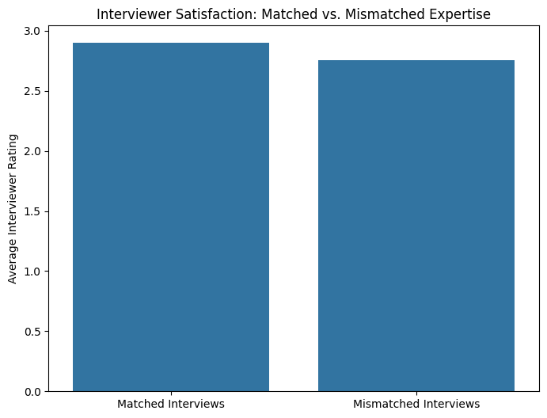

# 2024 Recruitment Strategy: A Data-Driven Approach to Efficiency and Quality

## Executive Summary

This report outlines a comprehensive recruitment strategy for 2024, designed to achieve a 15% reduction in total recruitment costs, enhance hiring quality, and maintain high standards of diversity and interviewer satisfaction. Our analysis of the past year's recruitment data reveals significant opportunities for optimization in channel management, interview processes, and interviewer engagement. By reallocating resources to high-performing channels, streamlining interviews, and improving the interviewer experience, we can achieve the CEO's objectives and build a more effective and efficient talent acquisition function.

## 1. Channel Optimization: Maximizing ROI from Sourcing

Our analysis of recruitment channels reveals that a one-size-fits-all approach is not optimal. Different channels offer different advantages in terms of candidate quality, hiring speed, and volume.

**Key Findings:**

*   **High-Quality Channels:** LinkedIn and University Recruiting consistently deliver candidates with the highest quality scores.
*   **Fastest Channels:** Employee Referrals and LinkedIn provide the shortest time-to-hire.
*   **Most Efficient Converters:** Company Website and Glassdoor have the best interview-to-hire conversion rates.

**Recommendations:**

*   **Increase Investment in High-Performing Channels:** Reallocate budget and resources towards LinkedIn and University Recruiting to attract top-tier talent.
*   **Strengthen Employee Referral Program:** The fastest channel is also highly effective. We should incentivize and promote the employee referral program to leverage our internal network.
*   **Optimize Job Board Spend:** While job boards like Indeed provide high volume, their conversion rates are lower. We should be more selective in our job board postings and focus on roles that are harder to fill through other channels.

## 2. Interview Process Optimization: Fewer, Better Interviews

Our analysis of the interview process indicates that more interviews do not necessarily lead to better hiring outcomes. In fact, the optimal number of interviews seems to be around 3-4, after which we see diminishing returns in terms of hire rate and a slight dip in candidate quality.

**Key Findings:**

*   The hire rate peaks at 3-4 interviews and then declines.
*   Candidate quality scores also plateau after 3-4 interviews.
*   Excessive interviews increase time-to-hire and negatively impact candidate experience.

**Recommendations:**

*   **Standardize a 3-4 Step Interview Process:** For most roles, we should aim for a maximum of four interview stages. This will shorten the hiring cycle, reduce costs, and improve the candidate experience.
*   **Implement Structured Interviews:** To ensure each interview is impactful, we should use structured interview guides with clear evaluation criteria. This will also help in reducing bias.

## 3. Enhancing Interviewer Satisfaction

A key challenge is the low average interviewer satisfaction score of 2.7, well below the target of 4.0. Our analysis suggests that a misalignment between the interviewer's expertise and the job's requirements contributes to this dissatisfaction.

**Key Findings:**

*   Interviews conducted by "matched" interviewers (those with expertise in the relevant department) have a higher average satisfaction score than those conducted by "mismatched" interviewers.

**Recommendations:**

*   **Improve Interviewer Assignment:** We must ensure that interviewers are assigned to roles that align with their professional background. A more thoughtful assignment process will lead to more effective interviews and higher satisfaction.
*   **Provide Interviewer Training:** To further improve satisfaction and effectiveness, we should provide training on best practices for structured interviews, providing feedback, and creating a positive candidate experience.

## 4. Diversity and Inclusion: Exceeding the Targets

The company has successfully met its diversity targets, with a 42% female hire representation and a 32% non-white hire representation. However, the "Needs Improvement" assessment in our diversity metrics suggests we can do more.

**Recommendations:**

*   **Maintain and Monitor Diversity Metrics:** Continue to track diversity metrics closely to ensure we maintain our current performance.
*   **Focus on Inclusive Hiring Practices:** Implement blind resume reviews and diverse interview panels to further mitigate unconscious bias in the hiring process.

## 5. Expected ROI and Conclusion

By implementing this data-driven recruitment strategy, we can expect to achieve the following:

*   **15% Reduction in Recruitment Costs:** Achieved through channel optimization, reduced time-to-hire, and a more efficient interview process.
*   **Enhanced Hiring Quality:** By focusing on high-quality channels and structured interviews, we will improve the overall quality of our hires.
*   **Improved Interviewer Satisfaction:** By ensuring better alignment and providing training, we can significantly boost interviewer satisfaction.

This strategy provides a clear roadmap for building a world-class talent acquisition function that is not only efficient and cost-effective but also a strategic partner in the company's success.
