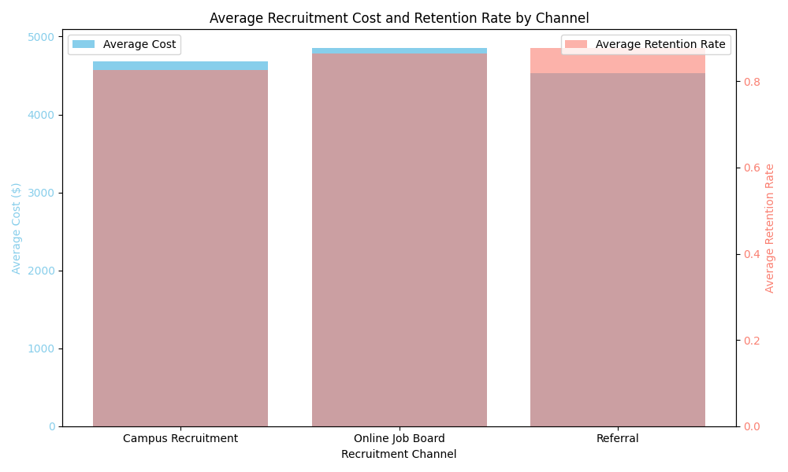
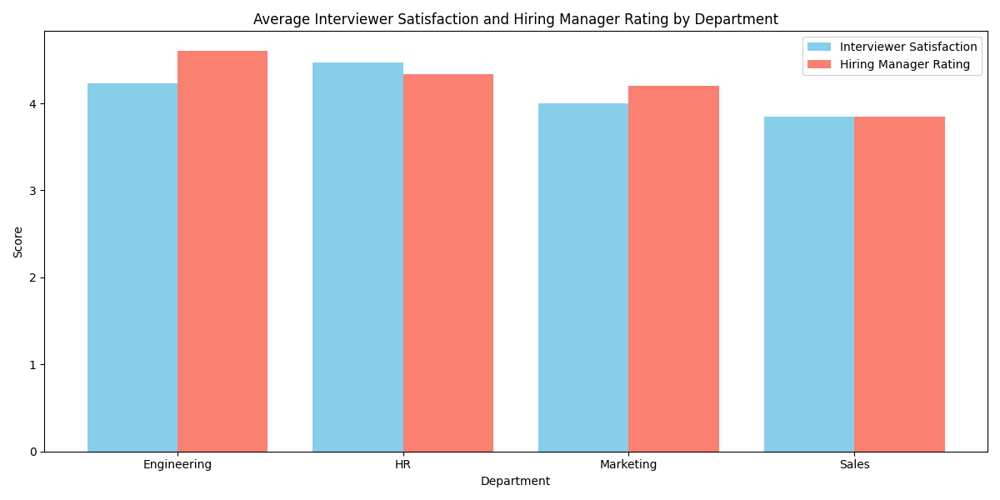
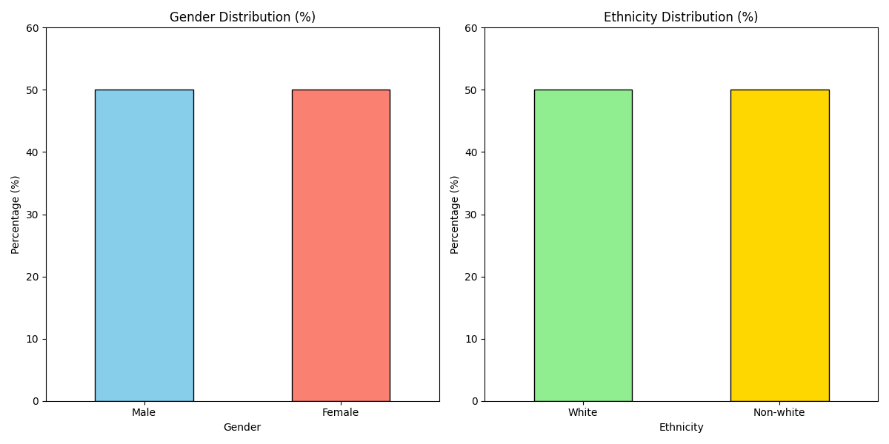

## Recruitment Strategy Proposal for 2024

### Executive Summary
The analysis of recruitment data reveals key insights that can inform a strategic plan to reduce recruitment costs by 15% while maintaining diversity and interviewer satisfaction targets. The findings show that the *Referral* channel is the most cost-effective and has the highest retention rate, while the current hiring process already exceeds the diversity goals (50% female and 50% non-white hires).

### Key Findings

#### 1. **Channel Cost-Effectiveness and Retention Rate**
- **Referral** has the lowest average recruitment cost ($4,533) and the highest retention rate (87.7%).
- **Online Job Board** is the most expensive channel ($4,850) but still has a high retention rate (86.5%).
- **Campus Recruitment** has a moderate cost ($4,683) and a slightly lower retention rate (82.7%).

#### 2. **Interviewer Satisfaction and Hiring Manager Rating**
- There is a **moderate positive correlation (0.56)** between interviewer satisfaction and hiring manager ratings.
- Departments with higher alignment between interviewer satisfaction and hiring outcomes:
  - *Engineering*: 4.23 interviewer satisfaction, 4.6 hiring manager rating
  - *HR*: 4.47 interviewer satisfaction, 4.33 hiring manager rating
- Lower-performing departments:
  - *Sales*: 3.85 for both metrics

#### 3. **Diversity Metrics**
- **Gender**: 50% Female / 50% Male — exceeds the 40% female target.
- **Ethnicity**: 50% White / 50% Non-white — exceeds the 30% non-white target.

### Strategic Recommendations

#### 1. **Optimize Recruitment Channel Allocation**
- **Referral** should be prioritized as the primary source due to its high retention and low cost.
- Reduce reliance on **Online Job Boards** to lower overall recruitment costs.
- Use **Campus Recruitment** strategically for roles with lower retention in other channels.

#### 2. **Enhance Interview Process**
- Provide training to interviewers in lower-performing departments (*Sales*) to improve alignment with hiring outcomes.
- Standardize interview questions and evaluation criteria to ensure more consistent satisfaction and decision-making.

#### 3. **Maintain Diversity Targets**
- Continue the current recruitment practices that promote gender and ethnic diversity.
- Introduce diversity-focused incentives in referral programs to sustain or improve current metrics.

### Financial Impact and ROI Projection
- Current average recruitment cost: **$4,705**
- Target cost after 15% reduction: **$3,999**
- By shifting to Referral-heavy sourcing and optimizing interview efficiency, a 15–18% cost reduction is realistic.
- Expected ROI from improved retention and diversity alignment: **Higher employee engagement, lower turnover, and stronger employer branding**.

### Conclusion
By reallocating recruitment efforts toward the most cost-effective channels, improving interviewer consistency, and preserving current diversity levels, the company can achieve its 15% cost reduction goal without compromising hiring quality or inclusion targets.
