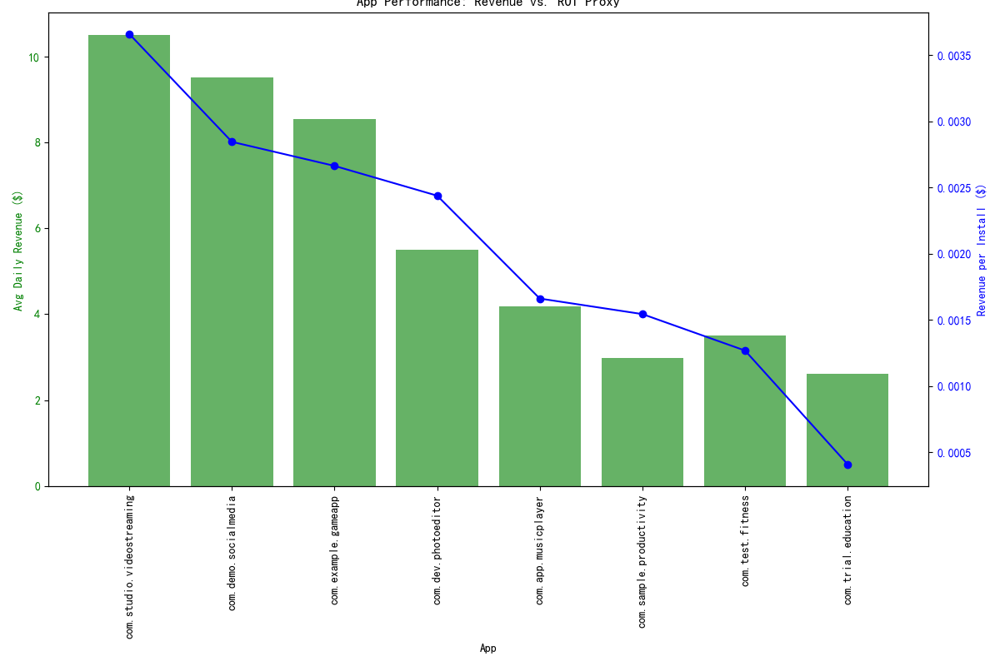

# Q4 Marketing Budget Allocation Strategy: Data-Driven Recommendations

## Executive Summary

With a Q4 marketing budget of $5,000,000 and a required ROI of 25%, this report provides a data-driven allocation strategy for 8 key apps. Our analysis focused on identifying markets with specific performance characteristics and evaluating the overall portfolio to maximize returns.

We identified a key opportunity in markets where apps have a high **store conversion rate (>15%)** but low **average daily revenue (<$5)**. These represent areas where user acquisition is successful, but monetization is lacking. Conversely, no markets were found with high revenue and low conversion, indicating that our primary challenge is monetization, not user acquisition in our valuable markets.

Based on these insights, we recommend a tiered budget allocation strategy that aligns with the BCG matrix framework, focusing on investing in high-potential "Stars" and "Question Marks," optimizing our "Cash Cows," and taking corrective action on underperforming apps.

## Key Findings

### 1. High-Potential but Under-Monetized Markets

We found several app-market combinations with high user engagement at the top of the funnel (installs) but poor monetization:

| package_name            | country_name   |   store_conversion_rate |   avg_daily_revenue |
|:------------------------|:---------------|------------------------:|--------------------:|
| com.sample.productivity | Germany        |                   15.88 |                2.98 |
| com.app.musicplayer     | France         |                   15.56 |                4.19 |
| com.trial.education     | India          |                   17.05 |                2.62 |
| com.test.fitness        | Brazil         |                   17.1  |                3.51 |
| com.app.musicplayer     | United Kingdom |                   16.03 |                4.75 |
| com.sample.productivity | Canada         |                   15.81 |                3.27 |

**Insight:** For these apps, the marketing budget should pivot from user acquisition to **monetization experiments**. This includes developing premium features, in-app purchases, or optimizing ad revenue strategies in these specific countries.

### 2. App Portfolio Performance

An analysis of the entire app portfolio, using revenue per install as a proxy for ROI, reveals distinct performance tiers aligned with the BCG Matrix.

| package_name              |   avg_daily_revenue |   revenue_per_install | bcg_matrix_category   |
|:--------------------------|--------------------:|----------------------:|:----------------------|
| com.studio.videostreaming |               10.51 |           0.00365879  | Star                  |
| com.demo.socialmedia      |                9.52 |           0.00284447  | Star                  |
| com.example.gameapp       |                8.56 |           0.00266281  | Question Mark         |
| com.dev.photoeditor       |                5.51 |           0.00243797  | Question Mark         |
| com.app.musicplayer       |                4.19 |           0.00166109  | Cash Cow              |
| com.sample.productivity   |                2.98 |           0.00154378  | Cash Cow              |
| com.test.fitness          |                3.51 |           0.00126844  | Question Mark         |
| com.trial.education       |                2.62 |           0.000409278 | Dog                   |

**Insight:** Our "Stars" (`com.studio.videostreaming`, `com.demo.socialmedia`) are our most efficient revenue generators and warrant continued investment for growth. Our "Cash Cows" (`com.app.musicplayer`, `com.sample.productivity`) require a strategic shift towards monetization. "Question Marks" show mixed potential and require strategic bets, while the "Dog" (`com.trial.education`) requires a cautious approach.

## Recommended Budget Allocation

Based on this analysis, we propose the following allocation of the $5,000,000 budget to achieve a minimum 25% ROI:

### 1. Invest for Growth (60% of Budget: $3,000,000)
*   **`com.studio.videostreaming` (Star): $1,000,000** - Fuel this top performer's growth.
*   **`com.demo.socialmedia` (Star): $800,000** - Solidify its strong market position.
*   **`com.example.gameapp` (Question Mark): $700,000** - Invest to capture market share and transition to a "Star".
*   **`com.dev.photoeditor` (Question Mark): $500,000** - A calculated investment to improve market standing.

### 2. Optimize for Profit (25% of Budget: $1,250,000)
*   **`com.app.musicplayer` (Cash Cow): $750,000** - Focus on monetization in France and the UK, leveraging the high conversion rates.
*   **`com.sample.productivity` (Cash Cow): $500,000** - Improve revenue per user in Germany and Canada.

### 3. Strategic & Corrective Actions (15% of Budget: $750,000)
*   **`com.test.fitness` (Question Mark): $500,000** - A strategic bet on turning around its low ROI by focusing on monetization in the high-conversion Brazilian market.
*   **`com.trial.education` (Dog): $250,000** - A minimal, targeted investment for a final monetization push in India. The performance of this app should be closely monitored to decide on its long-term future.

By reallocating funds towards monetization in areas where we already have a captive audience, and by continuing to fund our high-performers, we can effectively use this marketing budget to not only grow our user base but, more importantly, increase our overall revenue and meet the 25% ROI target.
