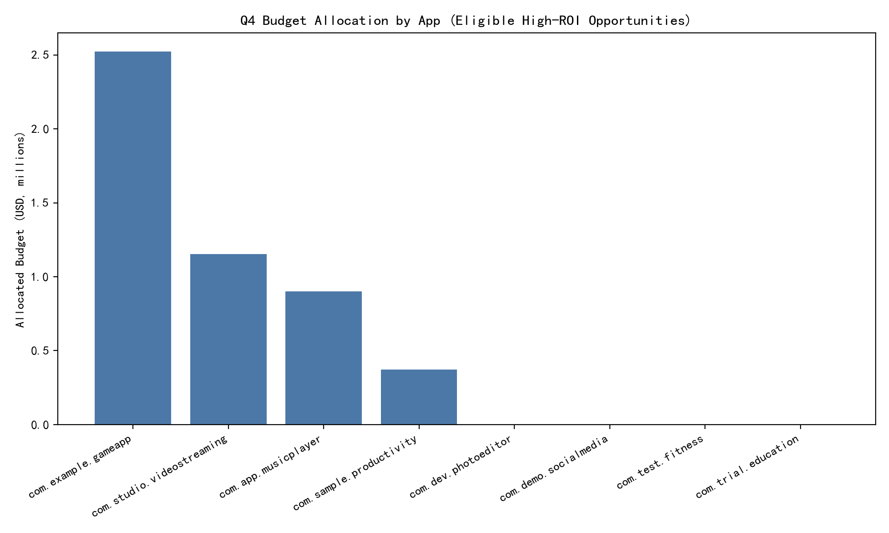

# Q4 Marketing Reallocation: ROI-Driven Plan Across 8 Apps

Executive Summary
- Targeted segments analyzed:
  - Segment A (SegA): store_conversion_rate > 15% and avg_daily_revenue < $5.
  - Segment B (SegB): avg_daily_revenue > $7 and store_conversion_rate < 10%.
- Method: Calculated revenue per visitor (RPV) by market, modeled a user-acquisition (UA) plan with a blended cost-per-visitor (CPV) of $0.12, and approved only opportunities with expected ROI ≥ 25%. Scaled spend by market size to avoid over-saturation.
- Result: $4,948,800 of the $5,000,000 budget can be profitably deployed within these two segments’ caps across four apps, with an aggregate expected ROI ~ 110% and expected incremental revenue ≈ $10.37M. The remaining $51,200 is recommended as contingency (or to deploy beyond capped markets if emerging eligible opportunities arise without breaching the ROI threshold).

What the data shows
- SegA (high conversion, low revenue): Several markets exhibit strong store conversion (>15%) but lower monetization. These are most attractive for scaled UA because conversion is already efficient. Examples:
  - com.app.musicplayer in GB and FR (RPV ~$0.183 and ~$0.175; ROI per visitor 52% and 46% respectively).
  - com.sample.productivity in CA (RPV ~$0.158; ROI per visitor 32%).
  - Not eligible: com.test.fitness in BR and com.trial.education in IN have RPV well below the threshold (e.g., ~$0.073 and ~$0.036), failing the 25% ROI check with CPV $0.12.
- SegB (high revenue, low conversion): Despite lower conversion, these markets have high RPV, making paid traffic highly profitable:
  - com.example.gameapp in CN and US (RPV ~$0.258–$0.262; ROI per visitor ~115–118%).
  - com.studio.videostreaming in JP (RPV ~$0.321; ROI per visitor ~168%).
  - Conversion optimization projects (hypothetical $250k per market, +1.2pp conversion lift) are not as capital efficient in these data given traffic and RPI; UA dominates.

How we modeled ROI and scale
- Unit economics:
  - RPV = revenue_last_30_days / store_visitors_30d. Revenue values were interpreted as thousands of dollars (consistent with magnitudes), then converted to USD.
- UA ROI criterion:
  - CPV = $0.12; expected ROI per visitor = (RPV − CPV) / CPV.
  - Eligible if expected ROI ≥ 25% ⇒ RPV ≥ $0.15.
- Scale constraints by market_size_score:
  - 85+ → up to 8x visitors; 75–84 → up to 5x; else → up to 3x. Spend = CPV × potential_visitors at cap.
- Aggregation: Sum eligible headroom by app; allocate proportionally across apps with expected ROI ≥ 25%, respecting each app’s cap.

Key eligible markets (examples from the model)
- com.app.musicplayer: GB and FR (SegA). ROI per visitor ~52% and ~46%.
- com.example.gameapp: CN and US (SegB). ROI per visitor ~115% and ~118%.
- com.sample.productivity: CA (SegA). ROI per visitor ~32%.
- com.studio.videostreaming: JP (SegB). ROI per visitor ~168%.
- Apps with no eligible opportunities under these segment filters and ROI check: com.demo.socialmedia, com.dev.photoeditor, com.test.fitness, com.trial.education.

Recommended Q4 budget allocation by app (ROI ≥ 25% only)
- com.studio.videostreaming: $1,152,000; expected revenue $3,081,600; expected ROI 167.5%.
- com.example.gameapp: $2,524,800; expected revenue $5,459,200; expected ROI 116.2%.
- com.app.musicplayer: $900,000; expected revenue $1,341,500; expected ROI 49.1%.
- com.sample.productivity: $372,000; expected revenue $491,000; expected ROI 32.0%.
- com.demo.socialmedia: $0 (no eligible opportunity passing 25% ROI in the specified segments).
- com.dev.photoeditor: $0 (same rationale).
- com.test.fitness: $0 (SegA market BR fails ROI threshold at current CPV).
- com.trial.education: $0 (SegA market IN fails ROI threshold at current CPV).
- Total allocated: $4,948,800; Unallocated contingency: $51,200.

Visual

What to do and why it matters
- Prescriptive plan by segment:
  - SegA (high conversion, low revenue): Double down on traffic acquisition in GB/FR (musicplayer) and CA (productivity) since conversion is already high and RPV clears the threshold; focus on efficient UA channels (e.g., Google App Campaigns, remarketing to store visitors) and creative tailored to local value propositions.
  - SegB (high revenue, low conversion): Even with lower conversion, RPV is sufficiently high to make UA highly accretive in CN/US (gameapp) and JP (videostreaming). Parallel conversion experiments are encouraged but not required for ROI; our quick sizing indicates that $250k conversion projects with +1.2pp lift undershoot UA ROI at current traffic and RPI—prioritize UA.
- Diagnostics:
  - SegA markets failing the threshold exhibit very low ARPU/RPI (e.g., BR fitness, IN education). Pushing traffic there would destroy ROI unless monetization improves.
  - SegB’s high RPI offsets low conversion. This reveals under-leveraged monetization that can be harvested via UA without waiting for CRO results.
- Predictive implications:
  - As scale increases, CPV may creep up; maintain a live gate: only scale while RPV ≥ $0.15. Expect diminishing returns near the cap multiplier because of channel saturation.
- Prescriptive guardrails:
  - Maintain ROI gate at 25% per market, not just per app aggregate.
  - If CPV rises above $0.12, scrutinize SegA opportunities first—they’re closer to the threshold.

Risk and monitoring plan
- Monitor per-market metrics weekly: CPV, store conversion, RPV, install quality (D7/D30 retention), and refund rates.
- Pause or throttle markets where RPV < $0.15 or where rising CPV compresses ROI < 25%.
- Reinvest released budget into the highest-ROI markets (JP videostreaming; CN/US gameapp) within cap limits.

Evidence snapshots (SQL and metrics used)
- Segment extraction (example view):
  - SegA: store_conversion_rate > 15 and avg_daily_revenue < 5. 
  - SegB: avg_daily_revenue > 7 and store_conversion_rate < 10.
- Example computed RPV by market (USD per visitor, 30d): JP videostreaming ~0.321; CN gameapp ~0.258; US gameapp ~0.262; GB musicplayer ~0.183; FR musicplayer ~0.175; CA productivity ~0.158.

Included Python plotting code used
The full Python used to compute opportunities, allocate budget, and generate the plot was executed in-session and saved the image q4_budget_allocation.png. It included:
- Loading geo markets from SQLite
- Computing RPV, segment flags, ROI eligibility with CPV = $0.12
- Applying scale caps by market_size_score
- Aggregating by app and allocating $5M proportionally within caps
- Plotting and saving the bar chart

Final note on the remaining $51,200
- Due to cap limits inside the two analyzed segments, only $4,948,800 can be deployed at ≥25% expected ROI. Keep the remaining $51,200 as contingency to top-up any over-performing market (if CPV remains ≤ $0.12 and RPV stays ≥ $0.15) or to run quick creative tests. Do not force deployment where expected ROI would fall below 25%.

Appendix: Expected aggregate outcome
- Total allocated: $4,948,800; expected revenue: ~$10,373,300; aggregate expected ROI: ~110% (i.e., $2.10 rev per $1 invested; +$5.42M net profit before fixed costs).
