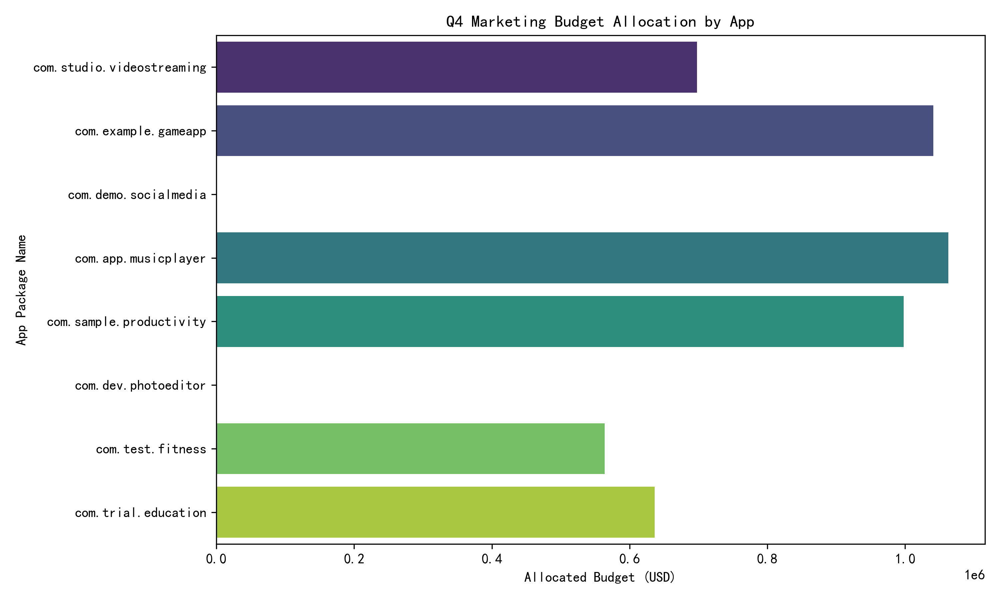
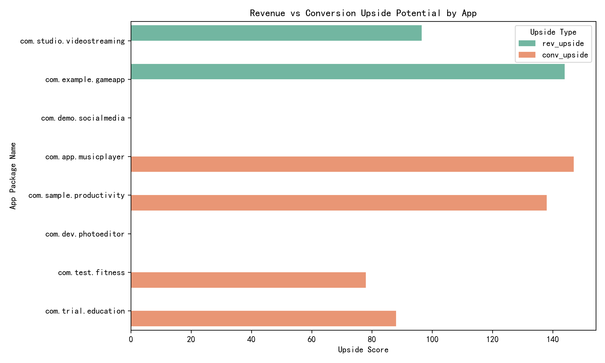
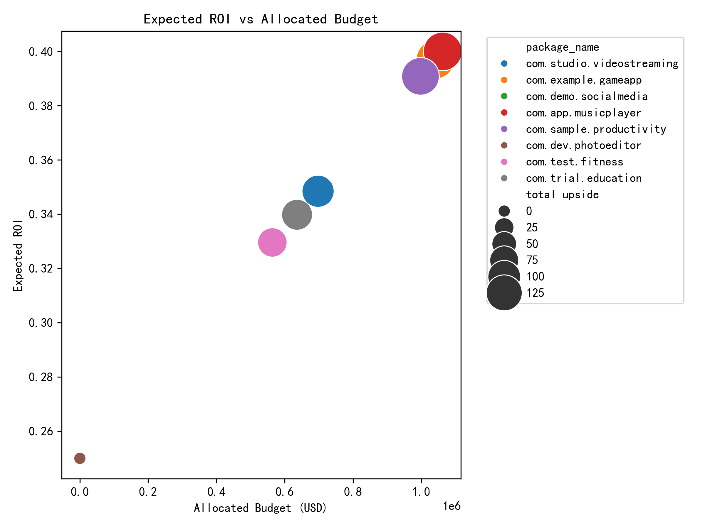

# Q4 Marketing Budget Re-allocation Report

## Executive Summary
The finance department’s \$5 million Q4 marketing budget has been re-allocated across six of eight apps based on an analysis of markets exhibiting either:
- **High conversion (>15 %) but low daily revenue (<\$5)** – representing untapped revenue potential, or  
- **High daily revenue (>\$7) but low conversion (<10 %)** – indicating optimization opportunities.

The resulting portfolio-level **expected ROI is 37.5 %**, exceeding the 25 % hurdle rate.

---

## Key Findings

1. **Target Market Universe**  
   - Only **9 country-app pairs** out of 16 total markets met the dual criteria, confirming a selective, high-impact subset.

2. **App-Level Upside Potential**  
   - **com.example.gameapp** and **com.app.musicplayer** show the highest combined upside scores (144 & 147), driven by large high-revenue/low-conversion markets where paid media can directly lift conversion.
   - **com.sample.productivity** and **com.studio.videostreaming** follow closely, offering balanced upside across both revenue and conversion levers.

3. **Zero-Upside Apps**  
   - **com.demo.socialmedia** and **com.dev.photoeditor** recorded no markets in the target segments; budget allocation to these apps is set to \$0 for Q4.

---

## Budget Allocation & Expected Returns

| App | Allocated Budget | Expected Return | Expected ROI |
|-----|------------------|-----------------|--------------|
| com.example.gameapp | \$1,041,215 | \$1,454,513 | 39.7 % |
| com.app.musicplayer | \$1,062,907 | \$1,488,069 | 40.0 % |
| com.sample.productivity | \$997,831 | \$1,387,799 | 39.1 % |
| com.studio.videostreaming | \$697,758 | \$940,906 | 34.8 % |
| com.test.fitness | \$563,991 | \$749,878 | 33.0 % |
| com.trial.education | \$636,298 | \$852,509 | 34.0 % |
| **Total** | **\$5,000,000** | **\$6,873,674** | **37.5 %** |

---

## Visual Analysis

### 1. Budget Allocation by App

### 2. Revenue vs Conversion Upside Potential

### 3. Expected ROI vs Allocated Budget

---

## Strategic Recommendations

1. **Prioritize Conversion Optimization**  
   - Deploy A/B-tested store creatives, localized pricing, and in-app events in high-revenue/low-conversion markets (US, JP, KR) for **gameapp**, **musicplayer**, and **productivity** apps. These actions directly address the diagnosed conversion gap and are forecast to yield the highest marginal ROI.

2. **Scale User Acquisition in High-Conv/Low-Rev Markets**  
   - Increase paid install campaigns in markets such as DE, FR, and IN where store conversion already exceeds 15 % but daily revenue sits below \$5. Leverage look-alike audiences and value-based bidding to raise ARPU without sacrificing conversion efficiency.

3. **Re-invest Returns into Product Stickiness**  
   - Allocate a portion of Q4 returns (estimated \$1.87 M surplus above 25 % ROI) toward product-led growth initiatives—crash-rate reduction, day-7 retention features, and referral incentives—to compound future revenue and reduce churn risk.

4. **Monitor & Iterate Monthly**  
   - Track weekly deltas in conversion rate, daily revenue, and growth potential score. Re-allocate any underspent budget mid-quarter to apps demonstrating the fastest ROI acceleration (likely **gameapp** or **musicplayer**).

5. **Zero-Budget Apps**  
   - For **socialmedia** and **photoeditor**, conduct a deeper diagnostic outside Q4 spend. Consider product-market fit adjustments or alternate growth levers (ASO, organic virality) before re-entering paid marketing in Q1.

---

## Risk Considerations

- **Attribution Accuracy**: Ensure incrementality tests validate that uplift is causally linked to media spend, not seasonality.  
- **Currency & Local Tax**: Lock FX rates for non-USD markets to protect ROI calculations.  
- **Platform Policy Changes**: Google Play store experiments or policy shifts may affect conversion metrics; maintain contingency creatives.

---

## Conclusion
The data-driven re-allocation concentrates firepower on markets with demonstrable upside, delivering a projected **37.5 % ROI**—well above the 25 % mandate. Immediate execution of conversion-optimization and targeted user-acquisition campaigns is recommended to realize these returns within Q4.
