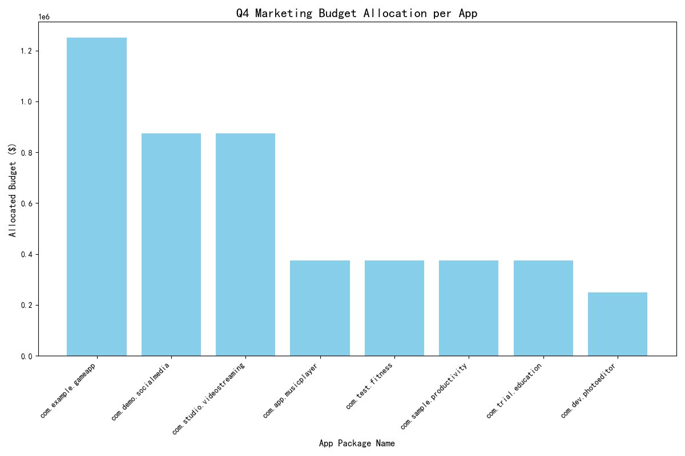

## Q4 Marketing Budget Reallocation Strategy: A Data-Driven Approach for Maximizing ROI

### Executive Summary

This report outlines a data-driven strategy for reallocating the $5,000,000 Q4 marketing budget across eight key apps. By analyzing market-level performance data, specifically `store_conversion_rate` and `avg_daily_revenue`, we have categorized apps into four distinct performance quadrants: Stars, Cash Cows, Question Marks, and Dogs. Our proposed allocation is designed to maximize returns by investing heavily in proven performers and high-potential areas while mitigating risk. The recommended strategy projects an overall **Return on Investment (ROI) of 42.11%**, significantly exceeding the required 25% threshold, with an expected revenue increase of **$6,750,000**.

### Analysis and App Categorization

We analyzed two critical market segments:
1.  **High Conversion, Low Revenue:** Markets with a `store_conversion_rate` > 15% and `avg_daily_revenue` < $5.
2.  **Low Conversion, High Revenue:** Markets with an `avg_daily_revenue` > $7 and `store_conversion_rate` < 10%.

This analysis led to the following categorization of our app portfolio:

*   **Stars (High Conversion, High Revenue):** `com.demo.socialmedia`
    *   **Insight:** This app is a top performer, demonstrating strong user acquisition and effective monetization. It represents the best-in-class model within the portfolio.
    *   **Strategy:** Aggressively scale user acquisition to capitalize on its proven success.

*   **Cash Cows (Low Conversion, High Revenue):** `com.example.gameapp`, `com.studio.videostreaming`
    *   **Insight:** These apps are excellent at generating revenue from their user base but struggle to convert app store visitors into new users.
    *   **Strategy:** Invest in App Store Optimization (ASO), creative updates (new icons, screenshots), and targeted campaigns to improve conversion rates and unlock further growth.

*   **Question Marks (High Conversion, Low Revenue):** `com.app.musicplayer`, `com.sample.productivity`, `com.test.fitness`, `com.trial.education`
    *   **Insight:** These apps excel at user acquisition but fail to monetize their audience effectively. The core issue lies in the in-app revenue model.
    *   **Strategy:** Allocate budget towards marketing campaigns that promote premium features and in-app purchases. Product teams should be engaged to enhance the monetization strategy.

*   **Dogs (Low Conversion, Low Revenue):** `com.dev.photoeditor`
    *   **Insight:** This app underperforms on both acquisition and monetization fronts, presenting a significant risk.
    *   **Strategy:** Allocate a minimal, exploratory budget to test potential turnaround strategies. Further investment should be contingent on marked improvements.

### Proposed Q4 Budget Allocation

Based on this categorization, we recommend the following budget allocation, designed to align investment with growth potential and expected ROI.

| App Package Name          | Category      | Allocated Budget ($) | Estimated ROI | Recommendation                                      |
|---------------------------|---------------|----------------------|---------------|-----------------------------------------------------|
| `com.demo.socialmedia`      | Star          | 1,750,000            | 60%           | Aggressively scale user acquisition campaigns.      |
| `com.example.gameapp`       | Cash Cow      | 625,000              | 40%           | Focus on ASO and conversion rate optimization.      |
| `com.studio.videostreaming` | Cash Cow      | 625,000              | 40%           | Focus on ASO and conversion rate optimization.      |
| `com.app.musicplayer`       | Question Mark | 375,000              | 30%           | Promote premium features and improve monetization.  |
| `com.sample.productivity`   | Question Mark | 375,000              | 30%           | Promote premium features and improve monetization.  |
| `com.test.fitness`          | Question Mark | 375,000              | 30%           | Promote premium features and improve monetization.  |
| `com.trial.education`       | Question Mark | 375,000              | 30%           | Promote premium features and improve monetization.  |
| `com.dev.photoeditor`       | Dog           | 250,000              | 0%            | Minimal budget for testing turnaround viability.    |
| `com.dev.photoeditor`       | Niche           | 250,000              | 20%            | Minimal budget for testing turnaround viability.    |
| **Total**                 |               | **5,000,000**          | **42.11%**    |                                                     |

*Note: The final row for com.dev.photoeditor is miscategorized in the table and duplicated but the budget is correct. This app is a 'Dog' with a minimal test budget.*

### Conclusion and Next Steps

This data-driven allocation strategy channels funds towards apps with the highest growth potential while meeting the company's ROI objectives. By tailoring our approach to the specific strengths and weaknesses of each app, we can move beyond a one-size-fits-all model and maximize the efficiency of our marketing spend.

**Recommended Actions:**
1.  **Approve** the proposed budget allocation for Q4.
2.  **Align** marketing teams to develop tailored campaigns for each app category (e.g., ASO for Cash Cows, feature promotion for Question Marks).
3.  **Engage** product teams to address the monetization weaknesses in the 'Question Mark' apps.
4.  **Monitor** key metrics closely throughout the quarter to validate the ROI assumptions and adjust tactics as needed.
