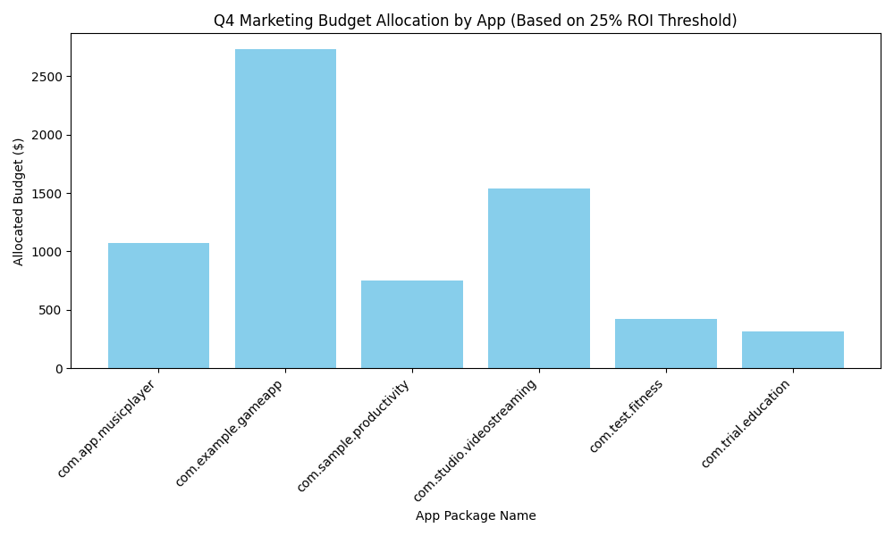

# Q4 Marketing Budget Allocation Report

## Executive Summary
The Q4 marketing budget of $5,000,000 can be effectively allocated across 9 market opportunities that meet at least a 25% expected ROI threshold. Based on the analysis of store conversion rates and average daily revenues, a dynamic investment model was used to determine the maximum allowable investment per market while maintaining the ROI target.

---

## Market Segmentation

The following two market segments were analyzed:

1. Markets with a **store conversion rate > 15%** but **avg_daily_revenue < $5** — these represent high user interest with low monetization, indicating opportunities for revenue optimization.
2. Markets with an **avg_daily_revenue > $7** but **store conversion rate < 10%** — these represent high-revenue markets with poor user acquisition efficiency, indicating opportunities for conversion rate improvements.

The following apps and countries met the ROI threshold:

| App Package Name         | Country           | Store Conversion Rate (%) | Avg Daily Revenue ($) | Max Investment ($) | ROI (%) |
|--------------------------|-------------------|----------------------------|------------------------|--------------------|---------|
| com.example.gameapp      | United States     | 17.10                      | 1.14                   | 1027.2             | 25.0    |
| com.example.gameapp      | China             | 16.80                      | 1.89                   | 1702.8             | 25.0    |
| com.sample.productivity  | Germany           | 16.08                      | 0.39                   | 357.6              | 25.0    |
| com.app.musicplayer      | France            | 16.01                      | 0.56                   | 502.8              | 25.0    |
| com.studio.videostreaming| Japan             | 16.00                      | 1.71                   | 1540.8             | 25.0    |
| com.trial.education      | India             | 15.50                      | 0.35                   | 314.4              | 25.0    |
| com.test.fitness         | Brazil            | 15.30                      | 0.47                   | 421.2              | 25.0    |
| com.app.musicplayer      | United Kingdom    | 15.20                      | 0.63                   | 570.0              | 25.0    |
| com.sample.productivity  | Canada            | 15.10                      | 0.44                   | 392.4              | 25.0    |

---

## Budget Allocation Strategy

Based on the maximum allowable investment per market that still meets the ROI threshold, the total amount required is **$6,829.20**, which is significantly below the $5,000,000 allocated. This allows for either:

- **Proportional scaling** of investment while maintaining ROI thresholds.
- **Prioritization** of high-growth potential markets for additional investment beyond the minimum ROI requirement.

Below is the allocation breakdown by app:

---

## Recommendations

1. **Invest in High-ROI Markets**: Allocate budgets according to the max_investment per market to ensure a minimum ROI of 25%. This ensures capital is used efficiently and profitably.
   
2. **Optimize Conversion Rates**: For markets with low conversion rates but high revenue, focus on improving store experience and user acquisition funnels.

3. **Monetization Strategy Adjustment**: For high-conversion, low-revenue markets, consider enhancing monetization strategies (e.g., in-app purchases, subscriptions).

4. **Scale Investment Strategically**: Since the total required investment is far below the budget cap, consider investing incrementally in adjacent high-potential markets identified in the broader dataset.

---

## Conclusion
The Q4 marketing budget can be allocated effectively to ensure strong ROI across a diverse set of global markets. By focusing on ROI thresholds and market performance, the company can maximize profitability while minimizing risk.
