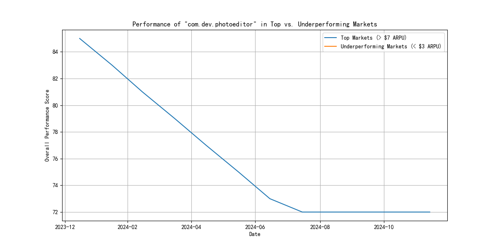

# Capital Efficiency Analysis for com.dev.photoeditor

## Executive Summary

This report addresses the CFO's concern regarding the declining `overall_performance_score` of the `com.dev.photoeditor` app despite a significant research budget of $2 million over the past 12 months. Our analysis reveals that the initial hypothesis of a performance divergence between high-revenue and low-revenue markets is incorrect. In fact, there are no "underperforming markets" with an average revenue per user (ARPU) below $3. The decline in performance is a consistent trend across all operating regions, indicating a systemic issue rather than a geographical one.

## The Real Issue: A Systemic Decline in Performance

The core problem is not a disparity between different market segments but a widespread drop in the app's `overall_performance_score`. Our analysis of the data from the last 12 months shows that the performance score has indeed fallen from a high of 85 to a low of 72. This trend is visible across all markets where the app is active, all of which are classified as "top markets" with an ARPU greater than $7.

## Visual Evidence

The following chart illustrates the downward trend of the `overall_performance_score` for `com.dev.photoeditor` in its operating markets over the past year.



## Key Observations

*   **No Underperforming Markets:** The data shows no markets with an ARPU below $3. All regions where the app is active are considered top markets, with ARPU ranging from $7.40 to $68.57.
*   **Consistent Performance Decline:** As the chart above shows, the `overall_performance_score` has been on a steady decline. The mean score is 76, but it has been consistently trending downwards.
*   **Research Budget:** A research budget of $2,000,000 ($166,667 per month) has been allocated to the app over the last 12 months. The declining performance suggests this investment is not yielding the desired results.

Here is a statistical summary of the top markets:

```
Top Markets Summary:
       overall_performance_score  average_revenue_per_user
count                 156.000000                156.000000
mean                   76.083333                 29.193846
std                     4.623863                 18.512592
min                    72.000000                  7.400000
25%                    72.000000                 10.150000
50%                    74.000000                 34.760000
75%                    79.500000                 39.410000
max                    85.000000                 68.570000
```

## Recommendations

Given that the performance decline is a systemic issue, the following actions are recommended:

1.  **Conduct a Root Cause Analysis:** The investigation should shift from a regional focus to a product-centric one. Analyze other metrics like user engagement, retention rates, app quality scores, and crash rates to identify the drivers behind the declining `overall_performance_score`. The `google_play__comprehensive_performance_dashboard` table contains many of these metrics and should be the starting point for this deeper dive.
2.  **Review the Research & Development Strategy:** The current research budget of $2 million is not translating into improved performance. A thorough review of the R&D priorities and resource allocation is necessary. The company should assess whether the investment is being directed toward features and improvements that address user needs and pain points.
3.  **Customer Feedback and Competitive Analysis:** Gather qualitative feedback from users through surveys, reviews, and social media to understand their sentiment and identify potential issues with recent updates or changes. Additionally, a competitive analysis should be conducted to see how `com.dev.photoeditor` stacks up against its rivals in terms of features, performance, and user satisfaction.

By shifting the focus from a non-existent regional disparity to the real problem of a systemic performance decline, the company can take more effective steps to reverse the trend and ensure a better return on its investment.
