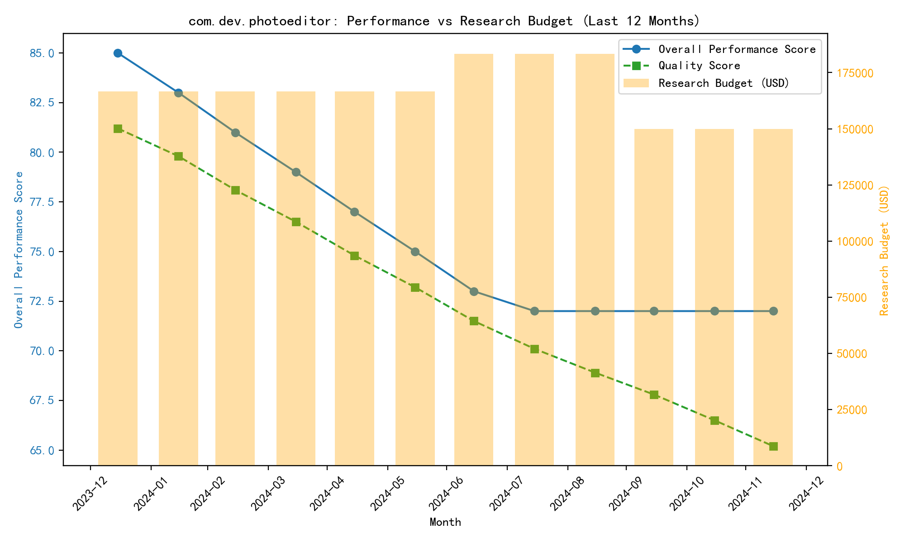
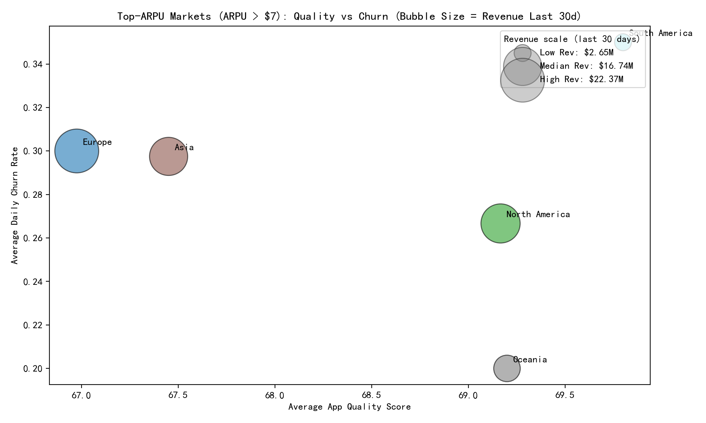
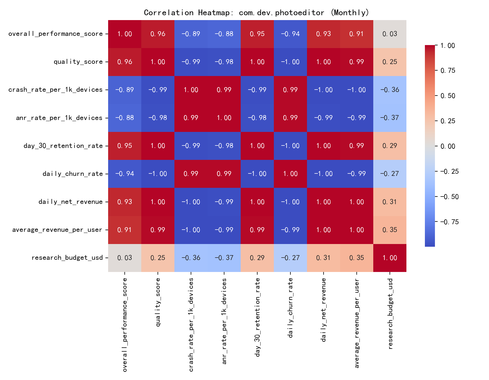

# Capital Efficiency Analysis: com.dev.photoeditor

## Executive Summary
Over the last 12 months, the company invested a total of $2M in research for com.dev.photoeditor. Despite this, the overall_performance_score fell from 85 to 72 (−13 points, −15%). Daily net revenue declined from $285k to $146k (−49%), and quality metrics deteriorated (quality_score dropped from 81.2 to 65.2), while stability worsened (crash_rate_per_1k_devices rose from 1.0 to 3.2; anr_rate_per_1k_devices from 0.4 to 1.3). Correlation analysis shows performance tightly linked to quality, retention, revenue, and ARPU, and negatively impacted by crashes, ANRs, and churn. The research_budget_usd has near-zero correlation with performance, suggesting poor capital efficiency.

Importantly for the CFO’s question: there are no geographical markets for this app where the key revenue metric (average_revenue_per_user from the geo market data) is under $3. All top markets in the geo analysis fall into ARPU> $7 or MID; ARPU< $3 does not occur for com.dev.photoeditor. Therefore, performance divergence is not driven by low-ARPU geographies; instead, it appears driven by broad quality and stability issues and differences among high-ARPU regions.

## Visual Evidence
- Performance vs Research Budget Trend (last 12 months): 
- Top-ARPU Markets (ARPU > $7): Quality vs Churn (bubble size = revenue last 30 days): 
- Correlation Heatmap of Monthly Drivers: 

## Data Highlights
1. Time-series performance and budget (google_play__comprehensive_performance_dashboard):
   - overall_performance_score: 85 → 72
   - quality_score: 81.2 → 65.2
   - crash_rate_per_1k_devices: 1.0 → 3.2
   - anr_rate_per_1k_devices: 0.4 → 1.3
   - day_30_retention_rate: 0.22 → 0.10
   - daily_churn_rate: 0.32 → 0.65
   - daily_net_revenue: $285k → $146k
   - average_revenue_per_user (time-series): 0.154 → 0.105 (appears to be daily ARPU)
   - research_budget_usd per month: ~$166.7k (Jan–Jun), ~$183.3k (Jul–Sep), ~$150k (Oct–Dec), totaling $2M.

2. Geographic segmentation (google_play__geo_market_analysis): key revenue metric segmentation using average_revenue_per_user:
   - ARPU>7 markets: 13
   - ARPU<3 markets: 0
   - MID: 1

   Aggregated segment comparison:
   - ARPU>7 (13 markets):
     - Sum revenue_last_30_days ≈ $67.12M
     - avg_quality ≈ 68.02; avg_retention_30d ≈ 0.208; avg_churn ≈ 0.288; avg_store_conv ≈ 0.068
     - avg_daily_installs ≈ 4,345; avg_active_devices ≈ 209,308
   - MID (1 market):
     - revenue_last_30_days ≈ $1.65M
     - avg_quality ≈ 72.1; retention_30d ≈ 0.17; churn ≈ 0.36; store_conv ≈ 0.077
     - avg_daily_installs ≈ 8,950; avg_active_devices ≈ 325,000

   ARPU<3 does not exist for this app, so the divergence analysis focuses on differences among ARPU>7 regions:
   - Europe (4 markets): revenue_last_30_days ≈ $22.37M; avg_quality ≈ 66.98; avg_churn ≈ 0.30; store_conv ≈ 0.0628; avg_active_devices ≈ 162k.
   - North America (3 markets): revenue ≈ $17.68M; avg_quality ≈ 69.17; avg_churn ≈ 0.267; store_conv ≈ 0.0723; avg_active_devices ≈ 268k.
   - Asia (4 markets): revenue ≈ $16.74M; avg_quality ≈ 67.45; avg_churn ≈ 0.298; store_conv ≈ 0.0700; avg_active_devices ≈ 218k.
   - Oceania (1 market): revenue ≈ $7.68M; highest retention (0.26) and lowest churn (0.20); strong quality (69.2); store_conv ≈ 0.06; avg_active_devices ≈ 112k.
   - South America (1 market): revenue ≈ $2.65M; highest churn (0.35), lowest retention (0.16), yet highest installs (6,850) and active devices (285k) among ARPU>7 regions—indicative of monetization/engagement friction.

## Diagnostics: What’s driving the decline?
- Correlation analysis (monthly, Pearson):
  - Positive with performance: quality_score (0.96), day_30_retention_rate (0.95), daily_net_revenue (0.93), average_revenue_per_user (0.91)
  - Negative with performance: daily_churn_rate (−0.94), crash_rate_per_1k_devices (−0.89), anr_rate_per_1k_devices (−0.88)
  - Near-zero correlation with research_budget_usd (0.026), implying spend has not been translating into quality or retention improvements.

- Trend synthesis:
  - Stability deterioration (crashes/ANRs) coincides with sustained drops in quality, retention, and revenue.
  - Research spending stepped up mid-year (Jul–Sep) without arresting the decline; reductions in budget Q4 also did not improve performance.
  - Across top-ARPU regions, Europe and Asia show relatively higher churn (~0.30), while North America and Oceania have lower churn, higher retention, and better quality—correlating with more resilient performance.

## Prescriptive Insights and Recommendations
1. Reallocate research budget toward engineering stability and user experience improvements:
   - Target crash_rate_per_1k_devices and anr_rate_per_1k_devices reductions via performance engineering (e.g., crash triage, automated regressions, ANR watchdog optimizations). Given the strong negative correlations, lowering crashes/ANRs should yield outsized benefits on quality and retention.
   - Establish stability OKRs: e.g., reduce crash_rate from 3.2 to <1.5 per 1k and ANRs from 1.3 to <0.7 per 1k within two quarters.

2. Region-specific action plans among top ARPU markets (> $7):
   - Europe and Asia: prioritize churn reduction (current ~0.30) and conversion improvements (store_conv ~0.063–0.070). Actions: onboarding UX audits, paywall/A-B pricing experiments, localization of value messaging, and friction removal in checkout funnels.
   - South America: address extreme engagement monetization gap—high installs and active devices with low revenue and poor retention (0.16), high churn (0.35). Actions: lifecycle messaging, regional pricing/package optimization, promotions tied to early retention milestones, and stability fixes if device-specific issues are prevalent.
   - North America and Oceania: protect strengths (lower churn, higher retention), use as early rollout markets for feature/stability changes; set guardrail KPIs to ensure changes don’t degrade quality.

3. Product and pricing optimization:
   - Improve store_conversion_rate via streamlined purchase flows, clearer value communication, and reduced refund friction.
   - Consider tiered pricing or bundles tailored by region to improve ARPU where engagement is strong but monetization lags.

4. Monitoring and governance for capital efficiency:
   - Tie future research budget releases to measurable quality and retention outcomes (e.g., gating additional funds on meeting stability and retention thresholds), given the current near-zero correlation between spend and performance.
   - Implement weekly quality/retention dashboards and cohort retention analyses to detect regressions early.

## Predictive Outlook
If current crash/ANR trends persist, expect further degradation in quality and retention, with continued revenue softening. Conversely, modeling from correlations implies that improvements in stability and churn could materially lift overall performance. Prioritizing stability in Europe and Asia and monetization/retention in South America should have the highest immediate leverage while safeguarding North America and Oceania.

## Methodology Notes
- Data sources: google_play__comprehensive_performance_dashboard (12 months Jan–Dec 2024), google_play__geo_market_analysis (regional metrics).
- Key revenue metric for segmentation: average_revenue_per_user in geo data. Verification for under-$3 markets returned zero for both ARPU and avg_transaction_value.
- Visuals were generated via Python and saved in the working directory. Code used to create the images is included in the transcript above.

## Files Referenced
- photoeditor_trend.png
- arpu_gt7_regions_bubble.png
- photoeditor_corr.png

Overall conclusion: The capital efficiency issue is not due to low-ARPU geographies for com.dev.photoeditor; it is primarily a stability/quality/retention problem across high-ARPU regions. Redirecting research investment into targeted stability engineering and region-specific churn/monetization initiatives should yield a measurable rebound in performance and revenue.
