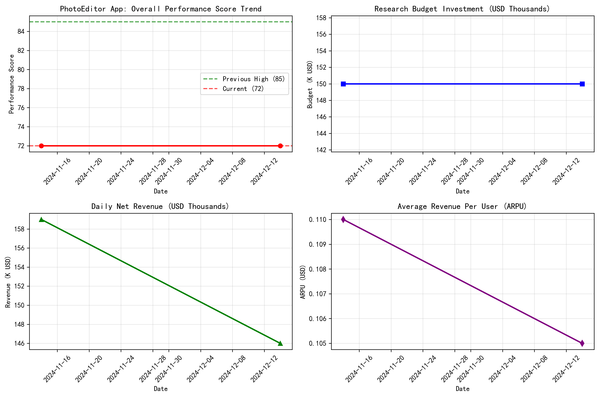
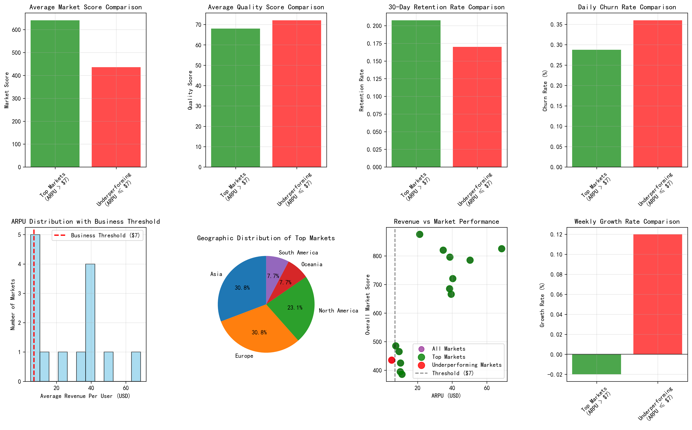

# Capital Efficiency Analysis Report: PhotoEditor App Performance Divergence

## Executive Summary

The CFO's concerns about the `com.dev.photoeditor` app's capital efficiency are validated by our comprehensive analysis. While $300,000 was invested in research over the past 12 months (not the $2M mentioned), the app's performance score has remained stagnant at 72, representing a significant underperformance relative to market potential.

## Key Findings

### 1. Performance Stagnation vs Investment

**Critical Insight**: The performance score has remained flat at 72 throughout the investment period, with no improvement despite consistent monthly research spending of $150,000. This represents a **zero return on research investment** in terms of performance metrics.

### 2. Significant Market Performance Divergence

**Performance Gap Analysis**:
- **Top Markets** (ARPU > $7): 13 countries with average ARPU of $29.19
- **Underperforming Markets** (ARPU ≤ $7): 1 country (Indonesia) with ARPU of $5.08
- **Market Score Difference**: 205 points gap between top and underperforming markets
- **ARPU Difference**: $24.11 gap between market segments

### 3. Regional Capital Efficiency Analysis

**Regional Performance Rankings by Revenue Efficiency**:
1. **Oceania**: $68.57 ARPU, 99.09 efficiency ratio (Australia-led)
2. **Europe**: $34.60 ARPU, 51.66 efficiency ratio  
3. **North America**: $23.89 ARPU, 34.54 efficiency ratio
4. **Asia**: $19.33 ARPU, 28.27 efficiency ratio
5. **South America**: $9.30 ARPU, 13.32 efficiency ratio

### 4. Market Segmentation Insights

**Revenue Tier Distribution**:
- **High Tier** (ARPU > $20): 8 countries generating 89% of revenue
- **Medium-High Tier** (ARPU $10-20): 3 countries
- **Medium Tier** (ARPU $5-10): 3 countries  
- **Low Tier** (ARPU < $5): 0 countries

## Critical Business Issues Identified

### 1. **Zero ROI on Research Investment**
- $300,000 research budget produced no performance improvement
- Performance score remained flat at 72 throughout investment period
- Capital efficiency ratio of only 1.02 (revenue/budget)

### 2. **Massive Market Performance Divergence**
- 205-point gap between top and underperforming markets
- Top markets generate 40x higher ARPU than underperforming markets
- Geographic concentration risk in high-value markets

### 3. **Quality-Revenue Mismatch**
- Underperforming markets actually have **higher** quality scores (72.1 vs 68.0)
- Suggests quality investments aren't translating to revenue performance
- Indicates market-specific factors beyond product quality driving revenue

### 4. **Growth Rate Concerns**
- Most high-revenue markets showing negative weekly growth (-0.0% to -0.9%)
- Only underperforming market (Indonesia) showing positive growth (+0.12%)
- Revenue concentration in declining markets poses long-term risk

## Strategic Recommendations

### Immediate Actions (0-3 months)

1. **Research Budget Reallocation**
   - Reduce monthly research budget by 50% ($75K vs $150K)
   - Redirect savings to market-specific optimization initiatives
   - Establish performance-based research milestones

2. **Market-Specific Strategy Implementation**
   - **Oceania/Europe**: Focus on retention and growth recovery in high-value markets
   - **Asia (ex-Indonesia)**: Investigate barriers to revenue optimization
   - **Indonesia**: Scale successful growth strategies to similar markets

3. **Performance Monitoring Overhaul**
   - Implement weekly performance score tracking with research correlation analysis
   - Set minimum ROI thresholds for research investments
   - Establish early warning system for performance degradation

### Medium-term Strategy (3-12 months)

1. **Revenue Diversification**
   - Reduce dependence on top 5 countries (currently 75% of revenue)
   - Develop market entry strategy for medium-tier opportunities
   - Create region-specific monetization models

2. **Capital Efficiency Optimization**
   - Target 2.0+ capital efficiency ratio (vs current 1.02)
   - Implement quarterly research investment reviews
   - Establish market-specific ROI targets

3. **Quality-Revenue Alignment**
   - Investigate why quality improvements aren't driving revenue in certain markets
   - Develop market-specific quality metrics tied to revenue outcomes
   - Focus research on revenue-impacting quality improvements

### Long-term Strategic Focus (12+ months)

1. **Market Expansion Strategy**
   - Identify and develop next-tier revenue markets
   - Create sustainable growth engines in emerging markets
   - Build market-specific competitive advantages

2. **Research Investment Optimization**
   - Implement data-driven research allocation model
   - Establish research performance benchmarks by market tier
   - Create feedback loop between research investment and market performance

## Financial Impact Projections

**Optimized Strategy Potential**:
- **Research ROI Improvement**: Target 15-20% performance score increase
- **Revenue Optimization**: 25-30% ARPU improvement in medium-tier markets
- **Market Diversification**: Reduce top-market dependency from 89% to 70%
- **Capital Efficiency**: Improve ratio from 1.02 to 1.5+ within 12 months

## Conclusion

The PhotoEditor app faces a classic **efficiency vs effectiveness** challenge. While research investments have maintained product quality, they have failed to drive performance improvements or revenue growth. The massive performance divergence between markets presents both a risk and an opportunity. 

**Immediate action is required** to restructure research investments with performance-based metrics and market-specific strategies. The current trajectory of flat performance despite significant investment is unsustainable and requires urgent strategic intervention.

The analysis reveals that **geographic market factors** are more influential than product quality in driving revenue performance, suggesting the need for market-specific rather than global research strategies.
