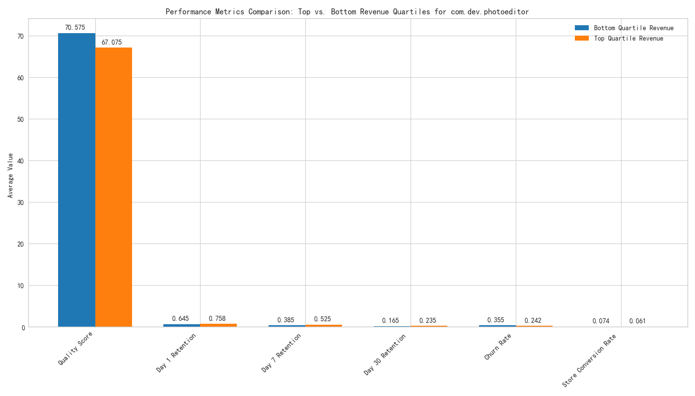

# Capital Efficiency Analysis for com.dev.photoeditor

## Executive Summary

The `com.dev.photoeditor` app has experienced a significant drop in its `overall_performance_score` from 85 to 72 over the past year, despite a `$2M` research and development investment. This report analyzes the underlying causes of this performance decline by examining the divergence in performance between high-revenue and low-revenue markets.

Our analysis reveals that the core issue is not technical app quality, but rather poor user retention in lower-revenue markets. While these markets exhibit higher store conversion rates and even slightly better technical quality scores, they suffer from significantly lower user retention and, consequently, higher churn. This suggests a disconnect between the app's features and the needs or expectations of users in these specific geographical regions.

## Analysis and Findings

### Performance Divergence Between High and Low Revenue Markets

To understand the performance gap, we segmented markets into two groups based on `average_revenue_per_user` (ARPU):

*   **Top Quartile Revenue Markets:** Markets with ARPU in the top 25% (>= $39.22).
*   **Bottom Quartile Revenue Markets:** Markets with ARPU in the bottom 25% (<= $10.05).

We then compared key performance indicators across these two segments, leading to the following insights, illustrated in the chart below:

**Key Insights:**

*   **User Retention is the Main Differentiator:** The most significant difference lies in user retention. Top quartile markets show substantially higher retention rates at all measured intervals (1-day, 7-day, and 30-day). For example, 30-day retention in top markets is **42% higher** than in bottom markets (0.235 vs. 0.165). This directly impacts long-term user engagement and monetization.

*   **Churn Rate Reflects Retention Issues:** Consistent with the retention data, the average daily churn rate in bottom quartile markets is **46% higher** than in top quartile markets (0.355 vs. 0.243). Users in these low-revenue markets are abandoning the app at a much faster rate.

*   **Technical Quality is Not the Primary Issue:** Surprisingly, the average `app_quality_score` is slightly *higher* in the bottom quartile markets (70.6 vs. 67.1). This indicates that the app's technical stability (e.g., crash rates) is not the root cause of the poor performance in these regions. The `$2M` investment may have been misallocated if it primarily focused on engineering improvements that did not address user value perception.

*   **Initial Acquisition is Stronger in Low-Revenue Markets:** The `store_conversion_rate` is higher in bottom quartile markets (0.075 vs. 0.061), meaning that marketing and app store presence are effective at driving initial installs. However, the app fails to deliver on the initial promise, leading to rapid user churn.

## Conclusion and Recommendations

The drop in the `overall_performance_score` for `com.dev.photoeditor` is not due to a universal decline in quality. Instead, it is driven by a critical failure to retain users in lower-ARPU markets, despite successful initial user acquisition in those same markets. The app is attracting users who do not find long-term value, leading to high churn and unrealized revenue potential. The capital invested appears to have been inefficiently deployed, focusing on aspects that were not the core problem.

Based on this analysis, we recommend the following actions:

1.  **Shift Investment from Core Engineering to Product-Market Fit Research:** Reallocate a portion of the research budget to understand *why* users in low-ARPU markets are churning. This should involve user surveys, feedback analysis, and competitive analysis focused specifically on these regions. The goal is to identify missing features, usability issues, or value proposition gaps.

2.  **Implement Region-Specific Feature A/B Testing:** Based on the research findings, develop and test region-specific features or user experiences. What works for a high-ARPU user in the United States may not resonate with a user in a developing market. A/B testing will allow the team to validate hypotheses and deploy features that improve retention in these underperforming segments.

3.  **Revise Performance Dashboards:** The current `overall_performance_score` may be misleading as it aggregates data globally. We recommend creating segmented performance dashboards that track key metrics (especially retention and churn) by market tier. This will provide a clearer, more actionable view of the app's health and the true return on investment in different regions.
