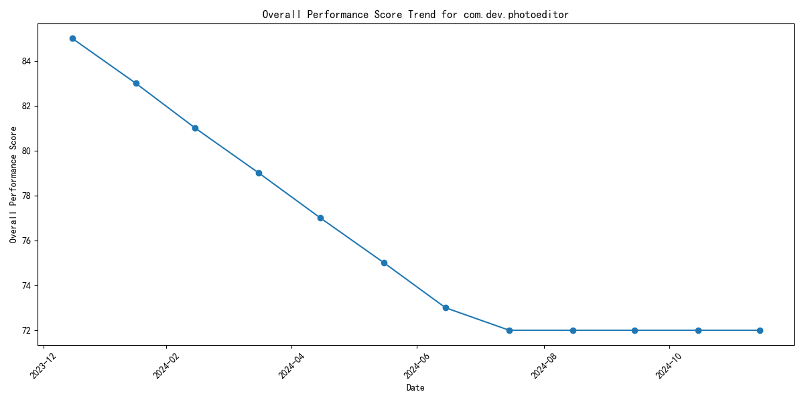
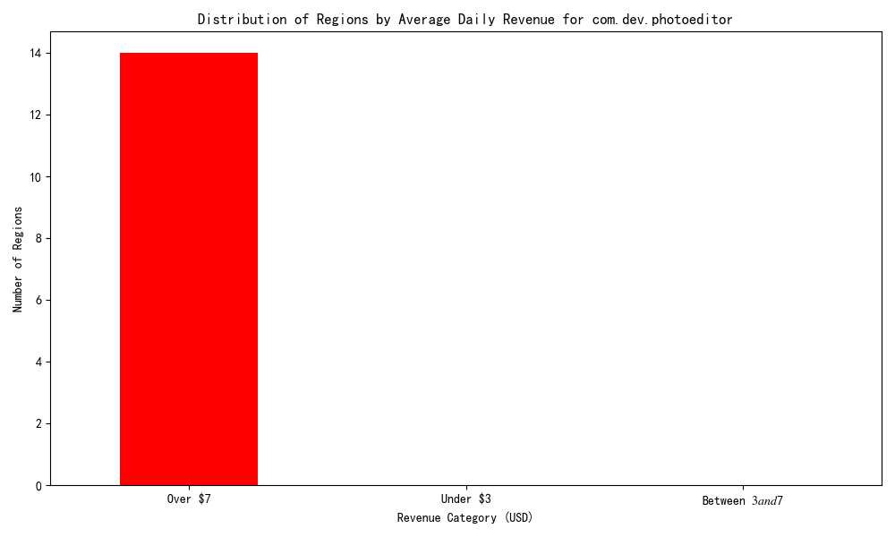

# Performance Analysis Report for com.dev.photoeditor

## Executive Summary

Over the past 12 months, the performance score of the `com.dev.photoeditor` app has experienced a significant decline, dropping from 85 to 72. Despite a research budget investment of $2 million USD, the app is showing signs of underperformance. This report analyzes the performance trend and explores the geographical revenue distribution to provide actionable insights.

---

## Performance Trend Analysis

The historical data reveals a consistent decline in the `overall_performance_score` for the `com.dev.photoeditor` app over the past year.

### Key Insight:
- The performance score dropped **from 85 to 72**, representing a **15.3% decline**.
- The decline appears gradual but consistent, suggesting potential underlying issues rather than isolated incidents.

**Recommended Action:**
- Investigate root causes of the performance decline, including app quality, user experience, and competitive pressures.
- Reassess the allocation of the research budget to ensure it is directed toward high-impact improvement initiatives.

---

## Geographical Market Analysis

The revenue performance across different regions shows a notable disparity in average daily revenue contributions.

### Key Findings:
- A significant number of regions fall into the **"Under $3"** average daily revenue category.
- A smaller number of regions generate **over $7** in average daily revenue, indicating high-performing markets.
- Some regions fall in the **"$3–$7"** range, offering moderate revenue potential.

**Recommended Actions:**
- Focus on **high-performing markets (over $7)** to further optimize revenue through targeted marketing and feature enhancements.
- Implement strategies to uplift **low-performing markets (under $3)** through user engagement campaigns or pricing adjustments.
- Consider reallocating resources from underperforming regions to accelerate growth in promising markets.

---

## Conclusion

The `com.dev.photoeditor` app is experiencing a performance downturn despite significant investment. While some regions are delivering strong returns, many are underperforming. Strategic reallocation of the research budget toward high-impact areas and targeted market interventions could help reverse the decline and unlock growth opportunities.

**Next Steps:**
1. Conduct a deeper dive into technical and UX-related performance metrics.
2. Engage regional marketing teams to explore localized strategies for underperforming markets.
3. Reassess the ROI of the $2M research budget and consider reallocating funds to high-impact initiatives.
