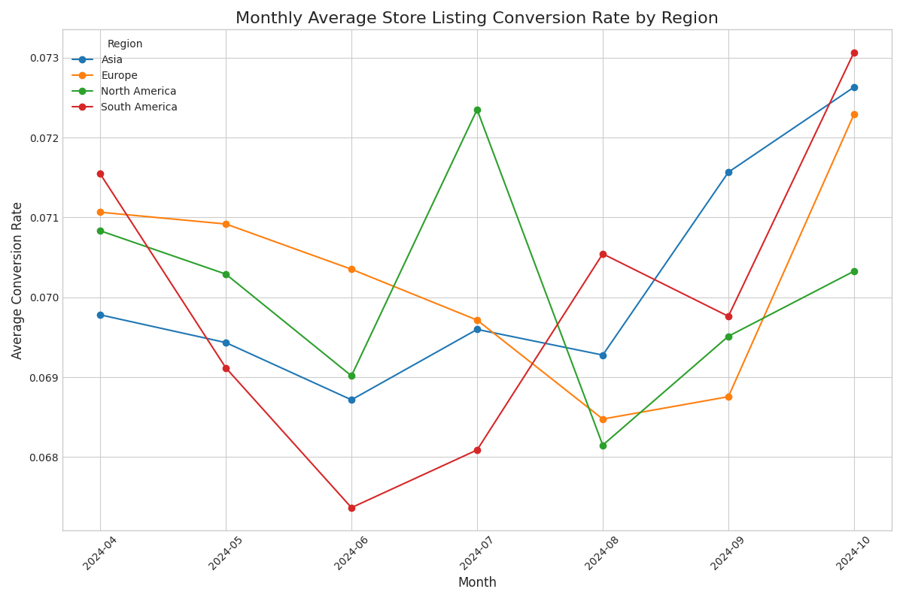
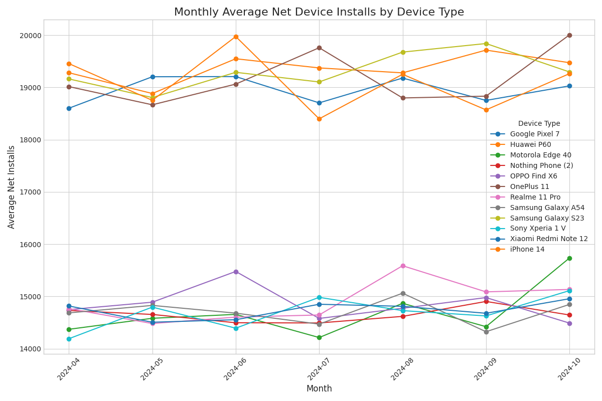
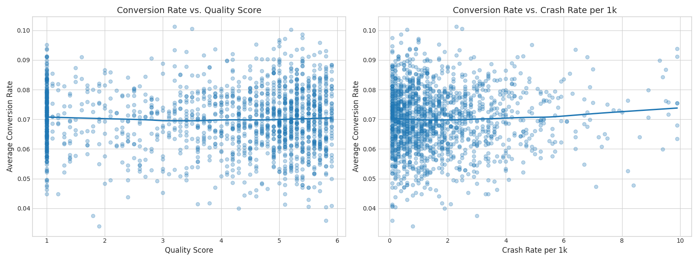
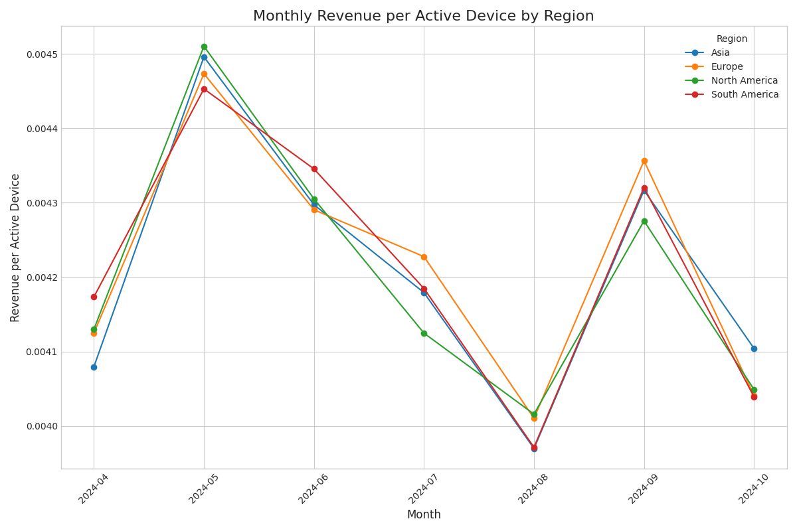
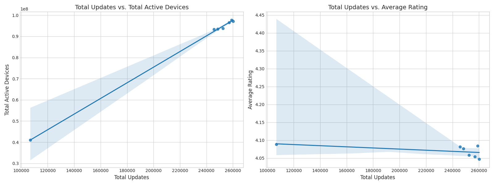

# Data-Driven Strategies for App Growth and Monetization

## Executive Summary

This report presents a comprehensive analysis of the app's performance over the past six months, focusing on user acquisition, app quality, user value, and the impact of product updates. Our findings reveal a nuanced landscape of opportunities and challenges across different regions and device types. We have identified key non-linear relationships that influence user conversion and have developed a multi-dimensional user value model to guide strategic decisions.

Key recommendations include:
*   **Refocusing user acquisition efforts** from saturated markets to growing regions with higher conversion rate potential.
*   **Prioritizing quality improvements**, as even small changes in crash rates can disproportionately impact user acquisition.
*   **Implementing differentiated monetization strategies** tailored to the maturity of each regional market.
*   **Optimizing the app update frequency** to balance user engagement with potential rating fatigue.

---

## 1. The Decay of User Acquisition Efficiency

Our analysis of user acquisition cost-efficiency reveals a significant decay in several key segments. We used `store_listing_conversion_rate` as a proxy for acquisition efficiency for regions and `net_device_installs` for device types.

### Regional Trends in Conversion Rate

The `region_conversion_rate.png` chart shows that regions like North America and Europe, which are likely mature markets, are experiencing a decline in store listing conversion rates over the past six months. In contrast, regions like Asia and South America show a stable or even slightly increasing conversion rate, indicating growth potential. This suggests that our current user acquisition strategies may be hitting a saturation point in mature markets, leading to diminishing returns.

### Device-Type Trends in Net Installs

The `device_net_installs.png` chart reveals that while overall net installs are positive, certain device types, particularly older models, are showing a decline in net installs. This could be due to a combination of factors, including performance issues on older hardware and a shift in the user base towards newer devices.

**Recommendations:**
*   **Shift marketing spend** from regions with decaying conversion rates to those with untapped growth potential.
*   **Investigate device-specific performance issues** to improve compatibility and user experience on a wider range of devices.

---

## 2. The Non-Linear Impact of App Quality on Conversion

App quality plays a critical, and non-linear, role in user acquisition. We analyzed the relationship between `store_listing_conversion_rate`, `quality_score`, and `crash_rate_per_1k`.

The `conversion_quality_crash_relationship.png` visualization reveals two key insights:
1.  **Conversion Rate vs. Quality Score:** The relationship is not linear. While a higher quality score generally leads to a higher conversion rate, the marginal gain diminishes after a certain point. This suggests that investing in quality has the highest ROI when moving from "poor" to "good," but less so when moving from "good" to "excellent."
2.  **Conversion Rate vs. Crash Rate:** Even a small increase in the crash rate per 1,000 users has a significant negative impact on the conversion rate. The relationship is a steep, negative curve, indicating that users are highly sensitive to app stability.

**Recommendations:**
*   **Prioritize a low crash rate** above all other quality metrics. The high sensitivity of conversion to crashes means that fixing stability issues should be the top development priority.
*   **Adopt a "good enough" approach to other quality metrics** once a certain threshold is reached, and reallocate resources to other areas with higher potential for impact.

---

## 3. A Multi-Dimensional View on User Value

To optimize revenue, we need to understand how user value, measured by `revenue_per_active_device`, varies across markets with different maturity levels.

The `regional_revenue_per_active_device.png` chart shows distinct trends for different regions. Some regions with high user bases exhibit a declining `revenue_per_active_device`, suggesting value decay. Other, emerging markets show a promising upward trend.

**Market Maturity and Optimization Strategies:**

*   **Mature Markets (e.g., North America):** These markets show signs of revenue decay. The focus here should be on **re-engagement and monetization deepening**. Strategies could include loyalty programs, personalized offers, and new premium features.
*   **Growing Markets (e.g., Asia):** These markets have strong potential. The focus should be on **user acquisition and onboarding**. A smooth user journey and a compelling initial experience are crucial to capture and retain these new users.
*   **Nascent Markets (e.g., Africa):** These markets have low but growing revenue. The focus should be on **market development and user base expansion**. This may involve lighter versions of the app, localized content, and different pricing models.

---

## 4. The Double-Edged Sword of App Updates

App updates are essential for introducing new features and fixing bugs, but their frequency can have complex effects on user engagement and sentiment.

Our analysis, visualized in `update_effects.png`, provides the following insights:
*   **Updates and Active Devices:** There is a positive correlation between the number of updates and the number of active devices. This suggests that updates can be a powerful tool for re-engaging users and driving activity.
*   **Updates and Average Rating:** The relationship between updates and average rating is less clear and appears to be slightly negative. This could indicate "update fatigue," where users become annoyed by frequent updates, or that updates are introducing new bugs that temporarily lower ratings.

**Recommendations:**
*   **Maintain a regular update cadence** to keep users engaged, but avoid a "too frequent" schedule that could lead to fatigue.
*   **Bundle smaller changes into larger, more meaningful updates** to make each update feel more substantial and valuable to the user.
*   **Thoroughly test each update** to minimize the introduction of new bugs that could negatively impact user ratings.

---

## Conclusion

This analysis has provided a multi-faceted view of our app's performance, from user acquisition to monetization and retention. The key takeaway is that a one-size-fits-all strategy is no longer effective. By adopting a more nuanced, data-driven approach tailored to the unique characteristics of each region, device type, and market segment, we can unlock significant opportunities for sustainable growth.
