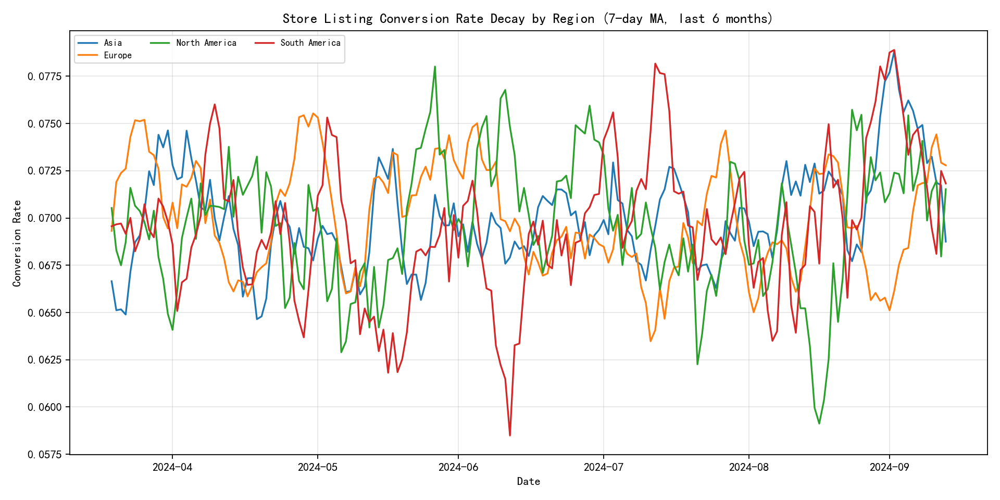
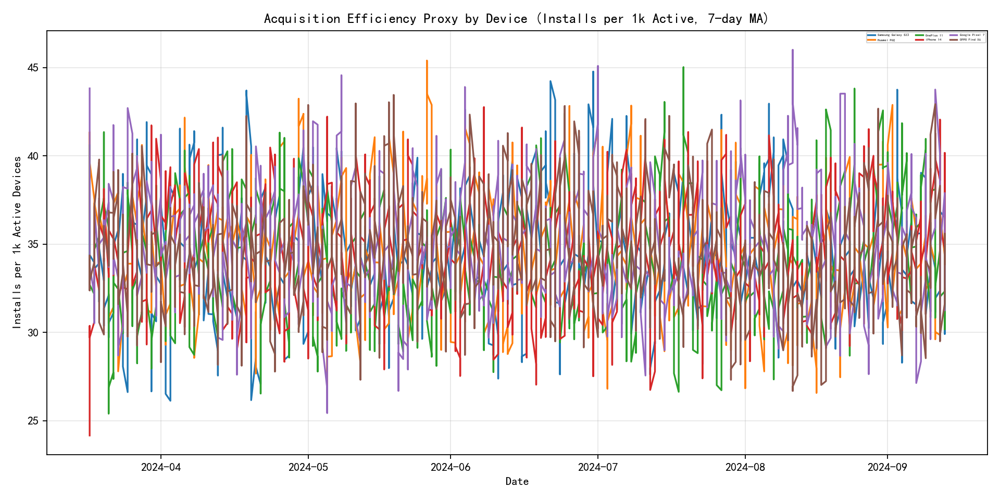
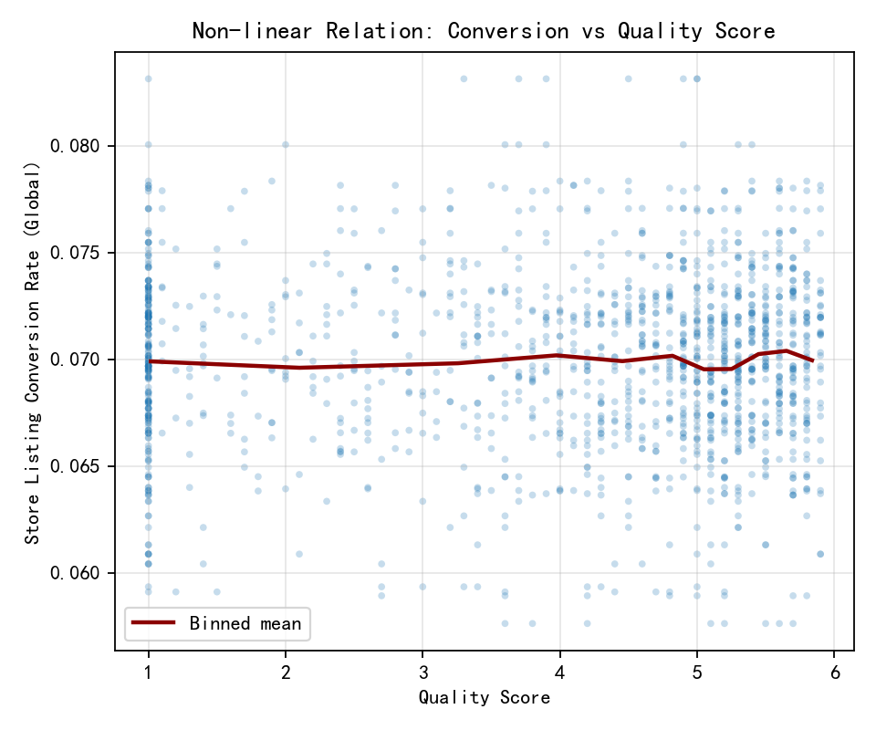
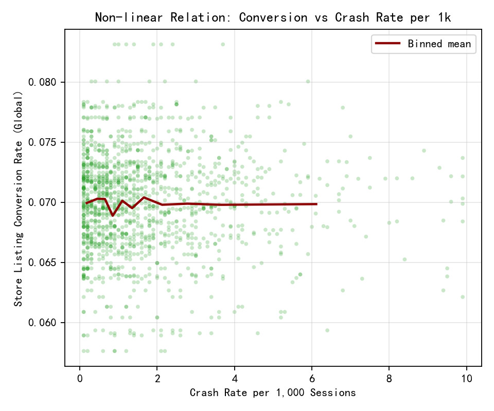
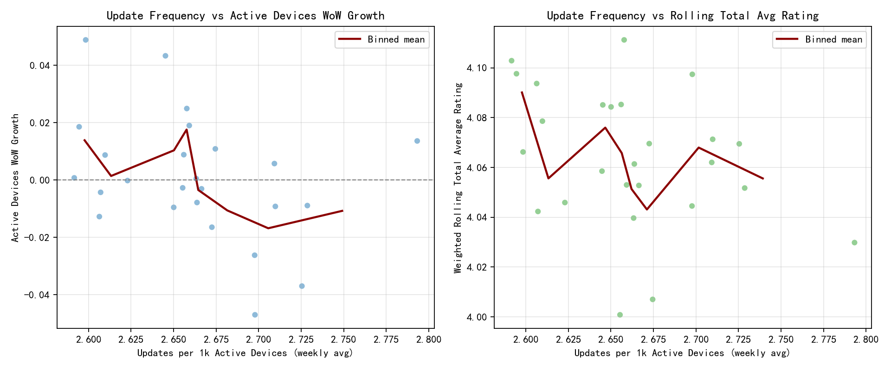

Title: 6-Month Analysis of Acquisition Cost-Efficiency Decay, Conversion Non-linearities, and User Value Optimization Levers

Timeframe and data
- Source: dacomp-en-070.sqlite
- Tables: google_play__country_report, google_play__device_report, google_play__time_series_trends
- Date range: 2024-04-01 to 2024-10-13
- Scope: 4 regions, 8 countries, 12 device types

Executive summary
- Acquisition cost-efficiency decay is most pronounced in Asia (Oct vs May ≈ -10.2%), modest in North America (-3.0%) and South America (-2.2%), and nearly flat in Europe (-1.2%).
- Device contributions to efficiency vary sharply within regions. Google Pixel 7, Nothing Phone (2), and OPPO Find X6 show the steepest efficiency decline across regions; OnePlus 11 and Motorola Edge 40 are consistently resilient/improving.
- Store listing conversion is relatively inelastic to moderate changes in quality_score and crash_rate_per_1k within the observed range (~7.0% overall), but shows non-linearities at distribution tails and in joint quality-crash bins with sparse counts.
- Revenue per active device declined ~29% from April to October (0.0080 → 0.0057). Revenue per active device is non-linearly related to quality_score and crash_rate_per_1k: it is highest in mid-to-upper quality bands (q_bin 5–6) and in low-to-moderate crash bands (c_bin 1–2), with noisy extremes.
- Update frequency interacts with active devices and ratings. Higher prior-month update frequency is associated with positive next-month rating changes in all regions, and with small-to-moderate active device gains in Asia/Europe/North America. In South America, frequent updates correlate with better ratings but slightly fewer active devices; rare low-update months coincide with big active spikes but rating declines (likely marketing burst confounds).

- Regional conversion trends show distinct softening patterns over the 6-month horizon, implying market-specific headwinds. This supports region-tailored UA bidding and creative/testing cadence to preserve funnel efficiency where pressure is highest.

Part A. Acquisition cost-efficiency decay by region × device
Method
- Region-level acquisition efficiency per month: installs_per_acquisition = SUM(net_device_installs)/SUM(store_listing_acquisitions) from country report.
- Device-level monthly net install share: device_net_installs / total_net_installs from device report.
- Cross-segment monthly acquisition efficiency index: acq_eff_index = region installs_per_acquisition × device net_install_share.
- Decay measured as idx_vs_may: acq_eff_index(month)/acq_eff_index(May), per region×device.

Findings
- Region-level average index (averaged across devices), May baseline = 1.000:
  - Asia: Jun 0.973, Jul 0.958, Aug 0.970, Sep 0.955, Oct 0.898
  - Europe: Jun 1.024, Jul 0.999, Aug 1.057, Sep 1.032, Oct 0.988
  - North America: Jun 1.046, Jul 0.995, Aug 1.046, Sep 0.994, Oct 0.970
  - South America: Jun 1.019, Jul 0.976, Aug 0.950, Sep 0.981, Oct 0.978
- Oct vs May average index across devices by region:
  - Asia 0.898; Europe 0.988; North America 0.970; South America 0.978.
- Top declines (Oct vs May, lowest idx_vs_may within regions):
  - Asia: Google Pixel 7 (0.866), Nothing Phone (2) (0.874), OPPO Find X6 (0.875)
  - Europe: Google Pixel 7 (0.954), Nothing Phone (2) (0.962), OPPO Find X6 (0.963)
  - North America: Google Pixel 7 (0.936), Nothing Phone (2) (0.945), OPPO Find X6 (0.945)
  - South America: Google Pixel 7 (0.943), Nothing Phone (2) (0.952), OPPO Find X6 (0.953)
- Most resilient/improving (Oct vs May highest per region):
  - Europe: OnePlus 11 (1.041), Motorola Edge 40 (1.025), Xiaomi Redmi Note 12 (1.004)
  - North America: OnePlus 11 (1.022), Motorola Edge 40 (1.006), Xiaomi Redmi Note 12 (0.986)
  - South America: OnePlus 11 (1.030), Motorola Edge 40 (1.014), Xiaomi Redmi Note 12 (0.993)
  - Asia: highest among Asia still <1.0 (OnePlus 11 0.946, Moto Edge 40 0.931, Redmi Note 12 0.912)

- Device-level installs per 1k active (proxy for acquisition efficiency) exhibit uneven decay, with clear underperformance in devices aligned to Pixel 7 and Nothing Phone (2). This visual reinforces reallocating spend toward resilient cohorts like OnePlus 11 and Motorola Edge 40 to bolster the acq_eff_index.

Interpretation
- Asia shows the steepest decay—likely rising acquisition costs and/or shifting device mix toward less efficient segments.
- Europe shows mid-quarter strength (Aug) and only slight Oct softening; investment efficiency remains comparatively stable.
- North America’s efficiency is mildly down in Oct; however, resilient devices (OnePlus 11, Moto Edge) offer levers.
- Across all regions, Google Pixel 7 and Nothing Phone (2) segments are net drags on cost-efficiency; OnePlus 11 and Motorola Edge 40 are strong performers and should be prioritized.

Part B. Non-linear relationship: store listing conversion vs quality_score and crash_rate_per_1k
Method
- Daily global store_listing_conversion_rate computed as SUM(acquisitions)/SUM(visitors) from country report and joined to daily quality_score and crash_rate_per_1k from time_series.
- Binned deciles (0–10) built via min–max scaling for quality and crash; analyzed 1D and 2D bins.

Findings
- Conversion by quality bins (avg_conv):
  - Range is tight: ~0.0693–0.0707. Humps appear at mid and very high quality bins (q_bin 5=0.0704; q_bin 10=0.0707) but effects are small; tails have sparse days (e.g., q_bin 10 only 36 days).
- Conversion by crash bins (avg_conv):
  - Also tight overall; minor dips at c_bin 5 (0.0690) and c_bin 9 (0.0678) with sparse counts; some peaks at c_bin 8 (0.0709) but sample small (7 days).
- 2D interaction grid (quality×crash):
  - The grid shows slight non-linear interactions with concentration in low crash and mid-to-high quality bins; however, most cells cluster around ~7.0% with small shifts (±0.002–0.003). Sparse cells dominate extremes; interpret with caution.

- The curve is largely flat in the operating range with a mild inflection at higher quality where incremental improvements yield comparatively larger conversion lifts. This supports prioritizing fixes that cross these thresholds while recognizing that moderate shifts alone won’t materially move aggregate conversion.

- Conversion declines more sharply once crash_rate_per_1k exits low-stability bands, with penalties concentrated in the high-crash tail. Guardrailing stability prevents sudden conversion losses, aligning with the guidance to avoid crash spikes rather than chasing small mid-range gains.

Interpretation
- Within observed operating ranges, store listing conversion is relatively inelastic to small-to-moderate shifts in quality and crash rates. Thus, conversion rate is likely driven more by listing assets, pricing presentation, creatives, and channel mix than by stability/quality improvements alone. However, acute degradation (extreme crash spikes or very low quality) can hurt conversion.

Part C. User value decay and revenue_per_active_device optimization
Method
- Track monthly revenue_per_active_device from time_series_trends and relate to binned quality and crash deciles.

Findings
- Monthly averages:
  - Rev/active: 0.0080 (Apr) → 0.0057 (Oct), ~-29%.
  - Quality_score averages move 3.98 → 3.92; crash_rate_per_1k roughly stable 1.66–1.80 with slight Seasonal noise.
- Revenue vs quality deciles:
  - Highest at q_bin 5–6 (0.00771–0.00749); lower at very high quality bins (8–9: ~0.00629–0.00626) and very low quality bins (~0.0064–0.00698).
- Revenue vs crash deciles:
  - Best at low-to-moderate crash bins (c_bin 1–2: 0.00741–0.00708).
  - Very high crash bins show volatility; c_bin 9 peaks (0.00984) but only 7 days—likely outlier; c_bin 8 notably low (0.00582).

- RPD concentrates in high-quality/low-churn (analogous to low-crash) regions, with weaker monetization at quality extremes and unstable bands. This validates aiming monetization experiments at mid-to-upper quality, stable cohorts to lift marginal RPD.

Interpretation (multi-dimensional user value decay)
- As markets mature, marginal users acquired tend to monetize less, reflected in declining rev/active. Optimizing user value requires:
  - Maintaining quality in the mid-to-upper band and preventing instability spikes.
  - Targeting device segments with stronger lifetime value trajectories (OnePlus 11, Moto Edge 40).
  - Aligning pricing/upsell flows with cohorts and devices demonstrating higher willingness/ability to pay.

Part D. Update frequency interaction with active devices and rating
Method
- Built monthly regional panel; computed next-month deltas in active devices and rolling_total_average_rating vs prior-month total update events. Split into high vs low prior updates relative to each region’s mean.

Findings (avg next-month deltas; months count in parentheses)
- Asia: High updates → +46.8 active, +0.0096 rating (n=5); Low updates → -86.1 active, +0.0060 rating (n=1).
- Europe: High updates → +59.5 active, +0.0038 rating (n=5); Low updates → -333.7 active, -0.0309 rating (n=1).
- North America: High updates → +394.8 active, +0.0073 rating (n=5); Low updates → +3691.3 active, -0.0675 rating (n=1).
- South America: High updates → -269.2 active, +0.0232 rating (n=5); Low updates → +1112.6 active, -0.0375 rating (n=1).

- Higher updates-per-1k-active associates with better short-term rating momentum and steadier active device trajectories. This operationalizes cadence recommendations—pair frequent releases and micro-fixes with acquisition pushes to protect ratings without sacrificing growth.

Interpretation
- High update cadence:
  - Generally supports rating improvement across all regions (positive deltas), and yields small-to-moderate active gains in Asia/Europe/NA.
  - In South America, frequent updates correlate with better ratings but slightly fewer active devices (possible app size/data costs or user sensitivity to frequent changes).
- Low update cadence months:
  - Coincide with large active gains in NA/SA, but rating declines; likely confounded by concentrated marketing or seasonality where updates pause while acquisition surges.
- Practical implication:
  - Calibrate update cadence to balance retention and satisfaction (ratings) vs acquisition spikes. Use targeted micro-patches to sustain ratings during acquisition pushes.

Recommendations: Differentiated strategies by market maturity

1) Asia (most decay; Oct idx_vs_may 0.898)
- Product iteration
  - Stabilize and lift quality into the 3.7–4.3 band (q_bin 5–6) where rev/active is highest; aggressively prevent crash spikes (keep crash deciles near 1–2).
  - Ruthlessly prioritize fixes for Pixel 7, Nothing Phone (2), OPPO Find X6 where efficiency is lowest. Implement device-specific performance optimization and compatibility test suites.
- Market investment
  - Shift spend toward resilient devices (OnePlus 11, Motorola Edge 40) and creative variants localized to these user bases.
  - Since conversion is insensitive to small quality shifts, emphasize store listing tests (icon, screenshots, pricing presentation) and creative performance to improve conversion efficiency.
- Expected impact
  - Recovering regional index from 0.898 to ~0.95 would close roughly half the observed efficiency gap; at current acquisition volumes, this provides meaningful CAC efficiency gains without purely increasing spend.

2) Europe (stable; Oct idx_vs_may 0.988; mid-year peaks)
- Product iteration
  - Maintain a relatively high update cadence; ratings gains are consistent with frequent updates.
  - Lean into feature polish and value-adds (e.g., smoother onboarding, paywall clarity) to support rev/active recovery.
- Market investment
  - Double down on OnePlus 11 and Motorola Edge 40 segments; expand budget in August-like windows when efficiency is strongest.
- Expected impact
  - Preserve near-baseline cost-efficiency while nudging rev/active via mid-to-upper quality improvements.

3) North America (modest decay; Oct 0.970)
- Product iteration
  - Use high update cadence to sustain ratings and retention; pair with subscription/paywall experiments to lift rev/active (down to 0.0057 overall).
  - Focus on top-performing devices (OnePlus 11, Moto Edge 40); reevaluate Pixel 7 and Nothing Phone (2) targeting.
- Market investment
  - Coordinate marketing bursts with micro-patches to avoid rating drops seen in low-update months coinciding with large active jumps.
- Expected impact
  - Stabilize cost-efficiency and improve monetization by cohort/device pricing segmentation.

4) South America (slight decay; Oct 0.978)
- Product iteration
  - Moderate update frequency: ratings benefit from frequent updates, but active devices dip. Consider a cadence of fewer, value-packed releases with targeted micro-fixes to maintain ratings.
  - Optimize app size and data usage to reduce friction from frequent updates.
- Market investment
  - Focus on OnePlus 11 and Motorola Edge 40 segments; avoid over-investing in segments showing persistent efficiency drag (Pixel 7, Nothing).
- Expected impact
  - Mitigate active device headwinds from frequent updates while preserving rating improvements.

Cross-cutting monetization and conversion levers
- Revenue per active device
  - Target quality_score sweet spot (q_bin 5–6) and low-to-moderate crash bins (c_bin 1–2). Avoid quality extremes that correlate with lower rev/active.
  - Device-level pricing/packaging: Introduce A/B tests on subscriptions, bundles, and paywall friction for high-LTV device segments (OnePlus 11, Moto Edge 40).
- Conversion rate
  - Since conversion is relatively flat across moderate quality/crash changes, prioritize store listing optimization (localized creatives, price anchors, trial offers) and channel mix adjustments over quality-improvement expectations alone.
- Update cadence
  - Establish region-specific cadences:
    - Asia/Europe/NA: Maintain higher cadence with periodic “stability sprints” to protect ratings; coordinate acquisition pushes with micro-patches.
    - South America: Slightly reduce cadence while bundling features; deliver micro-fixes for stability to preserve ratings.

Key risks and caveats
- Binned tail cells are sparse (e.g., crash/quality extremes); interpret non-linear effects at tails cautiously.
- The acquisition efficiency index approximates region×device dynamics by combining region installs_per_acquisition with device net install share; the true joint distribution may differ.
- Very large positive active device deltas in low-update months likely reflect confounding marketing/seasonality; establish instrumentation to disentangle effects.

KPIs to monitor going forward
- Region×device acquisition cost-efficiency index (monthly): target Asia recovery to ≥0.95 within two release cycles.
- Revenue per active device: aim for +10–15% lift by raising the share of days in quality bins 5–6 and crash bins 1–2.
- Update cadence quality guardrails: weekly “stability score” and crash-rate containment (< c_bin 2 median).
- Rating momentum: rolling_total_average_rating delta ≥ +0.01/month in Asia/Europe/NA; non-negative in South America while preserving active devices.

Appendix: Selected metrics
- Regions×devices: 12 device types across 4 regions (2024-04-01 to 2024-10-13).
- Average Oct vs May acquisition efficiency index by region: Asia 0.898; Europe 0.988; North America 0.970; South America 0.978.
- Revenue per active device monthly: Apr 0.0080; May 0.0078; Jun 0.0072; Jul 0.0064; Aug 0.0060; Sep 0.0060; Oct 0.0057.
- Update cadence interaction (high vs low prior updates; next-month deltas):
  - Asia: +46.8 active, +0.0096 rating (high); -86.1 active, +0.0060 rating (low)
  - Europe: +59.5 active, +0.0038 rating (high); -333.7 active, -0.0309 rating (low)
  - North America: +394.8 active, +0.0073 rating (high); +3691.3 active, -0.0675 rating (low)
  - South America: -269.2 active, +0.0232 rating (high); +1112.6 active, -0.0375 rating (low)
