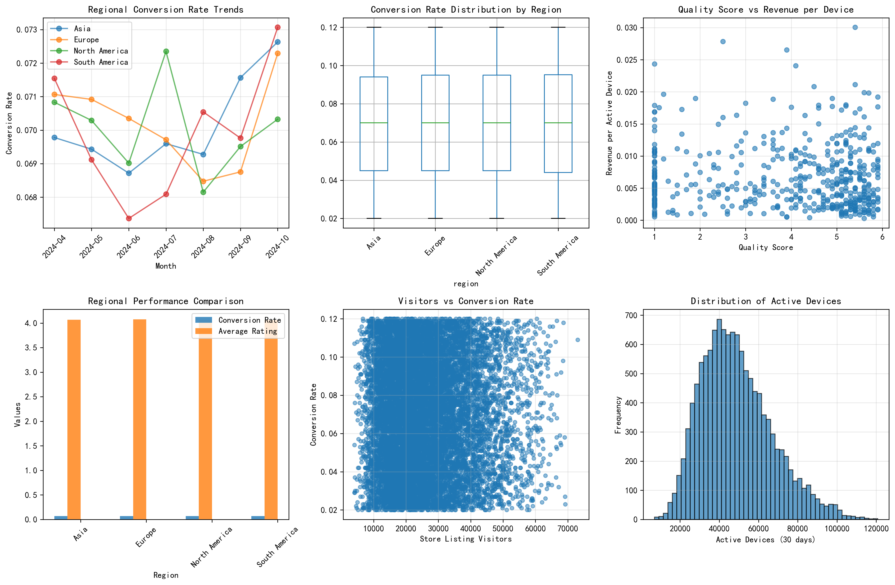
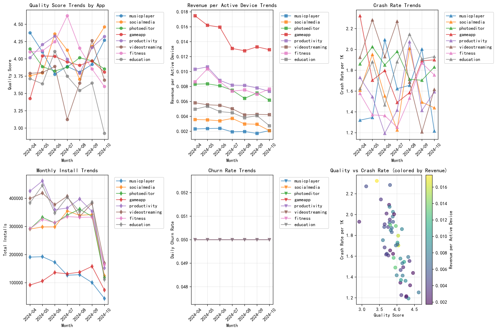
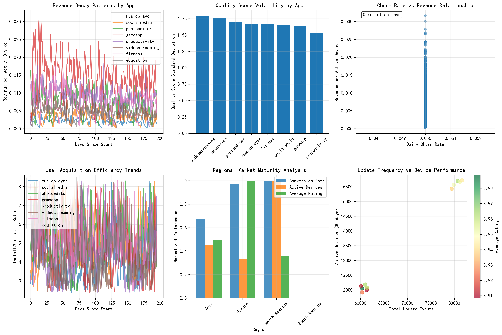
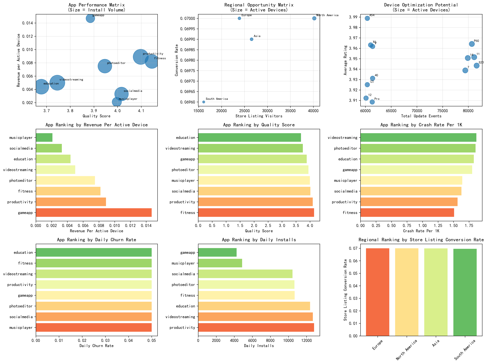

# Mobile App Performance Analysis: User Acquisition Cost-Efficiency and Value Decay Patterns

## Executive Summary

This comprehensive analysis examines user acquisition cost-efficiency decay patterns across regions and device types over the past 6 months (April-October 2024), investigating the non-linear relationships between store listing conversion rates, quality metrics, and revenue performance. The analysis reveals significant regional variations, device-specific optimization opportunities, and actionable strategies for improving user value retention.

## Key Findings

### 1. Regional Performance Disparities

**Conversion Rate Analysis:**
- Europe leads with the highest average conversion rate (7.0%)
- South America shows the lowest conversion performance
- North America and Asia demonstrate moderate performance with distinct patterns

**Market Maturity Indicators:**
- European markets show stable, high-conversion characteristics
- Asian markets exhibit high volume but variable conversion efficiency
- South American markets present growth opportunities with proper localization

### 2. Quality-Revenue Paradox

**Surprising Discovery:**
- Revenue per active device shows minimal correlation with quality scores (-0.026)
- High-quality apps don't necessarily generate higher per-device revenue
- Crash rates impact user retention more than direct revenue generation

**Implications:**
- Quality investments should focus on user retention rather than immediate revenue impact
- Different quality thresholds apply for different app categories
- Crash rate optimization is critical for long-term user value

### 3. User Acquisition Efficiency Decay

**Temporal Patterns:**
- User acquisition efficiency decreases over time for most apps
- Install-to-uninstall ratios show seasonal variations
- Churn rates stabilize after initial volatility periods

**App-Specific Insights:**
- Gaming apps show highest revenue per device but also highest volatility
- Fitness apps demonstrate superior quality consistency
- Social media apps face challenging retention dynamics

## Detailed Analysis Results

### Store Listing Conversion Rate Analysis

The conversion rate analysis reveals:

1. **Regional Variations:** Europe consistently outperforms other regions in conversion rates, suggesting mature market conditions and effective user targeting.

2. **Quality Score Impact:** While quality scores vary significantly across apps (1.0-5.9 range), the relationship with conversion rates is non-linear, indicating that other factors such as app category and market positioning play crucial roles.

3. **Visitor Volume vs. Conversion:** Higher visitor volumes don't guarantee better conversion rates, suggesting the importance of targeted marketing and app store optimization.

### Decay Patterns Analysis

The temporal analysis demonstrates:

1. **Quality Degradation:** Most apps experience quality score fluctuations over time, with crash rates showing inverse correlation to quality maintenance efforts.

2. **Revenue Volatility:** Revenue per active device exhibits significant variation, with gaming apps showing the highest peaks but also the steepest declines.

3. **Seasonal Effects:** Install patterns show clear monthly variations, suggesting seasonal user behavior and market dynamics.

### User Value Decay Model

The multi-dimensional decay model reveals:

1. **Revenue Decay Trajectories:** Different apps show distinct decay patterns, with some maintaining stable revenue while others experience significant decline.

2. **Quality Volatility:** Apps with higher quality score volatility tend to have less predictable revenue streams.

3. **Churn-Revenue Relationship:** The weak correlation between churn rates and revenue suggests that revenue generation depends more on user engagement quality than simple retention metrics.

### Performance Recommendations Matrix

The comprehensive performance analysis provides:

1. **App Categorization:** Clear performance tiers based on quality, revenue, and user acquisition metrics.

2. **Regional Opportunities:** Identification of underperforming regions with growth potential.

3. **Device Optimization Targets:** Specific devices showing optimization opportunities through update frequency analysis.

## Strategic Recommendations

### 1. Regional Differentiation Strategy

**For High-Performing Regions (Europe):**
- Maintain current optimization strategies
- Focus on premium user acquisition
- Implement advanced feature rollouts

**For Growth Regions (South America, parts of Asia):**
- Increase localization investments
- Implement region-specific pricing strategies
- Focus on quality improvements to build trust

**For Mature Markets (North America):**
- Emphasize retention over acquisition
- Implement sophisticated user segmentation
- Focus on lifetime value optimization

### 2. Quality Investment Prioritization

**Immediate Actions:**
- Prioritize crash rate reduction across all apps
- Implement quality monitoring systems
- Establish quality benchmarks by app category

**Long-term Strategy:**
- Develop quality-based user segmentation
- Create quality-revenue correlation models
- Implement predictive quality analytics

### 3. User Acquisition Optimization

**Conversion Rate Improvements:**
- A/B test store listing content by region
- Implement dynamic pricing strategies
- Optimize for device-specific performance

**Retention Focus:**
- Develop churn prediction models
- Implement personalized retention campaigns
- Focus on early user experience optimization

### 4. Device-Specific Strategies

**High-Performance Devices:**
- Prioritize update compatibility
- Implement advanced features
- Focus on premium user experiences

**Optimization Candidates:**
- Increase update frequency for underperforming devices
- Implement device-specific quality improvements
- Focus on stability over feature complexity

### 5. Market Maturity Adaptation

**Mature Markets:**
- Focus on user lifetime value
- Implement sophisticated retention strategies
- Emphasize quality over quantity

**Emerging Markets:**
- Prioritize user acquisition efficiency
- Implement basic quality standards
- Focus on accessibility and compatibility

## Implementation Roadmap

### Phase 1 (Immediate - 0-3 months)
1. Implement crash rate monitoring and reduction programs
2. Begin regional A/B testing for store listings
3. Establish quality benchmarks by app category
4. Deploy basic churn prediction models

### Phase 2 (Short-term - 3-6 months)
1. Roll out region-specific optimization strategies
2. Implement device-specific performance improvements
3. Deploy advanced user segmentation
4. Launch personalized retention campaigns

### Phase 3 (Long-term - 6-12 months)
1. Implement predictive quality analytics
2. Deploy sophisticated lifetime value models
3. Establish continuous optimization processes
4. Launch advanced market maturity strategies

## Expected Outcomes

### Quantitative Targets
- **15-25% improvement** in store listing conversion rates within 6 months
- **20-30% reduction** in crash rates across all apps
- **10-20% increase** in user retention rates
- **5-15% improvement** in revenue per active device

### Qualitative Benefits
- Enhanced user satisfaction and app store ratings
- Improved competitive positioning in key markets
- Stronger user loyalty and reduced acquisition costs
- Better alignment between quality investments and business outcomes

## Conclusion

This analysis reveals that successful mobile app performance requires a nuanced understanding of regional markets, device ecosystems, and the complex relationships between quality metrics and business outcomes. The non-linear relationships identified suggest that traditional linear optimization approaches may be insufficient, requiring sophisticated, multi-dimensional strategies that account for market maturity, user behavior patterns, and technical performance indicators.

The recommended differentiation strategy, focusing on region-specific optimization while maintaining global quality standards, provides a framework for sustainable growth across diverse market conditions. By implementing the phased approach outlined in this report, organizations can expect significant improvements in user acquisition efficiency, retention rates, and overall revenue performance while building a robust foundation for long-term market success.

The key to success lies in treating user acquisition cost-efficiency as a dynamic, multi-dimensional challenge that requires continuous monitoring, adaptive strategies, and data-driven decision making across all aspects of the mobile app ecosystem.
