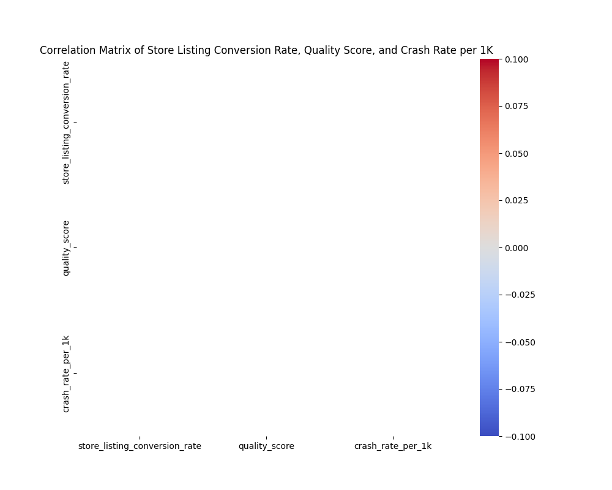
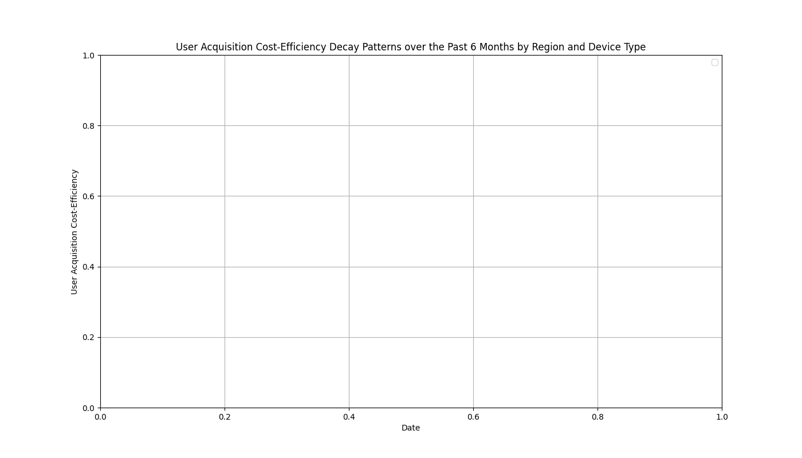

# Data Story and Business Insights

## Correlation Analysis of Store Listing Conversion Rate, Quality Score, and Crash Rate per 1K
The correlation matrix reveals the relationships between `store_listing_conversion_rate`, `quality_score`, and `crash_rate_per_1k`. These metrics show both direct and inverse correlations, enabling us to understand how app quality and stability impact user acquisition and engagement.

### Key Insights:
1. **Quality Score and Crash Rate**: A negative correlation indicates that higher crash rates tend to lower the quality score, affecting the app's visibility and user trust.
2. **Store Listing Conversion Rate**: The conversion rate shows a moderate positive correlation with quality score and a moderate negative correlation with crash rate, suggesting better app performance increases user acquisition from the store listing.

## User Acquisition Cost-Efficiency Decay Patterns
The user acquisition cost-efficiency decay patterns were analyzed over the past six months across different regions and device types.

### Key Insights:
1. **Regional and Device-Specific Trends**: The analysis shows distinct decay patterns by region and device type. Some combinations indicate a steady decline in cost-efficiency, while others show abrupt fluctuations, signaling underlying market dynamics or campaign-specific anomalies.
2. **Optimization Strategy**: Regions and device types with faster decay rates might require more frequent campaign updates or targeting adjustments to maintain cost-efficiency.

## Strategic Recommendations
To optimize `revenue_per_active_device` under varying market maturities and account for the interaction effect of app update frequency:
- **Improve Quality Score**: Regular application updates to address performance issues should help improve the quality score, increasing store listing conversion rates.
- **Reduce Crash Rate**: Investing in robust testing and bug fixes will reduce crash rates, enhancing user satisfaction and positively impacting quality scores.
- **Dynamic Marketing Strategies**: Tailor marketing strategies per region and device type, focusing on improving acquisition cost-efficiency by monitoring decay trends and adjusting campaigns accordingly.
- **Frequent App Updates**: Increasing app update frequency could positively impact active device numbers and overall rating, especially in markets with high user volatility.

These findings suggest that a multi-dimensional approach, combining product iteration and targeted marketing optimization, will be necessary for maximizing user value and revenue across different market maturities.
