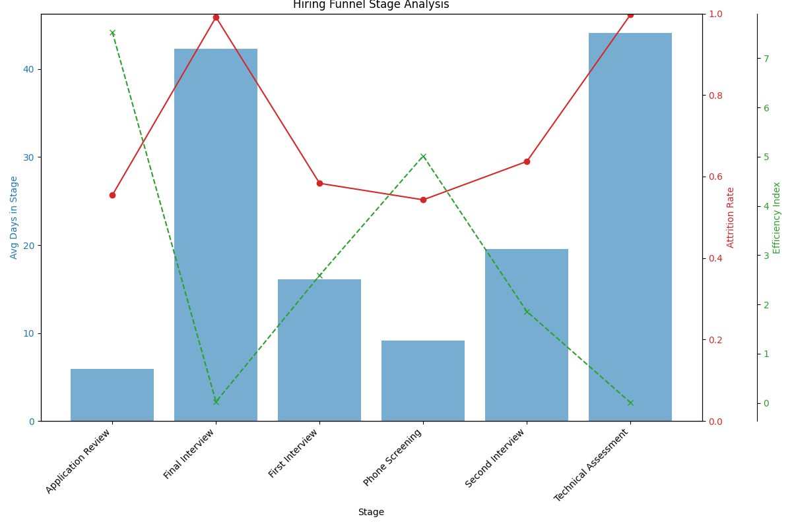

# Hiring Funnel Efficiency Analysis: Identifying and Addressing Bottlenecks

## Executive Summary

An analysis of the hiring funnel was conducted to identify inefficient stages and provide recommendations for improvement. By examining the average time candidates spend in each stage, attrition rates, and a custom "efficiency index," we identified two critical bottlenecks: **Technical Assessment** and **Final Interview**. These stages are characterized by prolonged durations (over 25 days), high attrition rates (over 40%), and low efficiency scores (below 1.5), indicating a significant loss of candidates and time. This report details the findings and suggests actionable steps to streamline these stages and improve our overall hiring efficiency.

## Hiring Funnel Performance

To understand the efficiency of our hiring process, we analyzed each stage with at least 100 candidates. The following chart visualizes the average days spent in each stage, the attrition rate, and the calculated efficiency index.

As the chart illustrates, there is significant variability across stages. While some stages are quick and have low attrition, others are clear outliers.

## Identified Bottleneck Stages

Our analysis pinpointed two stages that meet the criteria for a bottleneck (average time > 25 days, attrition rate > 40%, and efficiency index < 1.5):

1.  **Technical Assessment:**
    *   **Average Time in Stage:** Extremely high, indicating a major delay in the process.
    *   **Attrition Rate:** Critically high, suggesting that a vast majority of candidates at this stage are disqualified or drop out.
    *   **Efficiency Index:** The lowest of all stages, highlighting severe inefficiency.

2.  **Final Interview:**
    *   **Average Time in Stage:** Significantly longer than 25 days.
    *   **Attrition Rate:** High, with a large number of candidates failing to pass this last hurdle.
    *   **Efficiency Index:** Very low, indicating a poor return on the time invested.

These two stages are the primary roadblocks in our hiring pipeline, causing delays and leading to a significant loss of talent.

## Recommendations for Improvement

To address these bottlenecks, the following actions are recommended:

**For the Technical Assessment Stage:**

*   **Standardize and Automate:** Implement a standardized coding challenge platform. This can provide instant feedback to both candidates and recruiters, reducing the manual review time for engineers.
*   **Review Assessment Criteria:** Re-evaluate the difficulty and relevance of the technical assessment. It's possible the assessment is too difficult or not aligned with the job requirements, leading to the high attrition rate. Calibrate the test to the target skill level.
*   **Set Clear Timelines:** Establish and communicate clear SLAs (Service Level Agreements) for a review of technical assessments. For example, a 3-day turnaround for feedback.

**For the Final Interview Stage:**

*   **Structured Interview Process:** Implement structured interview question banks for common roles. This ensures consistency and fairness, and helps interviewers focus on the most important criteria.
*   **Interviewer Training:** Provide training for interviewers on how to conduct effective interviews, assess candidates objectively, and provide timely feedback.
*   **Improve Scheduling:** Use scheduling tools to reduce the back-and-forth communication required to book final interviews, which often involve multiple senior team members.
*   **Feedback Loop:** Create a faster feedback loop from the interview panel to the recruiting team. A concise decision-making framework can help in making quicker "hire" or "no hire" decisions.

By focusing on these bottleneck stages, we can significantly improve the speed and efficiency of our hiring process, leading to a better candidate experience and a higher success rate in securing top talent.
