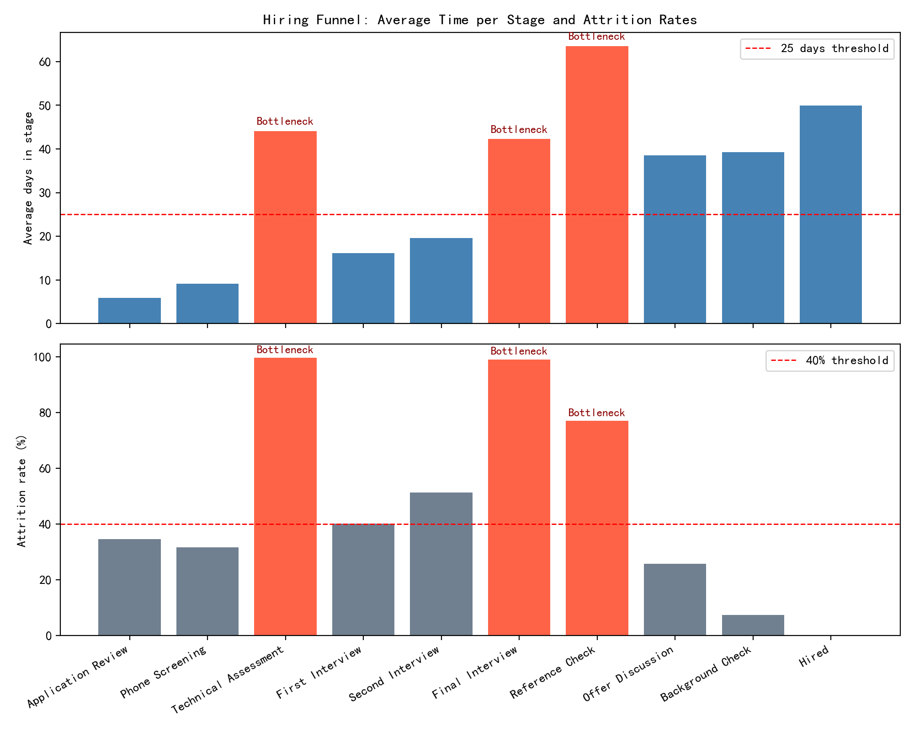

# Hiring Funnel Efficiency Analysis

## Executive Summary
- Bottleneck stages (average time > 25 days AND attrition rate > 40%):
  - Technical Assessment — avg 44.11 days, attrition 99.63%, efficiency index 0.008 (n=1,342)
  - Final Interview — avg 42.28 days, attrition 99.11%, efficiency index 0.021 (n=224)
  - Reference Check — avg 63.54 days, attrition 77.11%, efficiency index 0.360 (n=83; below the 100-sample threshold for recommendations)
- Low-efficiency stages (efficiency index < 1.5):
  - Technical Assessment, Final Interview, Reference Check (same three as above)

These stages account for very long elapsed times and extremely low pass-through rates, indicating process frictions and poor screening calibration before these steps. Recommendations below focus on stages with at least 100 samples (Technical Assessment, Final Interview).

## Data and Method
- Data: lever__opportunity_stage_history (includes stage, days_in_stage, archive_reason) from dacomp-en-071.sqlite.
- Metric definitions:
  - Pass: archive_reason in {\"Advanced to next stage\", \"Proceeding\", \"Qualified\"}; for the Hired stage, archive_reason == \"Hired\".
  - Attrition: any other archive_reason.
  - Average time in stage: mean(days_in_stage).
  - Pass rate and attrition rate: proportion of records per stage.
  - Efficiency index: (pass_rate / avg_days) * 100.
- Note: archive_reason is used to classify outcomes at each stage; we do not infer pass via timestamps. No data cleaning was performed as per instructions.

## What the Funnel Shows
- Top-of-funnel is fast and relatively healthy:
  - Application Review: avg 5.92 days, pass 65.4%, n=3,000.
  - Phone Screening: avg 9.12 days, pass 68.4%, n=1,962.
- The mid-to-late funnel slows drastically and sees severe fallout:
  - Technical Assessment: avg 44.11 days, pass 0.37%, n=1,342.
  - Final Interview: avg 42.28 days, pass 0.89%, n=224.
  - Reference Check: avg 63.54 days, pass 22.89%, n=83.
- Other stages are moderate:
  - First Interview: avg 16.10 days, pass 59.9%, n=768.
  - Second Interview: avg 19.56 days, pass 48.7%, n=460.
  - Offer Discussion: avg 38.54 days, pass 74.32%, n=74.
  - Background Check: avg 39.29 days, pass 92.73%, n=55.

## Visuals
- Time and attrition by stage, with bottlenecks highlighted: see hiring_stage_bottlenecks.png
- Efficiency index by stage, with low-efficiency stages highlighted: see stage_efficiency_index.png

## Diagnostic Insights (Why these bottlenecks happen)
Using archive_reason distributions:
- Technical Assessment (n=1,342; attrition 99.63%; avg 44.11 days)
  - Top attrition reasons:
    - Failed technical assessment: 56.69%
    - Technical skills insufficient: 32.91%
    - Coding challenge failed: 9.57%
  - Interpretation: The assessment is eliminating nearly all candidates after a long wait/cycle time. Likely issues: difficulty is miscalibrated to role level; misaligned sourcing/profile; long take-home windows; scheduling/feedback delays; insufficient candidate prep.

- Final Interview (n=224; attrition 99.11%; avg 42.28 days)
  - Top attrition reasons:
    - Cultural fit concerns: 66.67%
    - Interview performance below expectations: 25.23%
  - Interpretation: End-of-funnel bar is eliminating almost everyone after extended cycles. Signals of calibration gaps in expectations, inconsistent interviewer rubrics, and late detection of fit/performance risk that could be screened earlier. The long elapsed time suggests scheduling or decision latency as additional drivers.

- Reference Check (n=83; attrition 77.11%; avg 63.54 days)
  - Top attrition reasons:
    - Negative reference feedback: 59.38%
    - Reference check concerns: 35.94%
  - Interpretation: High fallout and very long time, but small sample (<100). Worth monitoring; not the current focus for changes.

## Prescriptive Recommendations (stages with ≥100 samples)
1) Technical Assessment
- Improve early screening to avoid sending poor-fit candidates into a long assessment:
  - Add role-specific pre-screens (targeted questions, short skill checks) at Phone Screening.
  - Tighten job requirements in postings and sourcing briefs to reduce skill mismatch.
- Shorten and stage the assessment:
  - Replace long take-homes with a two-step approach: 15–30 min automated screen + focused 45–60 min live problem session only for those who pass.
  - Provide clear candidate prep materials and examples to reduce failure due to format unfamiliarity.
- Reduce cycle time via SLAs and tooling:
  - SLA: schedule assessment within 3 business days of Phone Screening; return feedback within 2 business days.
  - Use scheduling automation and a shared assessor pool to increase availability.
- Calibrate difficulty and rubrics:
  - Align challenge complexity with the role level; use standardized rubrics to reduce over-rejection.
  - Run a pilot on 20–30% of reqs to A/B test reduced complexity and staged assessments; track pass rate, avg days, and offer conversion.

2) Final Interview
- Move fit/performance evaluation earlier where possible:
  - Introduce a structured behavioral interview prior to Final Interview with explicit rubric on values/fit to avoid late-stage surprises.
  - Add a job-simulation or role-play in Second Interview to front-load performance signal.
- Standardize decision-making and reduce latency:
  - Use calibrated rubrics for each competency; require scorecards within 24 hours; hold a 15-minute decision huddle within 48 hours.
  - Limit panel size where feasible; pre-brief interviewers on must-meet criteria to minimize unnecessary rejections for preference-based reasons.
- Pre-close and expectation alignment:
  - Recruiter pre-close before Final Interview to surface concerns on scope, team, and compensation.
  - Provide candidates with realistic job previews to reduce performance anxiety and mismatch.

## Prioritization and Expected Impact
- Technical Assessment and Final Interview drive the largest drops after long elapsed times. Addressing these two should cut time-to-decision materially and improve conversion.
- Target outcomes after 6–8 weeks of changes:
  - Reduce Technical Assessment avg days from ~44 to <20; increase pass rate from ~0.37% to 5–10% by calibrated difficulty and staged screening. Efficiency index should increase 10x+.
  - Reduce Final Interview avg days from ~42 to <15; increase pass rate from ~0.89% to 10–20% via rubrics and earlier fit screens.

## Measurement Plan
- Weekly stage metrics:
  - Avg days in stage, pass/attrition rates, efficiency index by stage and by role level.
- SLA adherence:
  - Scheduling and feedback turnaround for assessments and final rounds.
- Quality of hire proxy:
  - Track downstream outcomes (offer acceptance, early performance signals) to ensure higher conversion doesn’t compromise quality.

## Notes and Assumptions
- Pass/attrition defined via archive_reason: {Advanced to next stage, Proceeding, Qualified} considered pass; Hired stage considered pass only when archive_reason == Hired.
- Reference Check shows concerning metrics but has <100 samples; include in monitoring but defer process changes until more data accumulates.

By focusing on Technical Assessment and Final Interview with the targeted actions above, we can materially reduce wasted cycle time and increase throughput, improving both candidate experience and hiring velocity.
