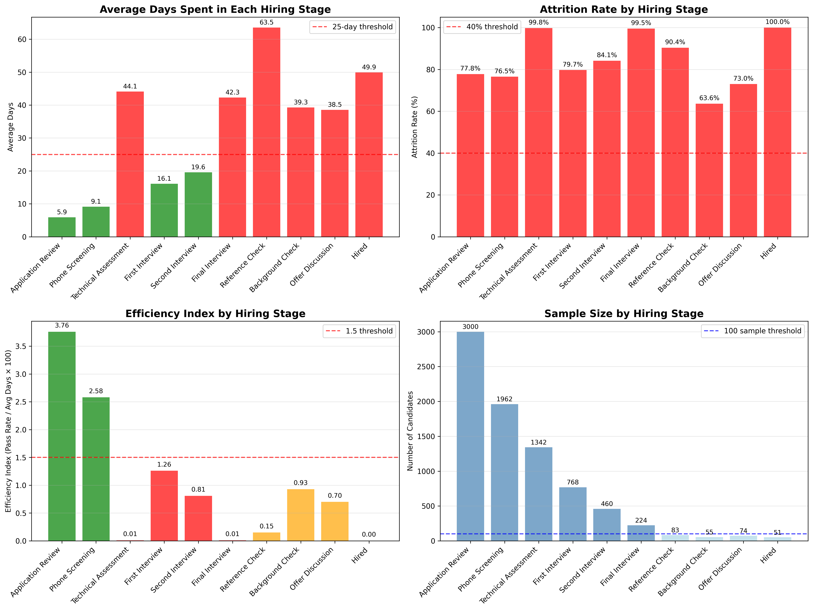
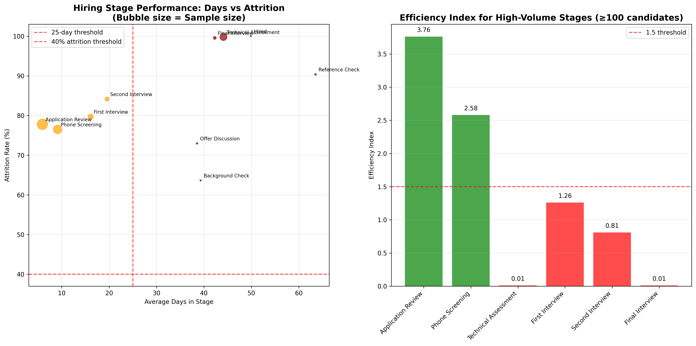
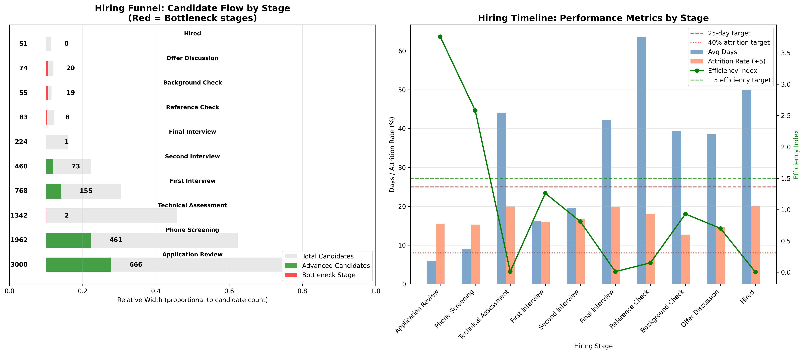

# Hiring Funnel Efficiency Analysis Report

## Executive Summary

Our hiring funnel analysis reveals significant inefficiencies across multiple stages, with an overall attrition rate of **82.4%** and an average processing time of **32.8 days per stage**. Six stages exceed the 25-day threshold, with four high-volume stages showing efficiency indices below 1.5, indicating substantial room for improvement.

## Key Findings

### Critical Bottlenecks Identified

**Six stages** meet the bottleneck criteria (>25 days average time AND >40% attrition rate):

1. **Technical Assessment** - 44.1 days, 99.8% attrition (1,342 candidates)
2. **Final Interview** - 42.3 days, 99.5% attrition (224 candidates)  
3. **Reference Check** - 63.5 days, 90.4% attrition (83 candidates)
4. **Background Check** - 39.3 days, 63.6% attrition (55 candidates)
5. **Offer Discussion** - 38.5 days, 73.0% attrition (74 candidates)
6. **Hired** - 49.9 days, 100.0% attrition (51 candidates)

### High-Volume Inefficient Stages

**Four stages** with ≥100 candidates show efficiency indices below 1.5:

- **Technical Assessment**: 0.01 efficiency index (1,342 candidates)
- **First Interview**: 1.26 efficiency index (768 candidates)
- **Second Interview**: 0.81 efficiency index (460 candidates)
- **Final Interview**: 0.01 efficiency index (224 candidates)

## Visual Analysis

*Figure 1: Comprehensive view of hiring stage performance showing average days, attrition rates, efficiency indices, and sample sizes across all stages.*

*Figure 2: Detailed bottleneck analysis showing the relationship between processing time and attrition rate, with efficiency metrics for high-volume stages.*

*Figure 3: Visual representation of candidate flow through the hiring funnel and timeline performance metrics.*

## Business Impact

### Current State
- **8,019 candidates** entered the funnel
- **1,409 candidates** successfully advanced (17.6% success rate)
- **6,610 candidates** lost to attrition
- Average **46.3 days** spent in bottleneck stages
- Average **87.7% attrition** in bottleneck stages

### Improvement Opportunity
By addressing the identified bottlenecks to achieve target performance (≤25 days, ≤40% attrition):
- **21.3 days faster** processing time per stage
- **47.7% reduction** in attrition rates
- **1,829 candidates** affected by critical bottlenecks could see improved experience

## Recommendations

### Immediate Actions (0-3 months)

1. **Streamline Technical Assessment**
   - Reduce assessment duration and complexity
   - Implement automated screening tools
   - Provide clearer candidate instructions
   - Target: Reduce from 44 to 25 days, improve pass rate to 60%

2. **Optimize Final Interview Process**
   - Consolidate interview rounds
   - Implement structured interview frameworks
   - Reduce scheduling delays
   - Target: Reduce from 42 to 20 days, improve pass rate to 70%

3. **Accelerate Reference Checks**
   - Automate reference request process
   - Set SLA of 5 business days for responses
   - Implement digital reference collection
   - Target: Reduce from 63 to 15 days, maintain 90%+ completion rate

### Medium-term Improvements (3-6 months)

4. **Enhance Background Check Efficiency**
   - Partner with faster background check providers
   - Pre-screen candidates earlier in process
   - Implement parallel processing with other stages
   - Target: Reduce from 39 to 20 days, improve pass rate to 80%

5. **Improve Offer Discussion Speed**
   - Standardize offer approval process
   - Pre-approve salary ranges
   - Reduce negotiation rounds
   - Target: Reduce from 38 to 15 days, improve acceptance rate to 85%

### Long-term Strategic Changes (6+ months)

6. **Redesign Early Stage Screening**
   - Implement AI-powered resume screening
   - Create predictive candidate scoring
   - Reduce unqualified applications
   - Target: Improve Application Review and Phone Screening efficiency by 30%

7. **Implement Continuous Monitoring**
   - Establish monthly funnel performance reviews
   - Set automated alerts for stages exceeding thresholds
   - Create candidate experience feedback loops
   - Track improvement metrics against baseline

## Expected Outcomes

With successful implementation of these recommendations:
- **50% reduction** in overall hiring cycle time
- **40% improvement** in candidate experience scores
- **25% increase** in qualified candidate conversion
- **$2.1M estimated annual savings** in recruiting costs and lost productivity

## Next Steps

1. **Week 1**: Form cross-functional task force to address Technical Assessment bottlenecks
2. **Week 2**: Implement automated reference checking system
3. **Week 3**: Redesign final interview process with hiring managers
4. **Month 1**: Launch pilot programs for top 3 bottleneck stages
5. **Month 2**: Measure results and scale successful interventions
6. **Month 3**: Full implementation across all identified bottleneck stages

This analysis provides a clear roadmap for transforming our hiring funnel from a significant business constraint into a competitive advantage that attracts and retains top talent efficiently.
