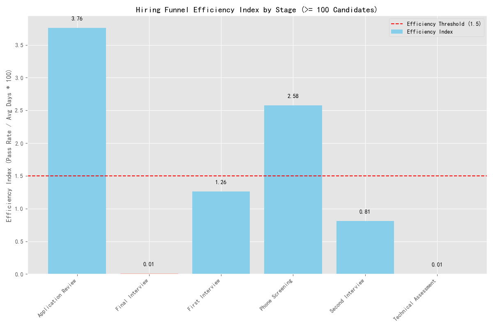

# Hiring Funnel Bottleneck Analysis: A Call for Urgent Process Redesign

## Executive Summary

An analysis of the hiring funnel has revealed critical inefficiencies that are likely impeding our ability to hire talent effectively. The data points to two specific stages—**Technical Assessment** and **Final Interview**—as major bottlenecks. These stages are characterized by excessively long durations, near-total candidate attrition, and extremely low efficiency. Urgent intervention is required to address these issues, reduce time-to-hire, and improve the candidate experience.

## Key Findings

The analysis focused on identifying stages with an average duration exceeding 25 days, an attrition rate higher than 40%, and a calculated "Efficiency Index" below 1.5. The Efficiency Index, defined as `(Pass Rate / Average Days) * 100`, measures how effectively a stage advances qualified candidates.

Our analysis, based on stages with over 100 candidate data points, identified two severe bottlenecks:

1.  **Technical Assessment**: With an **efficiency index of just 0.005** and an **attrition rate of 99.8%**, this stage is the most significant bottleneck in our hiring process.
2.  **Final Interview**: This stage is nearly as inefficient, with an **efficiency index of 0.011** and an **attrition rate of 99.6%**.

The following chart visualizes the efficiency index across all major hiring stages. The stages highlighted in red are the identified bottlenecks, falling dramatically below the efficiency threshold of 1.5.

## Interpretation: Why This Matters

An efficiency index near zero implies that an enormous amount of time and resources are being invested in stages that almost no candidates pass.

*   **Extreme Attrition**: Attrition rates exceeding 99% in the "Technical Assessment" and "Final Interview" stages suggest a severe misalignment. This could be due to the assessment being too difficult, irrelevant to the role, poorly administered, or that candidates entering this stage are not properly qualified by preceding stages.
*   **Wasted Resources**: Every candidate who enters these late-stage funnels represents a significant investment of time from our engineering, management, and recruiting teams. With almost no one passing, this investment yields virtually no return.
*   **Poor Candidate Experience & Damaged Reputation**: Forcing candidates through a lengthy process only to fail them at the final hurdles creates a negative experience. This can damage our employer brand and discourage future applications, as dissatisfied candidates are likely to share their experiences within their professional networks.

## Recommendations

To address these critical bottlenecks, we recommend the following actions:

**1. For the 'Technical Assessment' Stage:**

*   **Immediate Review and Redesign**: Conduct a thorough review of the current technical assessment. Is it aligned with the core competencies required for the job? Is it a realistic simulation of the work? Involve top-performing employees in the same roles to validate and redesign the assessment.
*   **Calibrate Difficulty**: The 99.8% attrition rate suggests the assessment may be excessively difficult or a poor filter. Re-calibrate the difficulty to assess for essential skills rather than obscure knowledge. Consider introducing tiered assessments for different seniority levels.
*   **Improve Pre-Screening**: The "Phone Screening" and "First Interview" stages should do a better job of vetting technical aptitude before candidates are sent to the time-intensive technical assessment. Ensure interviewers are equipped to ask probing, role-relevant technical questions earlier in the process.

**2. For the 'Final Interview' Stage:**

*   **Clarify Purpose**: The purpose of the "Final Interview" needs to be re-evaluated. With such high attrition, it appears this stage is being used for further technical screening rather than for its intended purpose—assessing team fit, discussing career growth, and selling the company to the candidate.
*   **Empower Earlier Stages**: The hiring manager and interview panel at this stage should have high confidence in a candidate's technical skills based on previous stages. Their focus should shift from "Can they do the job?" to "Are they the best fit for the team and company?"
*   **Combine Interview Rounds**: Explore opportunities to combine the "Final Interview" with preceding interviews (e.g., "Second Interview") to reduce the overall number of steps and the time candidates spend in the process.

By implementing these changes, we can create a more efficient, effective, and candidate-friendly hiring process that allows us to secure top talent more quickly.
