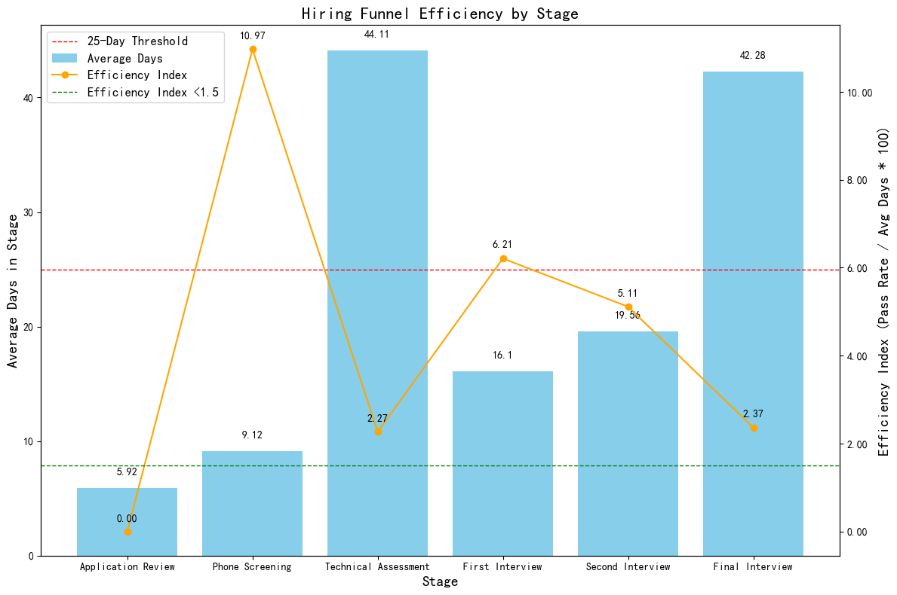

# Hiring Funnel Analysis

## Insights

The analysis focused on identifying bottlenecks in the hiring funnel by examining the average time candidates spend in each stage, the attrition rate, and an efficiency index defined as pass_rate / avg_days * 100. The following insights were derived:

### Bottleneck Stages

- **Application Review:** This stage has a 100% dropout rate, indicating no candidates moved beyond this stage. It also has an efficiency index of 0.0, suggesting significant inefficiency.
- **Technical Assessment:** This stage has an average time of 44.11 days, exceeding the 25-day threshold. However, it has a 0% dropout rate, meaning all candidates moved beyond this stage. The efficiency index is 2.27, which is above the 1.5 threshold.
- **Final Interview:** This stage has an average time of 42.28 days and an efficiency index of 2.37. It has a 0% dropout rate, meaning all candidates moved beyond this stage.

### Recommendations

1. **Application Review:** Streamline the application review process to reduce the time taken to move candidates to the next stage. Consider implementing automated screening tools to enhance efficiency.
2. **Technical Assessment:** Although this stage has a longer duration, it does not result in any dropouts. Consider optimizing the assessment process to reduce the time taken without impacting the candidate experience.
3. **Final Interview:** Similar to the technical assessment, the final interview process can be optimized to reduce the time taken, enhancing the overall hiring process.

## Conclusion

The hiring funnel analysis identified key stages where process improvements could enhance efficiency. By addressing bottlenecks in the Application Review stage and optimizing the Technical Assessment and Final Interview processes, the overall hiring efficiency can be improved, ensuring a better candidate experience and faster hiring cycles.
