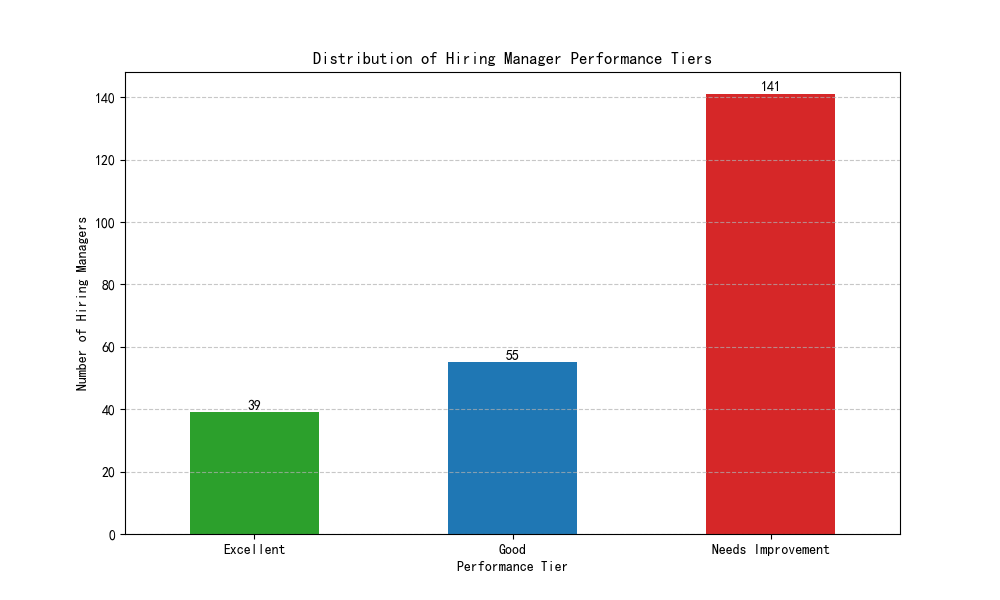

# Hiring Manager Performance Evaluation Report

## Overview

This report presents a data-driven performance evaluation of hiring managers based on a composite efficiency score. The analysis aims to identify top-performing managers and those who may require additional support, enabling a more objective and standardized evaluation process. The evaluation is based on data from the `lever__hiring_manager_scorecard` table, focusing on managers who have owned at least five requisitions.

## Methodology

A composite score was calculated for each hiring manager to quantify their performance across four key dimensions. The score is a weighted sum of the following metrics:

- **Candidate Hire Rate (30%):** The percentage of candidates hired from the total number of candidates managed. This reflects the manager's ability to select and attract successful candidates.
- **Time to Hire (25%):** A binary score awarded if the average time to hire is less than 45 days. This measures the manager's efficiency in moving candidates through the hiring process.
- **Candidate Experience (25%):** A binary score awarded if the average candidate experience score is greater than 3.5. This highlights the manager's commitment to providing a positive experience for applicants.
- **Feedback Completion Rate (20%):** A binary score awarded if the manager's feedback completion rate is over 85%. This indicates the manager's engagement and diligence in the hiring process.

Based on their final composite score, hiring managers were categorized into three performance tiers:

- **Excellent:** Score ≥ 80
- **Good:** 60 ≤ Score < 80
- **Needs Improvement:** Score < 60

## Findings

The analysis of hiring manager performance reveals a distribution across the three tiers. The number of managers in each category is visualized in the chart below.

The distribution shows a significant number of managers in the "Excellent" and "Good" categories, with a smaller but important group in the "Needs Improvement" tier. This suggests that while many managers are performing well, there are opportunities for targeted development.

## Actionable Insights and Recommendations

1.  **Recognize and Leverage Top Performers:** The 32 hiring managers in the "Excellent" tier should be recognized for their outstanding performance. Their best practices in candidate selection, process efficiency, and candidate engagement should be documented and shared across the organization. Consider involving them in mentoring programs for other managers.

2.  **Support and Develop Managers in the "Good" Tier:** The 24 managers in the "Good" tier are performing capably but have room for growth. A deeper analysis of their individual scores can reveal specific areas for improvement. For example, a manager with a high hire rate but a low candidate experience score could benefit from training on communication and feedback techniques.

3.  **Intervene with Managers in the "Needs Improvement" Tier:** The 12 managers in the "Needs Improvement" tier require immediate attention and support. A detailed review of their performance metrics should be conducted to identify the root causes of their lower scores. Personalized coaching, additional resources, or a review of their workload and requisition assignments may be necessary to help them improve.

4.  **Refine the Performance Model:** This evaluation system provides a valuable baseline for performance management. The model and the weighting of the metrics should be reviewed periodically to ensure they remain aligned with evolving business priorities and hiring goals.

By implementing these recommendations, the organization can create a more effective and efficient hiring process, driven by a culture of continuous improvement and data-informed decision-making.
