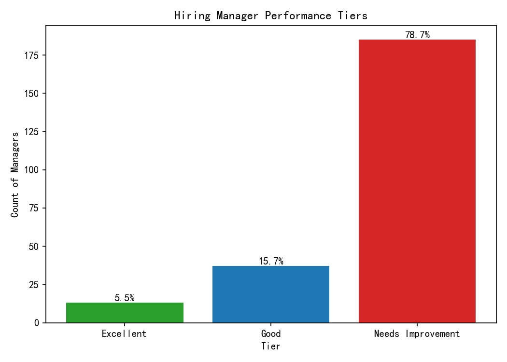
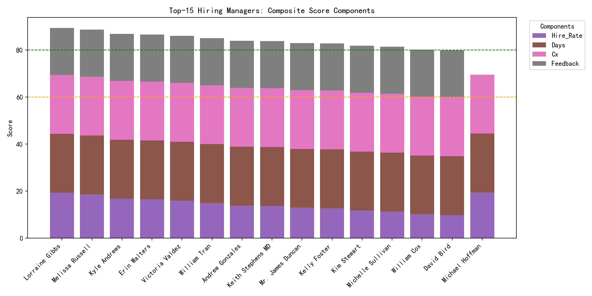

# Hiring Manager Performance Evaluation — Composite Efficiency Score

## Objective
Establish a data-driven performance evaluation system for hiring managers using a composite efficiency score and tiers to drive accountability and coaching.

## Methodology
- Data source: lever__hiring_manager_scorecard (SQLite)
- Eligibility: Only managers with total_requisitions_owned ≥ 5
- Scoring formula (0–100 points):
  - Candidate hire rate: candidate_hire_rate × 100 × 0.30 (max 30 points)
  - Avg total days to hire < 45: 25 points
  - Avg candidate experience score > 3.5: 25 points
  - Feedback completion rate > 85%: 20 points
- Tiers:
  - Excellent: score ≥ 80
  - Good: 60 ≤ score < 80
  - Needs Improvement: score < 60

Computed scores and tiers were exported to manager_scores.csv. Visuals were created with Python and saved in the current directory.

## Who’s included
- Eligible managers (total_requisitions_owned ≥ 5): 235

## What the data shows
- Tier distribution:
  - Excellent: 13 (5.5%)
  - Good: 37 (15.7%)
  - Needs Improvement: 185 (78.7%)

- Threshold attainment among eligible managers:
  - Avg total days to hire < 45: 48.9%
  - Avg candidate experience score > 3.5: 36.6%
  - Feedback completion rate > 85%: 24.7%

- Threshold attainment by tier:
  - Excellent: 100% meet all three thresholds
  - Good: 91.9% meet days, 81.1% meet CX, but only 29.7% meet feedback
  - Needs Improvement: 36.8% meet days, 23.2% meet CX, 18.4% meet feedback

- Top performers: The top 10 managers scored between 82.8–89.4 and universally met all three thresholds. Their candidate hire rates range ~42–65%, but the decisive factor is meeting thresholds.

The stacked-component view shows the score composition. With the binary thresholds worth 70 points combined, consistent attainment of these three levers defines top-tier performance. The hire rate component (max 30 points) differentiates leaders within the Excellent tier but is rarely sufficient to offset missing thresholds.

## Why it matters
- The current distribution indicates a high concentration in Needs Improvement (78.7%), suggesting large, consistent gaps in process discipline and candidate experience.
- The single largest blocker to moving managers from Good to Excellent is feedback completion (only 29.7% of Good meet >85%). This is a tractable process outcome that can be addressed with tooling and SLAs.
- For Needs Improvement managers, both candidate experience and feedback completion are primary obstacles, followed by speed (days to hire). Addressing these systematically will lift the entire cohort.

## Diagnostic insights
- Component leverage:
  - Binary thresholds dominate the score (70% of total). To move tiers:
    - From Needs Improvement to Good: Hit at least 2 of 3 thresholds plus a moderate hire rate.
    - From Good to Excellent: Hit all 3 thresholds; hire rate differences fine-tune final positioning within Excellent.
- Bottleneck analysis:
  - Feedback completion is the most common miss among Good managers; solving it is the shortest path to more Excellents.
  - Candidate experience and feedback completion are the most common misses among Needs Improvement; speed is also a frequent gap.

## Prescriptive recommendations
1. Raise feedback completion >85% organization-wide
   - Implement automated nudges and hard SLAs (e.g., 48-hour feedback window)
   - Add dashboard alerts for overdue feedback at the recruiter and manager level
   - Tie interview scheduling to feedback compliance (e.g., no new panels until feedback is submitted)

2. Improve candidate experience to >3.5
   - Standardize interview kits and rubrics; train interviewers on behavioral techniques
   - Provide candidate communication SLAs (status updates within 3 business days)
   - Review rejection messaging templates and recruiter follow-up scripts

3. Reduce average days to hire below 45
   - Enforce time-to-schedule SLAs; pre-assign interview panels for common roles
   - Use parallel stages where possible (e.g., references while offer is in review)
   - Remove low-signal stages after calibration reviews

4. Targeted tier-mobility playbooks
   - Good → Excellent: Focus first on feedback completion; audit any teams below 85% and deploy specific enforcement/automation
   - Needs Improvement → Good: Prioritize CX and feedback; once achieved, tune process speed

5. Governance and cadence
   - Publish a monthly scorecard per manager and department
   - Coach outliers with action plans; recognize top performers as benchmarks
   - Reassess thresholds quarterly for fairness and alignment with hiring goals

## Implementation artifact
- Scored dataset: manager_scores.csv (includes component breakdown and tiers)
- Visuals: tier_distribution.png, top15_composite_components.png

## Example benchmarks (top 3)
- Lorraine Gibbs: 89.39 (Excellent): Hire rate 64.6%, Days 43.0, CX 3.90, Feedback 85.5%
- Melissa Russell: 88.69 (Excellent): Hire rate 62.3%, Days 42.8, CX 4.53, Feedback 93.8%
- Kyle Andrews: 86.86 (Excellent): Hire rate 56.2%, Days 32.2, CX 4.13, Feedback 98.0%

## Conclusion
The composite scoring framework clearly distinguishes high performers and pinpoints actionable levers for advancement. To rapidly increase the share of Excellent managers, prioritize feedback completion compliance and candidate experience improvements, while continuing to streamline cycle time. With monthly visibility and tier-based coaching, expect measurable uplift in 1–2 quarters.

