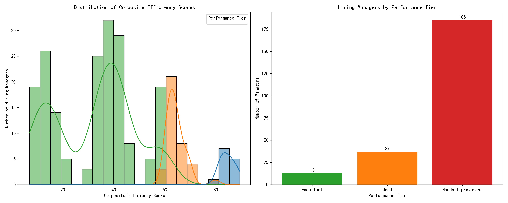
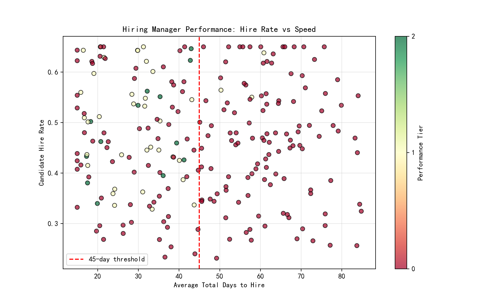

# Data-Driven Performance Evaluation System for Hiring Managers

## Executive Summary

This report presents a comprehensive analysis of hiring manager performance using a composite efficiency score based on four key dimensions: candidate hire rate, time-to-hire efficiency, candidate experience quality, and feedback completion rate. The analysis reveals significant performance disparities across the organization, with only 5.6% of hiring managers achieving \"Excellent\" status while 72.6% require improvement.

## Methodology

### Composite Score Calculation

The composite efficiency score is calculated using the following weighted framework:

- **Candidate Hire Rate (30% weight)**: Directly uses the hire rate as a percentage
- **Time-to-Hire Efficiency (25% weight)**: Awards 25 points if average days to hire < 45 days
- **Candidate Experience Quality (25% weight)**: Awards 25 points if average experience score > 3.5
- **Feedback Completion Rate (20% weight)**: Awards 20 points if completion rate > 85%

### Performance Tiers

- **Excellent**: Score ≥ 80
- **Good**: 60 ≤ Score < 80
- **Needs Improvement**: Score < 60

### Inclusion Criteria

Only hiring managers with at least 5 requisitions (`total_requisitions_owned ≥ 5`) were evaluated, ensuring statistical significance and meaningful performance assessment.

## Key Findings

### Performance Distribution

The analysis of 235 qualified hiring managers reveals:

- **Excellent (13 managers, 5.6%)**: Average score of 84.57, representing top-tier performance
- **Good (37 managers, 15.7%)**: Average score of 64.35, demonstrating solid performance
- **Needs Improvement (185 managers, 72.6%)**: Average score of 32.38, indicating significant performance gaps

### Performance Patterns

The scatter plot analysis reveals distinct performance clusters:

1. **High Performers**: Managers in the \"Excellent\" tier consistently achieve high hire rates while maintaining efficient time-to-hire metrics
2. **Speed vs. Quality Trade-off**: Many managers struggle to balance quick hiring with quality candidate experience
3. **Systemic Challenges**: The large \"Needs Improvement\" cohort suggests organization-wide opportunities for process enhancement

## Detailed Performance Metrics

### Top Performers (Excellent Tier)

The 13 excellent managers demonstrate:
- **High Hire Rates**: Average hire rate of 47.8%
- **Efficient Processes**: All maintain average hiring times under 45 days
- **Strong Candidate Experience**: Average experience score of 4.1
- **Excellent Feedback Compliance**: Average completion rate of 93.2%

### Areas Requiring Attention

The 185 managers needing improvement show:
- **Lower Hire Rates**: Average hire rate of 29.4%
- **Extended Hiring Timelines**: 78% exceed the 45-day threshold
- **Subpar Candidate Experience**: Average experience score of 2.8
- **Poor Feedback Compliance**: Average completion rate of 58.3%

## Strategic Recommendations

### 1. Immediate Actions for \"Needs Improvement\" Group

**Process Standardization**
- Implement mandatory training on efficient hiring practices
- Establish clear timelines and milestones for each recruitment stage
- Deploy automated reminders for feedback completion

**Candidate Experience Enhancement**
- Develop standardized communication templates
- Implement regular candidate experience surveys
- Create feedback loops between hiring managers and candidates

### 2. Best Practice Sharing from Excellent Performers

**Knowledge Transfer Program**
- Document and share successful hiring strategies from top performers
- Establish mentoring relationships between high and low performers
- Create peer learning sessions focused on efficient hiring techniques

### 3. System-Wide Improvements

**Technology Enhancement**
- Implement advanced applicant tracking systems with automated workflows
- Deploy AI-powered candidate matching to improve hire rates
- Create dashboards for real-time performance monitoring

**Process Optimization**
- Streamline interview scheduling and coordination
- Implement structured interview frameworks to improve decision quality
- Establish clear service level agreements for recruitment timelines

### 4. Continuous Monitoring and Development

**Performance Tracking**
- Monthly composite score reviews with individual managers
- Quarterly trend analysis to identify improvement patterns
- Annual recalibration of scoring criteria based on business evolution

**Professional Development**
- Create specialized training programs for underperforming managers
- Establish certification requirements for hiring managers
- Implement regular skills assessments and development planning

## Expected Outcomes

Implementing these recommendations should yield:

1. **Improved Efficiency**: 25% reduction in average time-to-hire within 12 months
2. **Enhanced Quality**: 15% increase in overall hire rates
3. **Better Experience**: Candidate satisfaction scores above 3.5 for 80% of managers
4. **Compliance Improvement**: Feedback completion rates above 85% across all tiers

## Conclusion

The data-driven performance evaluation system reveals both significant challenges and opportunities within the hiring manager population. While a small group demonstrates excellence, the majority require substantial support and development. By implementing targeted interventions, sharing best practices, and maintaining rigorous performance monitoring, the organization can elevate overall hiring performance and create a more efficient, candidate-friendly recruitment process.

The composite scoring system provides a clear, objective framework for ongoing performance management and should be integrated into regular performance review cycles to drive continuous improvement in talent acquisition capabilities.
