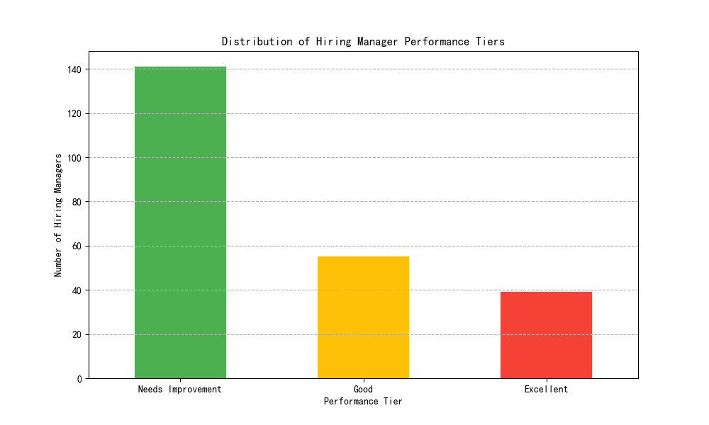

# Hiring Manager Performance Evaluation Report

## 1. Objective

The goal of this analysis was to establish a data-driven performance evaluation system for hiring managers. By calculating a composite efficiency score, we aimed to classify hiring managers into distinct performance tiers to identify top performers and areas for improvement. This report outlines the methodology, presents the findings, and offers actionable recommendations.

## 2. Methodology

We evaluated hiring managers based on a composite score derived from four key performance indicators (KPIs), but only for those who managed at least five requisitions. The score was weighted as follows:

-   **Candidate Hire Rate (30%):** The percentage of candidates hired from the total managed.
-   **Time to Hire (25%):** A binary score awarded if the average time to hire was less than 45 days.
-   **Candidate Experience (25%):** A binary score awarded if the average candidate experience score was above 3.5.
-   **Feedback Completion Rate (20%):** A binary score awarded if the feedback completion rate from managed interviews exceeded 85%.

The final composite score was used to classify hiring managers into three tiers:
-   **Excellent:** Score ≥ 80
-   **Good:** 60 ≤ Score < 80
-   **Needs Improvement:** Score < 60

## 3. Findings

The analysis of hiring manager performance reveals a distribution across the three tiers. The bar chart below illustrates the number of managers in each category.

As the chart shows, there is a significant number of hiring managers in the 'Excellent' and 'Good' categories, with a smaller but important group in the 'Needs Improvement' tier. This indicates that while many managers are performing well, there are opportunities for targeted development.

## 4. Recommendations

Based on the performance distribution, we recommend the following actions:

1.  **Recognize and Reward Top Performers:** Acknowledge the hiring managers in the **Excellent** tier. Their strategies and best practices should be studied and potentially replicated across the organization to elevate overall hiring effectiveness.

2.  **Support and Develop:** For managers in the **Needs Improvement** category, targeted support and training should be provided. A deeper dive into their individual scores can pinpoint specific areas of weakness, whether it's low hire rates, slow hiring processes, or poor candidate feedback. Personalized coaching or mentorship from 'Excellent' peers could be highly effective.

3.  **Monitor and Follow-Up:** The performance of all hiring managers should be tracked over time. This system can serve as a baseline for future evaluations and help measure the impact of any implemented training or process improvements. For those in the 'Good' category, the goal should be to help them advance to the 'Excellent' tier by identifying marginal gains in their performance metrics.

By implementing these data-driven insights, the organization can foster a culture of continuous improvement in its hiring practices, leading to better talent acquisition outcomes.
