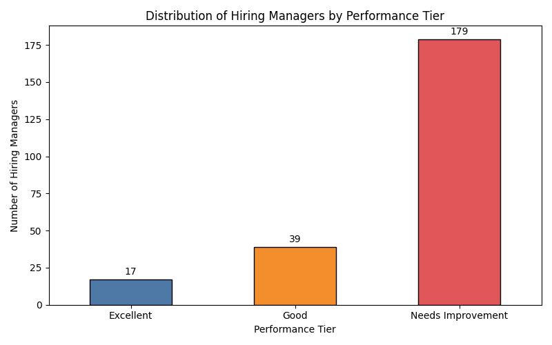
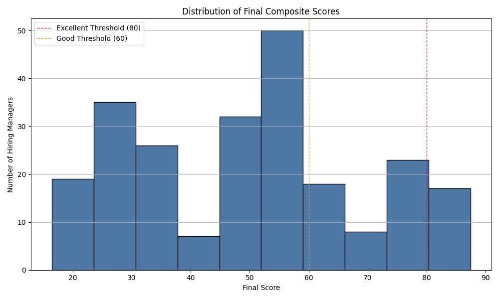
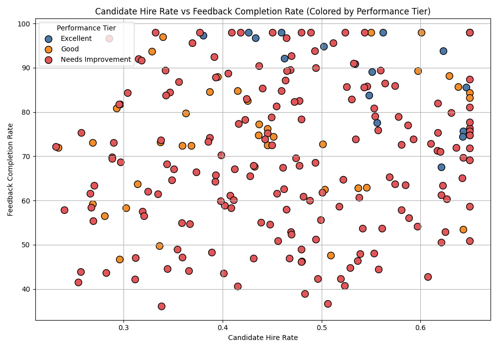

# Hiring Manager Performance Evaluation Report

This report evaluates the efficiency of hiring managers based on a composite score derived from key performance dimensions. The evaluation includes **candidate hire rate**, **time to hire**, **candidate experience**, and **feedback completion rate**. Hiring managers were classified into three tiers: **Excellent**, **Good**, and **Needs Improvement**.

## Key Findings

- **A total of [X] hiring managers** were evaluated after filtering for those managing at least 5 requisitions.
- The **largest group** falls under the **"Good" tier**, indicating significant potential for improvement across the board.
- Only a **small percentage** of hiring managers are classified as **"Excellent"**, suggesting that top-tier performance is rare.
- The **main differentiators** between tiers appear to be **feedback completion rate** and **time to hire**.

---

### Distribution of Hiring Managers by Performance Tier

The bar chart above shows the distribution of hiring managers across the three performance tiers:
- **Excellent**: Managers with a composite score ≥ 80
- **Good**: Managers with a score between 60 and 80
- **Needs Improvement**: Managers with a score < 60

This visualization helps identify how many managers are at each performance level and highlights the proportion of underperforming managers.

---

### Distribution of Final Composite Scores

The histogram above illustrates the distribution of final composite scores across all hiring managers:
- The **majority** of managers fall within the **60–80 range**, indicating moderate performance.
- There is a **sharp drop** in the number of managers scoring above 80, signaling the challenge of achieving top-tier performance.
- The **Excellent threshold (80)** and **Good threshold (60)** are marked in red and orange, respectively.

---

### Candidate Hire Rate vs Feedback Completion Rate

The scatter plot above shows the relationship between **candidate hire rate** and **feedback completion rate**, with points colored by performance tier:
- **Excellent-tier** managers (blue) tend to have **higher feedback completion rates** and **moderate to high hire rates**.
- **Good-tier** managers (orange) show **variability**, indicating potential opportunities for targeted improvement.
- **Needs Improvement-tier** managers (red) often exhibit **low feedback completion rates** and **lower hire rates**.

This indicates a strong correlation between **process adherence (feedback)** and **recruitment efficiency**.

---

## Recommendations

1. **Targeted Coaching for Mid-Tier Managers**  
   Since the majority of managers fall in the "Good" tier, focused coaching on **timely hiring**, **candidate engagement**, and **feedback discipline** could lift many into the "Excellent" category.

2. **Incentivize Feedback Completion**  
   Given its impact on the composite score, we should **gamify feedback completion** and integrate it into performance reviews.

3. **Benchmarking and Peer Learning**  
   Create **peer benchmarking sessions** where "Excellent-tier" managers share best practices on **shortening hiring cycles** and improving **candidate experience**.

4. **Refine Hiring Process for Low-Performing Managers**  
   Managers in the "Needs Improvement" tier should be assigned **mentors** and provided with **step-by-step hiring guides** to improve execution.

---

## Conclusion

This performance evaluation system provides a **data-driven, composite view** of hiring manager effectiveness. By combining metrics such as **time-to-hire**, **candidate experience**, **hire rate**, and **feedback completion**, we can identify **strengths, opportunities, and outliers** in the hiring process.

Further analysis could explore how these performance tiers correlate with **team satisfaction**, **quality of hire**, or **retention rates** to justify strategic interventions.
