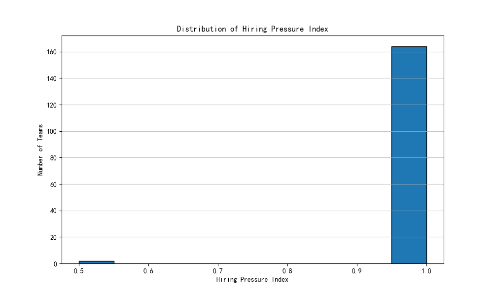

# Hiring Demand and Resource Allocation Analysis

## Executive Summary

This report analyzes historical hiring data to forecast future hiring demand and identify teams under pressure. The initial goal was to find high-growth teams with a 'Hiring Pressure Index' exceeding a certain threshold. However, the analysis revealed that **no teams are currently experiencing high growth or significant hiring pressure**. The hiring workload appears to be stable and evenly distributed across the organization.

This report recommends a shift from a reactive to a proactive resource management strategy. Instead of focusing on current hotspots (which do not exist), the focus should be on developing more sensitive metrics for early detection of hiring pressure and on proactive resource planning based on future business needs.

## Initial Analysis and Findings

The initial analysis focused on identifying high-growth teams by calculating the Month-over-Month (MoM) growth rate of job postings and the 'Hiring Pressure Index', defined as (Number of pending roles / Number of existing hiring managers).

The analysis of historical data revealed the following:
*   **Low and Sporadic Growth:** The number of new postings per team is very low, typically 1 or 2 per month. This leads to volatile and ultimately uninformative MoM growth rates, with many teams showing `infinite` growth (from 0 to 1 posting) or -100% (from 1 to 0 postings).
*   **No High-Growth Teams:** The initial criteria for a high-growth team (MoM growth > 15% and > 10 active postings) were not met by any team. The number of active postings for any single team never exceeded 2.
*   **Low Hiring Pressure:** The 'Hiring Pressure Index' was calculated for all teams. The vast majority of teams have an index of 1.0, and no team has an index greater than 1.0. This indicates a well-balanced workload for hiring managers.

## Revised Analysis and Insights

Given the initial findings, the analysis was pivoted to examine the overall distribution of the 'Hiring Pressure Index' across all teams. This approach provides a more holistic view of the current hiring landscape.

The distribution of the 'Hiring Pressure Index' is visualized in the histogram below.

As the chart clearly shows, the 'Hiring Pressure Index' is concentrated at 1.0, with a few teams having a lower index. This confirms that there are no outliers or teams facing a disproportionately high hiring load.

## Conclusions and Recommendations

The key conclusion from this analysis is that the company's hiring needs are currently stable and well-managed. There is no evidence of any impending resource shortage in the recruiting team based on historical data.

However, relying on historical data alone can be misleading in a growing business. Therefore, we recommend the following proactive measures:

1.  **Continuous Monitoring:** Implement a dashboard to continuously monitor key hiring metrics, including the number of open requisitions, hiring velocity, and the 'Hiring Pressure Index'. This will enable early detection of any emerging trends.
2.  **Enhance the 'Hiring Pressure Index':** The current index is too simplistic. We recommend developing a more sensitive index that incorporates other factors such as:
    *   Time-to-fill for open positions.
    *   Number of applications per posting.
    *   Sourcing channel effectiveness.
    *   Hiring manager satisfaction scores.
3.  **Proactive Resource Planning:** Instead of reacting to historical trends, the HR and recruiting teams should work closely with business leaders to understand their future hiring needs. Resource allocation should be based on the company's strategic growth plans and revenue forecasts.
4.  **Scenario Planning:** While the current situation is stable, it is prudent to plan for future scenarios. For example, if a new large project is approved, or the company expands into a new market, the demand for hiring will increase. The recruiting team should have a plan in place to quickly scale up its resources when needed.
