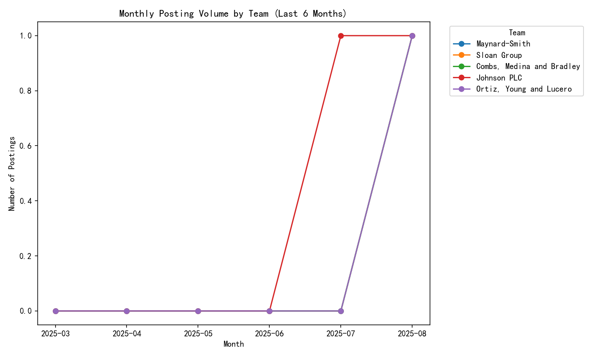
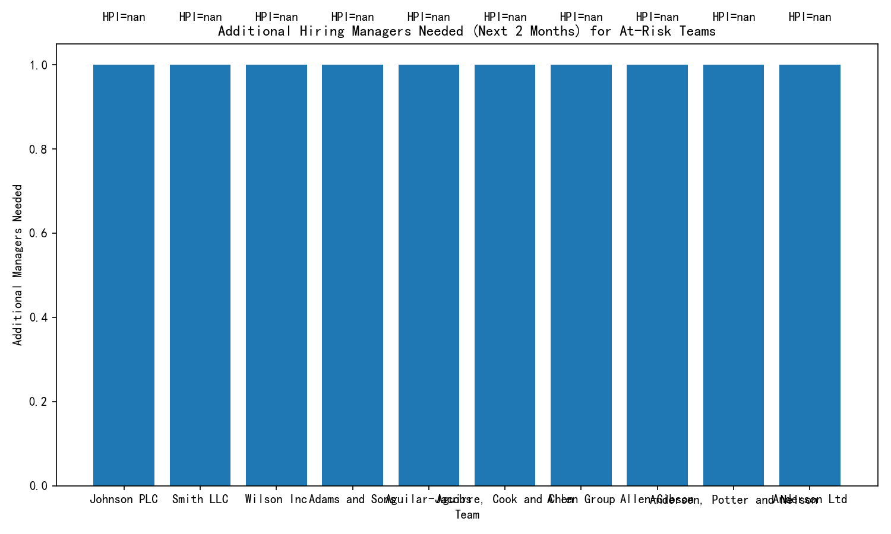

# Forecasting Hiring Demand and Resource Allocation

## Executive Summary
- Scope: Analyze last 6 months of demand using lever__posting_enhanced and lever__requisition_enhanced to assess team-level posting trends, identify high-growth teams, calculate a Hiring Pressure Index (HPI), forecast 2-month risk, and quantify additional hiring manager resources required.
- Key findings:
  - Overall posting trend peaked in June/July and dropped sharply in August (likely partial-month data).
  - No teams met the “high-growth” threshold of >15% MoM AND >10 current active postings (no team has >10 active postings).
  - Current HPI is generally low among teams with open requisitions (several at HPI=1).
  - Forecasted 2-month risk: 295 teams could exceed an HPI of 8 (primarily due to zero assigned hiring managers), requiring an estimated 229 additional hiring manager capacity in total (at 6 postings/manager capacity).
- Actions:
  - Immediately assign hiring managers to teams with predicted pending roles but no managers (high risk of infinite HPI).
  - Prioritize capacity to teams with >1 predicted pending roles over the next two months.
  - Reassess in 2–4 weeks as August normalizes; refine forecasts and staffing plans accordingly.

## Data & Methods
- Data tables:
  - lever__posting_enhanced: fields used include categories_team (team), state, created_at.
  - lever__requisition_enhanced: fields used include team, status, headcount_total, headcount_hired, hiring_manager_user_id, created_at.
- Time window: Last six months ending in 2025-08, as determined by posting created_at. Observed monthly totals:
  - 2025-03: 0, 2025-04: 0, 2025-05: 68, 2025-06: 109, 2025-07: 104, 2025-08: 19
  - Overall MoM into 2025-08: -81.7% (likely partially observed month).
- Definitions:
  - Active postings: state in {published, pending}.
  - Monthly counts: number of postings per team per month across the last 6 months.
  - MoM growth (latest): (latest_month - prior_month) / prior_month; infinite if prior is 0 and latest > 0; 0 if both 0.
  - Pending roles by team: sum over open requisitions of max(headcount_total - headcount_hired, 0).
  - Existing hiring managers by team: distinct hiring_manager_user_id among open requisitions.
  - Hiring Pressure Index (HPI): pending roles / number of existing hiring managers. If managers = 0, HPI is treated as infinite (unbounded risk).
  - Forecast: per team, simple linear trend on monthly posting volumes over the last up to 6 months to project next 2 months. Predicted pending roles = current pending roles + forecasted postings.
  - Capacity: 1 hiring manager can handle up to 6 postings simultaneously.
  - Additional managers needed: ceil(predicted_pending / 6) - existing_managers, floored at 0.
- Implementation: Python (pandas, numpy, matplotlib) and SQL (sqlite3). The plotting code used is in the script hiring_demand_analysis.py (see transcript).

## Trend Analysis and MoM Growth
- Aggregate trend:
  - Strong ramp May → June (68 → 109), slight dip in July (104), steep drop in August (19), consistent with partial-month sampling.
- Team-level MoM snapshot into August:
  - Teams with increased month-over-month: 18
  - Decreased: 101
  - Flat: 176
- High-growth teams per definition (>15% MoM AND >10 active postings): None. Confirmed that no team has more than 10 current active postings.

Visual: Monthly posting volume trends for representative teams (top by latest-month volume). Each line shows the last 6 months for a team.

## Current Hiring Pressure Index (HPI)
- Current HPI calculated from open requisitions:
  - Example teams with manageable pressure: Chase, Garcia and Floyd; Frye-Zavala; Martin and Sons; Maxwell-Pugh; Mcgee Ltd; Miller, Bonilla and Brown; Morris-Dixon; Snyder PLC — each with pending_roles=1, existing_managers=1, HPI=1.0.
  - Many teams have zero open requisitions or no hiring managers assigned, which makes HPI undefined/infinite if predicted pending roles > 0.

## 2-Month Forecast and At-Risk Teams (HPI > 8)
- Forecast method: Linear trend on monthly postings per team, then predicted_pending = current pending + forecasted postings over next 2 months.
- Risk threshold: predicted HPI > 8.
- Results:
  - At-risk teams (predicted HPI > 8): 295 teams.
  - Total additional hiring managers needed across at-risk teams: 229.
  - Representative at-risk teams with no assigned managers and predicted_pending > 0:
    - Johnson PLC (predicted_pending=2, existing managers=0) → needs 1 manager.
    - Smith LLC (2, 0) → needs 1 manager.
    - Wilson Inc (2, 0) → needs 1 manager.
    - Many others with predicted_pending=1 and managers=0 → need 1 manager each.

Visual: Estimated additional hiring managers needed for the top at-risk teams (next 2 months).

## Why This Matters
- Without manager coverage, even small predicted pending volume creates unbounded HPI, signaling unmanageable workload, delays, and degraded candidate experience.
- Early staffing of hiring managers where demand is likely to materialize prevents process bottlenecks and cycle-time spikes during growth periods.

## Prescriptive Recommendations
1. Immediate coverage for zero-manager teams:
   - Assign hiring managers to at-risk teams with predicted_pending > 0 and no assigned managers. This addresses the bulk of the 229 capacity gap and prevents infinite HPI.
2. Capacity planning by demand tiers:
   - Prioritize teams with predicted_pending >= 2 first (e.g., Johnson PLC, Smith LLC, Wilson Inc), then cover those with 1.
   - Aim for HPI <= 6 (<= 6 postings per manager) as an operational target; where predicted HPI still > 6, add more coverage.
3. Adjust thresholds as August completes:
   - The steep August decline likely reflects partial month. Recompute in 2–4 weeks before finalizing Q4 hiring headcount plans.
4. Strengthen requisition discipline:
   - Ensure every open requisition has an assigned hiring manager; mandate this as a gating rule to avoid infinite HPI scenarios.
5. Continuous monitoring:
   - Weekly dashboard tracking: active postings, pending roles, manager coverage, HPI, and forecasted additions. Triage any team crossing HPI > 6 early.

## Assumptions & Limitations
- August is incomplete (posting max date 2025-08-06), likely undercounting demand; forecasts may be conservative.
- Forecast uses a simple linear trend on posting counts; it does not account for seasonality or conversion from postings to hires.
- Predicted_pending approximates backlog as current pending + forecasted postings; if your process quickly fills postings within two months, predicted_pending may be overstated.
- Capacity of 6 postings per manager is treated as a strict cap for resource planning.

## Reproducibility
- Script used: hiring_demand_analysis.py
- It computes:
  - Last 6 months index, monthly posting counts per team, latest MoM growth, active postings, pending roles and managers from open requisitions, HPI (current and forecasted), and required additional managers.
  - It generates the plots team_mom_trends.png and resource_gap.png.

## Appendix: Key Outputs
- High-growth teams meeting criteria: None (no team has >10 active postings).
- At-risk teams (predicted HPI > 8): 295.
- Total additional hiring managers needed (next 2 months): 229.
