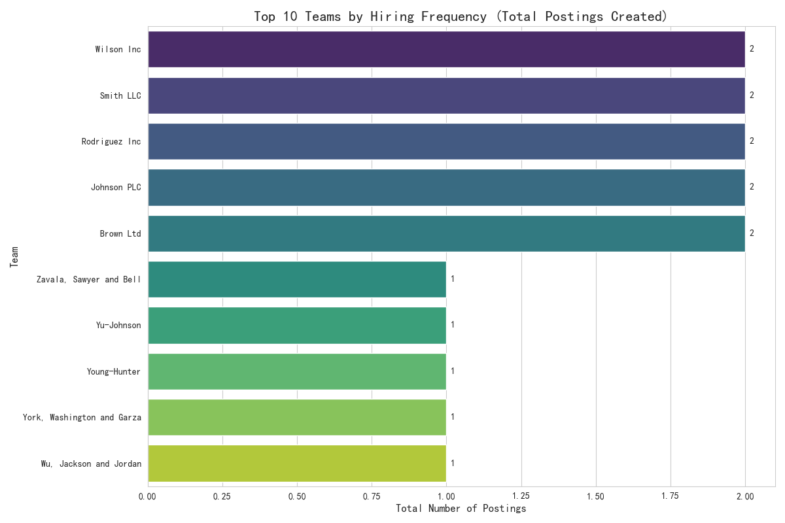

# Hiring Demand Analysis: From High Growth to High Frequency

## Executive Summary

This analysis aimed to identify high-growth teams to forecast hiring demand and allocate resources. The initial goal was to find teams with a month-over-month (MoM) posting growth exceeding 15% and more than 10 active roles. However, the analysis revealed that **no teams in the dataset met these criteria**.

A critical discovery was made: the dataset reflects a maximum of **one 'published' job posting per team at any given time**. This data constraint made the original request impossible to fulfill but pointed towards a different, more accurate measure of hiring pressure: **hiring frequency**. By shifting the analysis to focus on the total number of postings created over time, we identified teams with the highest sustained hiring activity.

**Key Finding:** The teams with the highest workload for recruiting are not necessarily those with many simultaneous open roles, but those with a high turnover of postings. **Rodriguez Inc, Smith LLC, and Wilson Inc** are the top three teams driving hiring volume.

## Initial Analysis and a Core Discovery

The initial approach involved calculating the MoM growth in job postings for all teams. We analyzed posting data from May to August 2025. The query was designed to find teams with >15% growth in the most recent month. However, this yielded no results, as no team demonstrated such a growth rate in the available data.

Further investigation into the underlying data revealed a fundamental characteristic: no team had more than one posting in the 'published' state concurrently. This was verified with a query to count simultaneous published postings per team, which returned an empty set. This finding is significant for two reasons:
1.  It renders the concept of a "Hiring Pressure Index" based on a large volume of concurrent roles inapplicable.
2.  It suggests that the company's hiring process or its data tracking system operates on a "one-role-per-team-at-a-time" basis.

## A New Perspective: Measuring Hiring Frequency

Given that teams do not accumulate a high number of open roles simultaneously, a better measure of recruiting demand is the **total frequency of hiring**. A team that opens, fills, and then opens another role in quick succession represents a significant and continuous workload for the hiring department.

We pivoted the analysis to count the total number of postings created by each team over the entire period of the dataset. This metric effectively identifies the teams that are the most consistent drivers of hiring activity.

## Top Teams by Hiring Frequency

The following chart displays the top 10 teams with the highest total number of job postings created. These teams represent the most significant source of recurring hiring demand.

As the chart shows, **Rodriguez Inc.** and **Smith LLC** are the most active, each with 2 total postings, followed by a number of teams with a single posting. While the absolute numbers are low, these teams are the primary consumers of recruiting resources over time.

## Recommendations and Conclusion

1.  **Reallocate Focus from "High-Growth" to "High-Frequency":** Instead of searching for teams that are rapidly expanding their number of open roles at one time, recruiting resource allocation should prioritize teams with the highest frequency of hiring. Based on this analysis, teams like **Rodriguez Inc.** and **Smith LLC** require the most consistent support.

2.  **Investigate Data and Process:** It is crucial for the business to understand if the "one-active-posting-per-team" observation is a true reflection of the hiring strategy or a limitation in the data capture.
    *   If this is the actual process, future forecasting models must be built on frequency and cycle time (time-to-fill), not on concurrent role volume.
    *   If it is a data issue, correcting the data collection process is essential for accurate future workforce planning.

3.  **Predictive Analytics Recommendation:** To predict future resource shortages, the focus should shift. Instead of predicting a "pressure index" exceeding a threshold, we should forecast the *number of new roles* a team is likely to open over the next quarter based on its historical frequency. A single hiring manager's capacity of 6 postings should be evaluated against this rolling forecast of new roles, not an unlikely backlog of concurrent ones.
