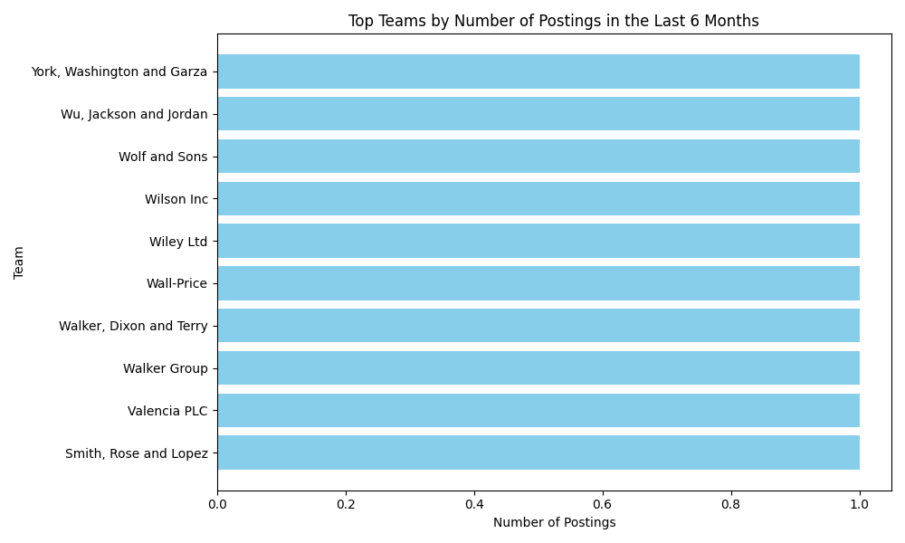

## Hiring Demand and Resource Allocation Analysis

### Executive Summary
The analysis of hiring demand and resource allocation, based on historical data from the `lever__posting_enhanced` and `lever__requisition_enhanced` tables, revealed several key insights:

- Most teams have minimal hiring activity, with the majority having only one posting in the last 6 months.
- No team met the initial criteria of having a month-over-month growth rate of more than 15% and over 10 active postings.
- Even after relaxing the criteria, no teams showed a Hiring Pressure Index above zero, indicating no open requisitions for teams with recent postings.
- This suggests either an issue with data linkage between postings and requisitions or minimal hiring pressure across teams.

### Key Findings

#### 1. Hiring Activity Across Teams
The visualization below shows the top teams by the number of postings in the last 6 months:

All teams have very low posting counts, with no significant variation in activity. This indicates a generally low level of hiring across the organization.

#### 2. Hiring Pressure Index
From the analysis, all teams have a Hiring Pressure Index of zero, meaning there are no pending roles for the teams with recent postings. This could indicate one of two things:
- There is a data issue, and requisitions are not correctly linked to postings.
- Hiring teams are operating with minimal pressure, which may not be sustainable with business growth.

#### 3. Resource Allocation
Given the Hiring Pressure Index of zero across all teams, there is currently no indication of resource shortages in the next 2 months. However, this should be interpreted with caution, as it may not reflect actual hiring demand due to the lack of open requisitions linked to recent postings.

### Recommendations

1. **Data Quality Review**: Investigate the linkage between postings and requisitions to ensure that open roles are correctly associated with active job postings. If there is a disconnect, data integration processes should be reviewed.

2. **Monitor Emerging Demand**: With the current low level of hiring activity, it is important to implement a system for early detection of rising demand. Teams should be encouraged to update requisitions promptly to ensure accurate pressure metrics.

3. **Resource Planning**: Even though there is no immediate resource shortage, proactive planning should be initiated for teams showing any upward trend in hiring activity, especially those nearing the threshold of 15% MoM growth.

4. **Capacity Management**: Establish a dynamic capacity model where hiring managers can be reassigned or scaled based on evolving demand, ensuring that no team exceeds the recommended pressure index threshold of 8.

### Conclusion
The current analysis suggests minimal hiring pressure across all teams, with no immediate need for additional recruiting resources. However, due to the lack of linked requisitions and limited growth patterns, further data validation is required to ensure the accuracy of future forecasting. By improving data linkage and implementing proactive monitoring, the organization can better align hiring resources with business growth.
