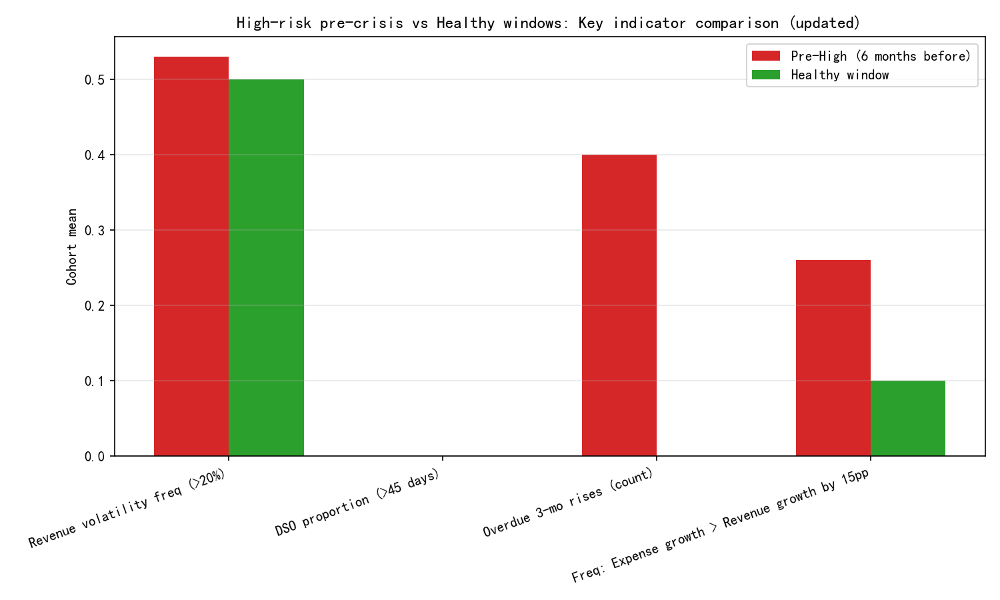

# Cash Flow Early-Warning Analysis for High-Risk Subsidiaries

## Executive Summary
Using historical data across 10 subsidiaries that entered a High cash_flow_risk_level, I analyzed the six months leading up to their first High state and compared these trajectories to healthy windows (no High risk) from the same subsidiaries. Three indicator families were evaluated:
- Revenue recognition stability: frequency of monthly revenue fluctuations exceeding 20%.
- Accounts receivable management: weighted_average_days_outstanding (DSO) and overdue_percentage trends.
- Expense control: divergence between expense growth rates and revenue growth rates.

Key results:
- Overdue percentage rises (3 consecutive months) occurred in 30–40% of pre-crisis windows but not in healthy windows.
- Revenue volatility (>20% MoM) is higher in pre-crisis windows (mean 0.53 vs 0.50), and intensifies in the 2–3 months right before High risk (late3 window: 0.67 vs early3: 0.33).
- Expense growth outpacing revenue growth by more than 15 percentage points is more common in pre-crisis windows (mean 0.26 vs 0.10 healthy), especially in the final 3 months (late3: 0.50 vs early3: 0.17).
- DSO >45 days was rare in this sample, but DSO slope trends diverged clearly: pre-crisis windows show rising DSO (mean slope +0.35 days/month) while healthy windows show declining DSO (−0.93 days/month).

A practical early-warning rule combining these indicators achieved strong precision and recall at the window level:
- Basic rule: flag if any of (DSO proportion >45% of months, any 3-month overdue rise, revenue volatility frequency >=0.50) delivered precision 0.889, recall 0.80, accuracy 0.75 across subsidiaries’ pre-crisis vs healthy windows.
- Score-based rule (stricter): requiring 2+ conditions among volatility, overdue rise, divergence improved precision to 1.0 but reduced recall to 0.40.

## Visualization
Cohort comparison of pre-crisis vs healthy windows (means across subsidiaries) for the key indicators:

## Data & Methodology
- Sources:
  - netsuite2_financial_dashboard: cash_flow_risk_level, DSO (weighted_average_days_outstanding), overdue_percentage, dates.
  - netsuite2_income_statement: monthly revenue and expense totals (account_category='Revenue'/'Expense').
- Joining logic:
  - Aligned by subsidiary_id and calendar month (strftime('%Y-%m')) to avoid null accounting_period_id issues.
- Cohorts:
  - Pre-crisis cohort: the six months strictly prior to the first “High” risk date for each subsidiary (10 subsidiaries).
  - Healthy cohort: the latest 6-month window ending ≥90 days before the first High event, with no High risk entries (2 subsidiaries).
- Indicators computed per 6-month window (and segmented into early 3 months vs late 3 months for timing diagnostics):
  - Revenue volatility: frequency of |MoM revenue change| >20%.
  - AR management: proportion of months with DSO >45 days; count of any 3 consecutive monthly increases in overdue_percentage.
  - Expense control: average difference between MoM expense and revenue growth; frequency of months where expense growth exceeds revenue growth by >15pp.
  - Trend diagnostics: linear slopes of DSO and overdue_percentage across the 6 months.

## Findings by Dimension

1) Revenue Recognition (volatility >20% MoM)
- Pre-crisis mean volatility frequency: 0.53 vs healthy: 0.50.
- Timing: signals intensify in the final 3 months before High risk (late3 mean 0.67) versus 4–6 months out (early3 mean 0.33).
- Interpretation: pronounced month-to-month swings in revenue become more frequent as liquidity stress approaches.

2) Accounts Receivable Management
- DSO >45 days: negligible in both cohorts (zero in this sample). However, trend slopes differentiate risk:
  - Pre-crisis DSO slope: +0.35 days/month (rising).
  - Healthy DSO slope: −0.93 days/month (declining).
- Overdue_percentage:
  - Pre-crisis windows show more upward bursts: mean 3-month rise count = 0.40; share with any 3-month rise ≈ 0.30.
  - Healthy windows: zero 3-month rise instances.
- Interpretation: rising DSO trends and consecutive increases in overdue indicate deteriorating collection performance leading up to cash strain even when absolute DSO levels stay below 45.

3) Expense Control vs Revenue
- Expense-vs-revenue divergence:
  - Mean frequency of “expense growth exceeds revenue growth by >15pp” is 0.26 in pre-crisis vs 0.10 in healthy.
  - Mean average divergence (expense minus revenue growth) is +0.018 pre-crisis vs −0.063 healthy.
- Timing: in the final 3 months (late3), divergence frequency jumps to 0.50 vs 0.17 in the earlier 3 months.
- Interpretation: uncontrolled expense growth relative to revenue is a consistent late-stage stressor.

## Early-Warning Rules (2–3 months ahead)
Based on the above, the following combination provides practical 2–3 month early warning:

Rule A (balanced recall and precision):
- Trigger an alert if any of the following are true within a rolling 3-month window:
  - Revenue volatility frequency (|MoM| >20%) ≥ 0.50,
  - Any 3 consecutive monthly increases in overdue_percentage,
  - DSO slope > +0.5 days per month (computed over the last 6 months).

Performance at the window level: precision ≈ 0.889, recall ≈ 0.80, accuracy ≈ 0.75.

Rule B (high precision, tighter):
- Trigger an alert if at least two of:
  - Revenue volatility frequency ≥ 0.60,
  - Frequency of expense growth > revenue growth by >15pp ≥ 0.40,
  - Any 3 consecutive monthly increases in overdue_percentage,
  - DSO slope > +0.5 days per month.

Performance at the window level: precision ≈ 1.00, recall ≈ 0.40, accuracy ≈ 0.50.
Use Rule B for subsidiaries where minimizing false positives is paramount; use Rule A for broader early detection.

## Recommendations for CFO’s Forecasting Model
- Feature engineering for cash flow forecasting:
  - Rolling 3-month revenue volatility frequency (|MoM| >20%).
  - Rolling 6-month DSO slope and overdue_percentage slope; a binary flag for any 3-month consecutive overdue rise.
  - Rolling 3-month frequency of “expense growth exceeds revenue growth by >15pp.”
- Early-warning overlay:
  - Implement Rule A as a real-time alert layer feeding into the forecasting dashboard.
  - For high-criticality entities, implement Rule B to reduce false alarms.
- Operational actions upon alert:
  - Accelerate collections: target accounts driving overdue increases; offer early payment discounts; tighten credit terms.
  - Expense holds: freeze discretionary spending when divergence flags trigger; re-align expense ramp with revenue trend.
  - Revenue smoothing: review billing patterns and accrual timing to reduce volatility spikes.

## Caveats and Next Steps
- Sample size: healthy cohort had 2 subsidiaries; expand cohort or include subsidiaries that never entered High risk to strengthen threshold calibration.
- DSO absolute threshold: DSO >45 days was rare pre-crisis in this dataset; use trend-based thresholds (slope) rather than static levels.
- Model validation: back-test proposed rules across longer periods and additional subsidiaries; consider a logistic regression using the features above to optimize precision/recall trade-offs.

## Appendix: Key Cohort Metrics (means)
- Revenue volatility frequency (>20%): pre-crisis 0.53, healthy 0.50.
- Overdue 3-month rise count: pre-crisis 0.40, healthy 0.00; share with any rise ≈ 0.30 vs 0.00.
- Expense growth > revenue growth by >15pp (frequency): pre-crisis 0.26, healthy 0.10.
- DSO slope per month: pre-crisis +0.35, healthy −0.93.

These combined thresholds are recommended to generate 2–3 months early warning signals of impending cash flow crises, and to feed the CFO’s improved cash flow forecasting model.
