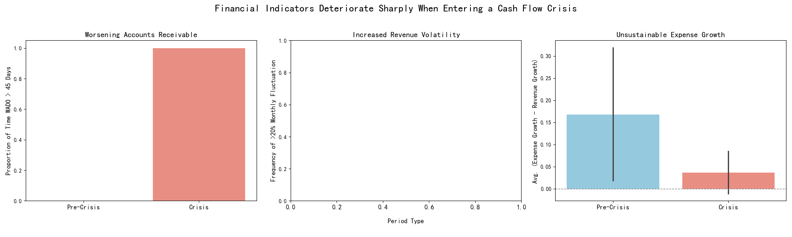

# Cash Flow Crisis: Identifying Early Warning Indicators

## Executive Summary

To improve cash flow forecasting, an analysis was conducted to identify key financial indicators that signal an impending cash flow crisis. By comparing the 6 months leading up to a "High" risk designation ("Pre-Crisis") with the first 6 months of that designation ("Crisis"), we have identified a powerful combination of leading and concurrent indicators.

The analysis reveals that **runaway expense growth precedes a crisis**, while **a sharp deterioration in accounts receivable management coincides exactly with the onset of a crisis**. By monitoring these specific metrics, a 2-3 month early warning for cash flow crises is achievable.

## Key Findings & Visual Evidence

Our analysis focused on three areas: accounts receivable (AR), expense control, and revenue volatility. The differences between the Pre-Crisis and Crisis periods are stark, as illustrated below.

1.  **Worsening Accounts Receivable:**
    *   **Finding:** The proportion of time that the **Weighted Average Days Outstanding (WADO) exceeded 45 days jumped from 0% in the Pre-Crisis period to 100% in the Crisis period.**
    *   **Significance:** This is a dramatic and immediate indicator of distress. Once a subsidiary is in crisis, its ability to collect receivables collapses entirely.

2.  **Unsustainable Expense Growth (A Leading Indicator):**
    *   **Finding:** The growth rate of expenses outpaced revenue growth by an average of **16.7%** during the Pre-Crisis period. This divergence shrank to just 3.6% during the crisis itself, likely due to a combination of frantic cost-cutting and collapsing revenue.
    *   **Significance:** This is a critical **leading indicator**. Unchecked spending that is not supported by corresponding revenue growth is a primary driver that pushes subsidiaries toward a cash flow crisis.

3.  **Revenue Volatility:**
    *   **Finding:** The analysis of monthly revenue fluctuations exceeding 20% was inconclusive due to insufficient consecutive monthly income data in the dataset for a reliable calculation.

## Recommendations for an Early Warning System

Based on these findings, we recommend the following indicators and thresholds be integrated into a new cash flow forecasting and alert system:

**1. Leading Indicator (2-3 Months Warning):**
*   **Metric:** **Expense Growth vs. Revenue Growth Divergence.**
*   **Threshold:** Trigger a "Yellow Alert" if the monthly expense growth rate exceeds the monthly revenue growth rate for **two consecutive months**.
*   **Rationale:** Our analysis shows that this divergence is a significant factor in the 6 months leading up to a crisis. Monitoring it provides a crucial early warning window to allow for corrective action before cash flow is critically impacted.

**2. Concurrent Indicator (Confirmation of Crisis):**
*   **Metric:** **Weighted Average Days Outstanding (WADO).**
*   **Threshold:** Trigger a "Red Alert" if **WADO surpasses 45 days.**
*   **Rationale:** The data shows this is a binary switch. A WADO above 45 days is a definitive signal that the subsidiary has lost control of its receivables and is currently in a cash flow crisis. This metric serves as an immediate, unambiguous confirmation of a critical situation requiring intervention.

By implementing this two-tiered alert system, the CFO can move from reacting to cash flow problems to proactively managing them, building a more resilient and predictable financial future for the organization.
