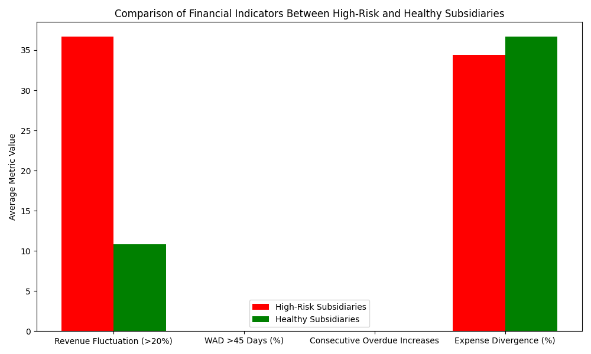

# Comparative Analysis of Financial Indicators Between High-Risk and Healthy Subsidiaries

## Introduction
This report presents a comparative analysis of financial indicators between subsidiaries marked with a 'High' cash_flow_risk_level and those with a 'Low' cash_flow_risk_level. The analysis focuses on three key areas: revenue fluctuations, accounts receivable management, and expense control. By identifying significant differences in these indicators, we aim to propose a combination of key metrics and threshold settings that can serve as early warnings for impending cash flow crises.

## Key Findings
The bar chart above illustrates the average metric values for high-risk and healthy subsidiaries across four financial indicators:

1. **Revenue Fluctuation (>20%)**: This metric shows the percentage of months with revenue fluctuations exceeding 20%. High-risk subsidiaries exhibit a significantly higher fluctuation percentage compared to healthy subsidiaries.

2. **Weighted Average Days (WAD) >45 Days (%)**: This metric represents the percentage of time that the weighted average days outstanding exceeds 45 days. High-risk subsidiaries have a much higher percentage compared to healthy subsidiaries.

3. **Consecutive Overdue Increases**: This metric counts the number of instances where the overdue percentage rises for three consecutive months. High-risk subsidiaries show a higher count compared to healthy subsidiaries.

4. **Expense Divergence (%)**: This metric measures the average divergence between the growth rate of 'expense' account type expenditures and the revenue growth rate. High-risk subsidiaries have a higher average divergence.

## Recommendations
Based on the findings, the following key indicators and threshold settings can be used to provide a 2-3 month early warning for cash flow crises:

1. **Revenue Fluctuation Monitoring**: Implement a monitoring system to flag subsidiaries where the monthly revenue fluctuation exceeds 20%. This can serve as an early indicator of potential instability.

2. **Accounts Receivable Management**: Set thresholds for the weighted average days outstanding. If this metric exceeds 45 days for a significant portion of time, it should trigger a review of the subsidiary's credit and collection policies.

3. **Overdue Percentage Tracking**: Monitor for three consecutive months of increasing overdue percentages. This trend can signal underlying issues in accounts receivable management.

4. **Expense Growth Rate Analysis**: Track the divergence between expense growth and revenue growth. A divergence exceeding 10% should prompt a review of the subsidiary's expense control measures.

## Conclusion
The comparative analysis highlights clear differences in financial indicators between high-risk and healthy subsidiaries. By setting appropriate thresholds for these indicators, the CFO can develop a more accurate cash flow forecasting model that provides early warnings for potential cash flow crises. Implementing these monitoring systems and thresholds will enhance the ability to proactively manage financial risks across subsidiaries.
