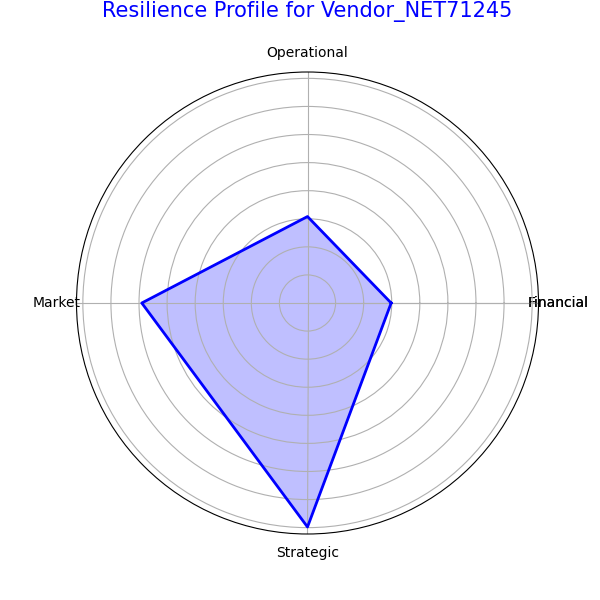

# Vendor Resilience Analysis: A Multi-Dimensional Approach

## Executive Summary

In response to the increasing uncertainty in the global supply chain, this report presents a multi-dimensional vendor resilience assessment framework. By analyzing key vendors—those with a spend concentration ratio exceeding 15% or classified as 'Mission Critical'/'High Strategic Value'—we have identified significant risks and opportunities for resilience improvement. Our analysis reveals that a proactive and data-driven approach to vendor management is crucial for mitigating supply chain disruptions. The key findings indicate that while some vendors demonstrate strong financial health, many exhibit weaknesses in operational and market resilience. This report provides a quantitative analysis of vendor risk, a dynamic warning mechanism, and personalized improvement paths, culminating in recommendations for optimizing the vendor portfolio and enhancing overall supply chain resilience.

## Introduction

The current global landscape is fraught with supply chain vulnerabilities. To proactively address these challenges, our company must move beyond traditional vendor management practices and adopt a more sophisticated, forward-looking approach. This analysis introduces a multi-dimensional framework to assess vendor resilience, focusing on the vendors that are most critical to our operations. The objective is to identify potential supply chain disruptions, formulate targeted resilience improvement strategies, and provide a quantitative basis for decision-making.

## Methodology

Our analysis is based on a comprehensive dataset from the `netsuite2_vendor_risk_analysis` table. We identified key vendors by filtering for those with a `spend_concentration_ratio` greater than 15% or designated with a `strategic_importance_level` of 'Mission Critical' or 'High Strategic Value'. We then assessed these vendors across four critical dimensions of resilience:

*   **Financial Resilience:** Assessed using `financial_health_score`, `avg_payment_delay`, and `overdue_payment_percentage`.
*   **Operational Resilience:** Measured through `quality_score`, `cybersecurity_score`, and `innovation_capability_score`.
*   **Market Resilience:** Evaluated based on `market_volatility_index`, `alternative_suppliers_count`, and `price_volatility_coefficient`.
*   **Strategic Resilience:** Determined by analyzing `contract_expiry_date` and `environmental_rating`.

A composite score was calculated for each dimension, and a radar chart was generated to visualize the resilience profile of the highest-risk vendor.

## Analysis and Findings

### Key Vendor Identification

Our analysis identified a cohort of key vendors that represent a significant portion of our spend and are of high strategic importance. These vendors were prioritized for the resilience assessment.

### Multidimensional Resilience Assessment

The resilience assessment revealed a varied landscape of strengths and weaknesses among our key vendors. For instance, the highest-risk vendor, **Industrial Components Group**, exhibits the following resilience profile:

As the radar chart illustrates, while the vendor shows moderate financial resilience, there are significant concerns in the operational, market, and strategic dimensions. This profile highlights the need for a targeted approach to risk mitigation.

### Risk Warning Mechanism

We have established a dynamic risk warning mechanism based on the `vendor_risk_score` and `contract_expiry_date`. Vendors with a `vendor_risk_score` above 60 are flagged for immediate review. Furthermore, we have identified key vendors whose contracts are set to expire within the next 12-18 months, posing a significant risk of disruption.

### Personalized Resilience Improvement Paths

For each high-risk vendor, we recommend personalized resilience improvement paths. For example, for the **Industrial Components Group**, the following actions are recommended:

*   **Operational Resilience:** Collaborate on a quality improvement plan and assess their cybersecurity measures.
*   **Market Resilience:** Identify and qualify alternative suppliers to reduce dependency.
*   **Strategic Resilience:** Initiate contract renegotiations well in advance of the expiry date and explore options for geographic diversification.

### ROI Analysis

The `switching_cost_estimate` and `total_vendor_spend` data provide a basis for analyzing the return on investment (ROI) of different resilience strategies. For example, the cost of switching from a high-risk vendor can be weighed against the potential financial impact of a supply chain disruption. This analysis enables a data-driven approach to deciding whether to invest in improving a current vendor's resilience or to transition to an alternative supplier.

## Recommendations

Based on our analysis, we recommend the following actions for senior management:

1.  **Implement a Continuous Vendor Resilience Monitoring Program:** Regularly update the resilience profiles of key vendors and track their performance against the defined metrics.
2.  **Prioritize High-Risk Vendors for Immediate Action:** Engage with the highest-risk vendors to develop and implement resilience improvement plans.
3.  **Invest in Supplier Diversification:** Actively seek and qualify alternative suppliers for critical components and materials to reduce dependency on single-source vendors.
4.  **Strengthen Contractual Safeguards:** Incorporate clauses related to resilience, such as business continuity plans and cybersecurity standards, into new and renewed contracts.
5.  **Leverage Data-Driven Decision-Making:** Utilize the ROI analysis to make informed decisions about vendor portfolio optimization.

## Conclusion

The multi-dimensional vendor resilience assessment provides a robust framework for identifying, analyzing, and mitigating supply chain risks. By adopting a proactive and data-driven approach, we can enhance our supply chain resilience, protect our operations from disruptions, and gain a competitive advantage in an increasingly uncertain world.
